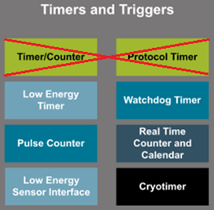
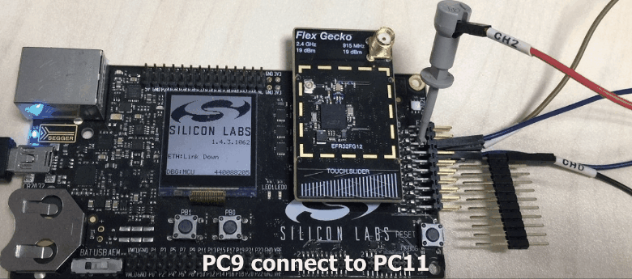
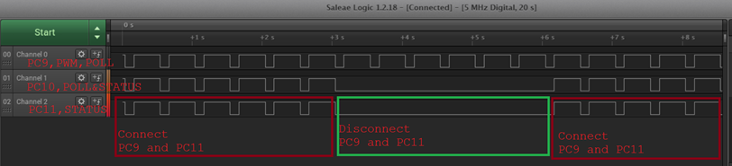

# Sensor activity auto detect in Low Power EM2 Mode #

## Summary ##

This project configures several peripherals to work together in low power EM2 mode, implement sensor activity auto detect. The sensor needs MCU(EFR32 device) output a pluse into it, then it feedback the same plause, if MCU can not catch the feedback status pluse input with in a certain time, it can regard as the sensor is crash or not working. 

Detect block:

  

Working timer in EM2

  

Peripherals in use: LETIMER(PWM), WDT, GPIO(POLL and STATUS), PRS(2 channels).  
Use LETIMER to generate PWM, WDOG for timeout(ERR_DET) checking, here call it ERR_TIMER.  
1. Use timer generate 1 PWM signal,which is EXT_POLL output to external sensor. Also use as PRS CH0's input.								
2. Sensor reply EXT_STATUS use as PRS CH1's input.								
3. Get an AND reflex from CH0 and CH1, we call it "EXT_STATUS & EXT_POLL"
4. "EXT_STATUS & EXT_POLL" on PRS CH0, use for ERR_TIMER clear.								
5. PWM and ERR_TIMER start at the same time.							
6. If sensor response normal, ERR_TIMER interrupt will never trigger, because PRS clear it peroid.	
7. If it trigger it means error, MCU wakeup by interrupt.

Test Result  
Test on BRD4253A, LED1 toggle when wake up, to test EM2 current, please remove LED control in ISR.
- PC9--POLL
- PC10--POLL&STATUS, for test only
- PC11--STATUS.

    

 

  

## Gecko SDK version ##

v2.7

## Hardware Required ##

- One Wireless Starter Kit (WSTK) Mainboard, BRD4001A
<https://www.silabs.com/products/development-tools/wireless/proprietary/slwstk6005a-sub-ghz-bluetooth-multiband-wireless-starter-kit>
- One Radio board, BRD4253A
<https://www.silabs.com/products/development-tools/wireless/proprietary/slwrb4253a-efr32-flex-gecko-915-mhz-radio-board>

## Setup ##

Import the included .sls file to Studio then build and flash the project to the SLSTK3701A STK.
In Simplicity Studio select "File->Import" and navigate to the directory with the .sls project file.
The project is built with relative paths to the STUDIO_SDK_LOC variable which was defined as  
C:\SiliconLabs\SimplicityStudio\v4\developer\sdks\gecko_sdk_suite\v2.7.

## .sls Projects Used ##

mcu_em2_sensor_alive_check.sls

## How to Port to Another Part ##

Open the "Project Properties" and navigate to the "C/C++ Build -> Board/Part/SDK" item.  
Select the new board or part to target and "Apply" the changes.  
Note: there may be dependencies that need to be resolved when changing the target architecture.
