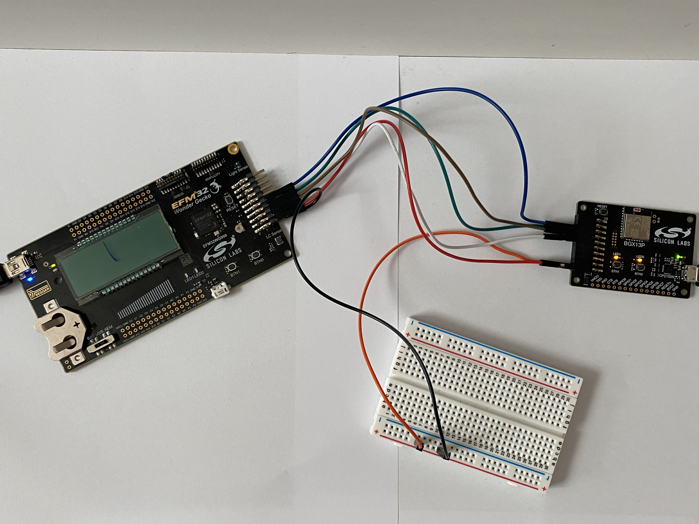

# BGX demo example


## Summary
This project shows how to communicate between the computer and the EFM32WG starter 
kit via Bluetooth using BGX devices. This includes sending certain commands from one
BGX to another to perform certain tasks.

## Gecko SDK Version
v2.7

## Hardware Required

* Board:  Silicon Labs EFM32WG Starter Kit (STK3800)
	* Device: EFM32WG990F256
		* EFM32 UART TX - BGX RXD - EXP Header Pin 4 (PD0)
		* EFM32 UART RX - BGX TXD - EXP Header Pin 6 (PD1)
		* BGX Stream Mode Active - BGX GPIO4 - EXP Header Pin 8 (PD2)
		* BGX Connection Active - BGX GPIO5 - EXP Header Pin 10 (PD3)

## Setup
0. Build the project and download it to the Starter Kit
1. Open a new BGX xpress configurator project in Simplicity Studio/bgx13p22ga.document
2. Paste Simplicity Studio/bgx13p22ga.document into the new project and then hit
   program to device
3. Connect the EFM32 Expansion header pins for the UART TX, UART RX, BGX Stream 
   Mode Active, and BGX Connection Active to the BGX as listed above
4. Additionally connect the EFM32 VMCU and GND pins to the BGX (See the photo 
   below for details)

5. Both LEDs will be on on the BGX connected to the EFM32WG
6. Open Teraterm and connect to the BGX powered by computer
   - Download Tera Term: <https://ttssh2.osdn.jp/index.html.en>
   - Choose Serial and the Port that is for the BGX powered
     by the computer
   - Set the baud rate to 115200 under Setup in Serial Port
   - Make sure to set Receive as CR and Transmit as CR + LF 
     for the New-line under Setup in Terminal
7. Have another BGX connected to EFM32WG powered by the wall
8. Reset both BGX first and then EFM32WG
9. Send commands through the Tera Term

## Commands
1. ```get time```
2. ```turn led off```
3. ```turn led on```

## How the Project Works
The following is the program flow corresponding to the LEDs:
1. Upon reset, both LEDs will be on. Since the board was reset through 
   powering on the board (POR), hitting the reset button (external reset pin), 
   or requesting a system reset (through the debugger), LED0 will be turned on.
2. After the Tera Term is connected to the BGX powered by the computer, ther are
   three commands available to send to the BGX that is connected to the EFM32WG.
3. Get time will get the time the program has been runnning in milliseconds. Turn
   led off will turn off the LED0 and the command turn led on will turn the LED0 on.
4. BGX overview: <https://docs.silabs.com/gecko-os/1/bgx/latest/index>

## .sls Projects Used
* platfrom_BGXdemo_series0.sls

## How to Port to Another Part
Open the "Project Properties" and navigate to the "C/C++ Build -> Board/Part/SDK" 
item. Select the new board or part to target and "Apply" the changes. Note: there 
may be dependencies that need to be resolved when changing the target architecture.

