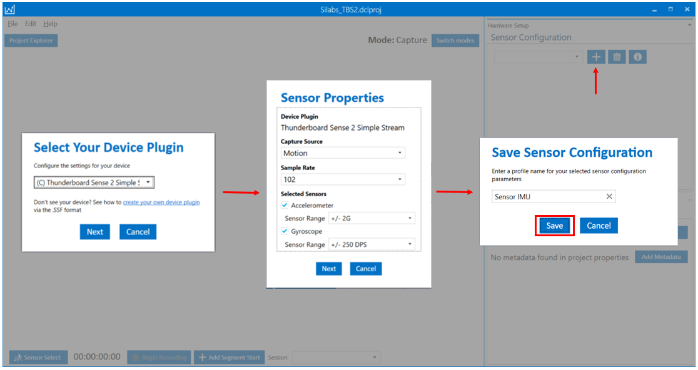
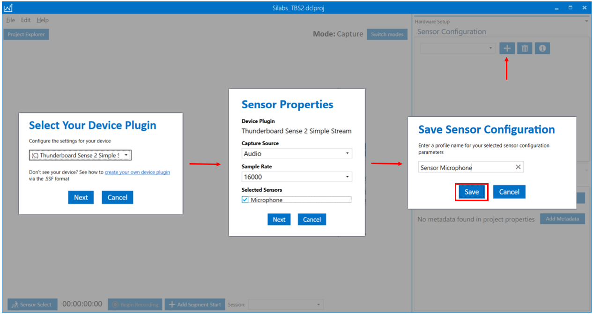
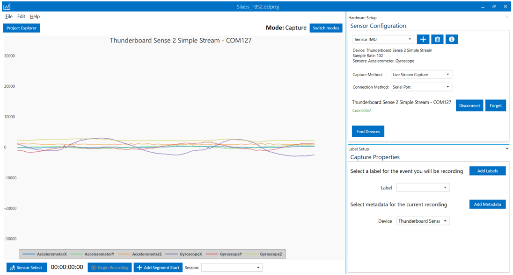

# SensiML Data Capture Examples #

## Summary ##

The projects provided in this repository contain the hard-coded data collection firmware for IMU (3-axis accelerometer and 3-axis gyroscope) and audio (microphone) data acquisition using Silicon Lab's Thunderboard Sense 2 development kit, targeting SensiML's data collection tool called Data Capture Lab (DCL). Both project implementations utilize DCL's lightweight, simple, data streaming protocol to stream live data from the device under test to the data acquisition software.

## Hardware Required ##

- One SLTB004A Thunderboard Sense 2 Development Kit
<https://www.silabs.com/development-tools/thunderboard/thunderboard-sense-two-kit>
- One micro USB cable

## Setup ##

### Device firmware/kit configuration - Simplicity Studio ###

Import the included .sls file to Studio then build and flash the project to the SLTB004A development kit.
In Simplicity Studio select "File->Import" and navigate to the directory with the .sls project file.
The project is built with relative paths to the STUDIO_SDK_LOC variable which was defined as

C:\SiliconLabs\SimplicityStudio\v4\developer\sdks\gecko_sdk_suite\v3.1

In Simplicity Studio, under the Debug Adapters window, right-click on the Thunderboard Sense 2 device and select "Launch console..." from the drop-down menu. In the Adapter Console window, select the "Admin" tab and type "serial vcom config speed 921600" into the terminal input. This will modify the VCOM baudrate to match the application settings. If making any changes to the USART baudrate, the baudrate change must also be modified in the VCOM debug adapter settings.

### SensiML Setup ###

In SensiML's Data Capture Lab (DCL), select Edit > Import Device Plugin... from the main menu. Select the provided \*.ssf in this repository. Next, create a new project, and in project explorer view, switch modes to "Capture".

Under the Hardware Setup window, click the "+" button to add a sensor. Select "(C) Thunderboard Sense 2 Simple Stream" from the drop-down menu. 

For adding the IMU sensor, select "Motion" for the Capture Source drop-down, select the appropriate hard-coded sampling rate (102 is the default configuration in firmware), and enable both Accelerometer and Gyroscope sensor (checkboxes).

For adding the audio sensor, select "Audio" for the Capture Source drop-down, select the appropriate hard-coded sampling rate (16000 is the default configuration in firmware), and enable the microphone sensor (checkbox).

Use the "Find Devices" button to locate the appropriate serial port. Once configured, use the Connect/Disconnect button to begin streaming data.

For more detailed information regarding the SensiML DCL tool, please visit SensiML's Toolkit Documentation located here - <https://sensiml.com/documentation/index.php>

