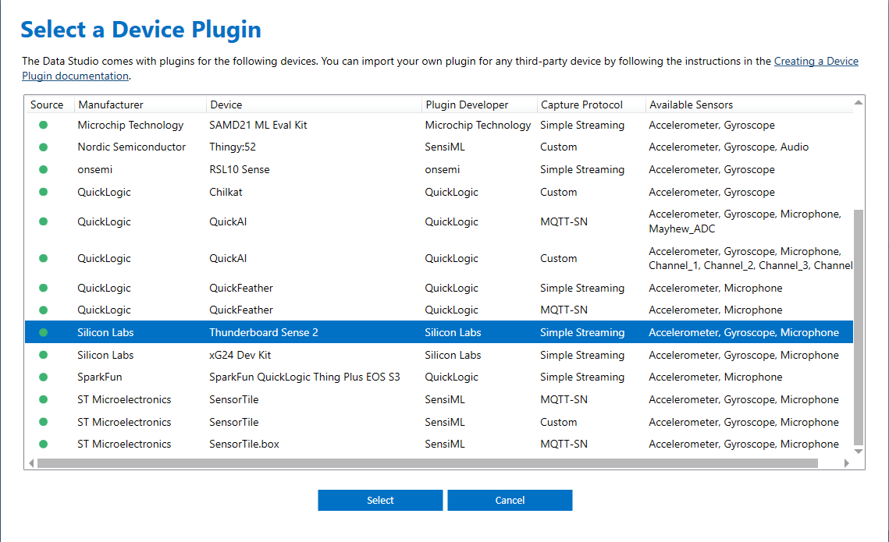
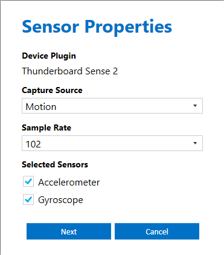
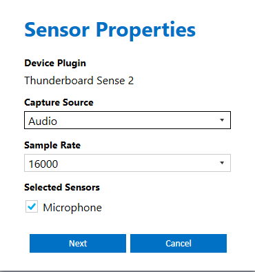

# Platform - SensiML Data Capture #

## Summary ##

The projects provided in this repository contain the hard-coded data collection firmware for IMU (3-axis accelerometer and 3-axis gyroscope) and audio (microphone) data acquisition using Silicon Lab's Thunderboard Sense 2 development kit, targeting SensiML's data collection tool called SensiML Data Studio (SDS). Both project implementations utilize SDS's lightweight, simple, data streaming protocol to stream live data from the device under test to the data acquisition software.

## Hardware Required ##

- Thunderboard Sense 2 Development Kit - SLTB004A

## Connections Required ##

- Connect the Kit to the PC through a micro USB cable.

## Software Required ##

- [SensiML Data Studio](https://sensiml.com/download/)

## Examples ##

| No | Example name | Link to example |
|:--:|:-------------|:---------------:|
| 1 | Platform - SensiML IMU Data Capture | [Click here](./SensiML_IMU/) |
| 2 | Platform - SensiML IMU Data Capture with BLE | [Click here](./SensiML_IMU_BLE/) |
| 3 | Platform - SensiML Microphone Data Capture | [Click here](./SensiML_Microphone/) |

### SensiML Setup ###

- Create a new project, and in the project explorer view, switch modes to "Capture Live Sensor Data..."

- Under the Sensor Configuration window, click the "Next" button. Select "Thunderboard Sense 2" from the Select a Device Plugin window.

  

- For adding the IMU sensor, select "Motion" for the Sensor Properties window, select the appropriate hard-coded sampling rate (102 is the default configuration in firmware), and enable both the Accelerometer and Gyroscope sensor (checkboxes).

  

- For adding the audio sensor, select "Audio" for the Capture Source drop-down, select the appropriate hard-coded sampling rate (16000 is the default configuration in firmware), and enable the microphone sensor (checkbox).

  

- Use the "Scan" button to locate the appropriate serial port. Once configured, use the Connect/Disconnect button to begin streaming data.

For more detailed information regarding the SensiML DCL tool, please visit SensiML's Toolkit Documentation located here - <https://sensiml.com/documentation/index.php>
