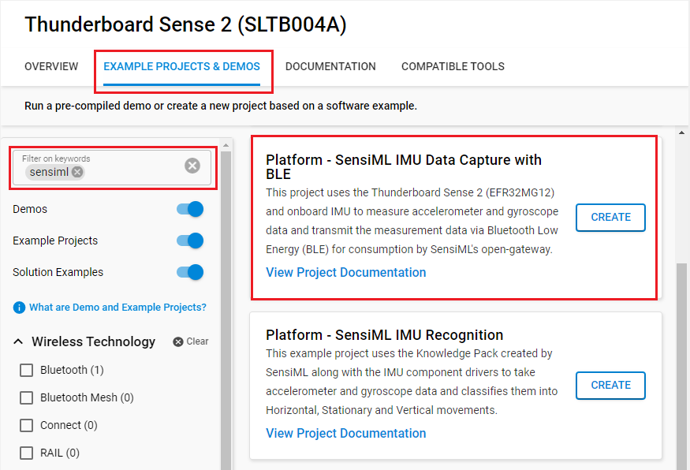
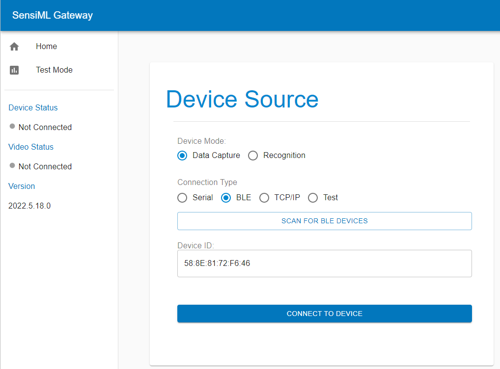
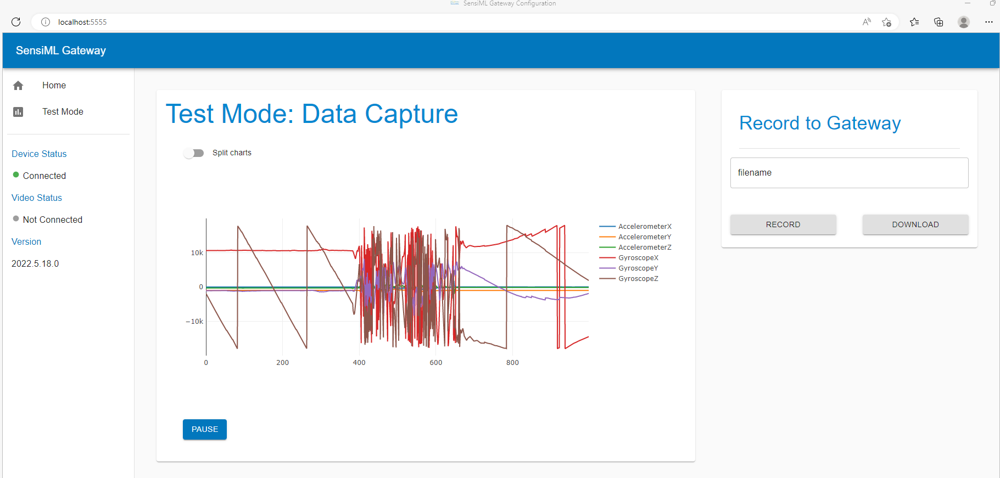

# Platform - SensiML IMU Data Capture with BLE #


## Overview ##

This project uses the Thunderboard Sense 2 (EFR32MG12) and onboard IMU to measure accelerometer and gyroscope data. After that, the measurement data are transmitted via Bluetooth Low Energy (BLE) for consumption by [SensiML Open Gateway](https://github.com/sensiml/open-gateway/). The example project uses Bluetooth services along with IMU component drivers running in a bare-metal configuration. The sensor data output data rate is configured at 102 Hz.

## Gecko SDK version ##

- v4.4.3

## Software Required ##

- [SensiML Open Gateway](https://sensiml.com/download/)

## Hardware Required ##

- Thunderboard Sense 2 Development Kit - SLTB004A

## Connections Required ##

- Connect the Kit to the PC through a micro USB cable.

## Setup ##

To test this application, you can either create a project based on an example project or start with a "Bluetooth - SOC Empty" project based on your hardware.

### Create a project based on an example project ###

1. Make sure that this repository is added to [Preferences > Simplicity Studio > External Repos](https://docs.silabs.com/simplicity-studio-5-users-guide/latest/ss-5-users-guide-about-the-launcher/welcome-and-device-tabs).

2. From the Launcher Home, add your device to My Products, click on it, and click on the **EXAMPLE PROJECTS & DEMOS** tab. Find the example project filtering by **sensiml**.

3. Click **Create** button on the **Platform - SensiML IMU Data Capture with BLE** example. Example project creation dialog pops up -> click Create and Finish and Project should be generated.


4. Build and flash this example to the board.

### Start with a "Bluetooth - SOC Empty" project ###

1. Create a **Bluetooth - SOC Empty** project for your hardware using Simplicity Studio 5.

2. Copy all attached files in *inc* and *src* folders into the project root folder (overwriting existing).

3. Import the GATT configuration:

   - Open the .slcp file in the project.

   - Select the **CONFIGURATION TOOLS** tab and open the **Bluetooth GATT Configurator**.

   - Find the Import button and import the attached **config/btconf/gatt_configuration.btconf** file.

   - Save the GATT configuration (ctrl-s).

4. Open the .slcp file. Select the SOFTWARE COMPONENTS tab and install the software components:

   - [Platform] → [Board Drivers] → [IMU - Inertial Measurement Unit]
   - [Platform] → [Board] → [Board Control] → Active "Enable Inertial Measurement Unit"
   - [Services] → [IO Stream] → [IO Stream: USART] → default instance name: **vcom**
   - [Application] → [Utility] → [Log]

5. Uninstall the software components:

   - [Bluetooth] → [OTA] → [In-Place OTA DFU]
   - [Platform] → [Bootloader] → [Bootloader Application Interface]

6. Build and flash the project to your device.

## How It Works ##

The application uses the process-action bare-metal project configuration model. The application sets the configuration GATT table entry statically in the GATT configuration file

```json
({"sample_rate":102,"samples_per_packet":1,"column_location":{"AccelerometerX":0,"AccelerometerY":1,"AccelerometerZ":2,"GyroscopeX":3,"GyroscopeY":4,"GyroscopeZ":5}});
```

After connecting it the application can receive notifications to transmit "data", which in this case is a single sample of acceleration and orientation data in a 6-dimensional vector.

## Testing ##

To view results over BLE, download and install the [SensiML Open Gateway](https://sensiml.com/download/) application on your PC. Make sure that your PC supports the BLE connection.

- Flash the project to your device.

- Open the SensiML Open Gateway application on your PC. Configure the Gateway to record data from your target sensor. You can scan for devices connected over Serial and BLE.

  

- After fetching the configuration your gateway will connect to the device. When connected you will see a Device: Connected status on the left navigation bar. When connected, the Gateway is able to forward sensor data from the source device to the SensiML Data Capture Lab which is used to record and annotate sensor data.

  
