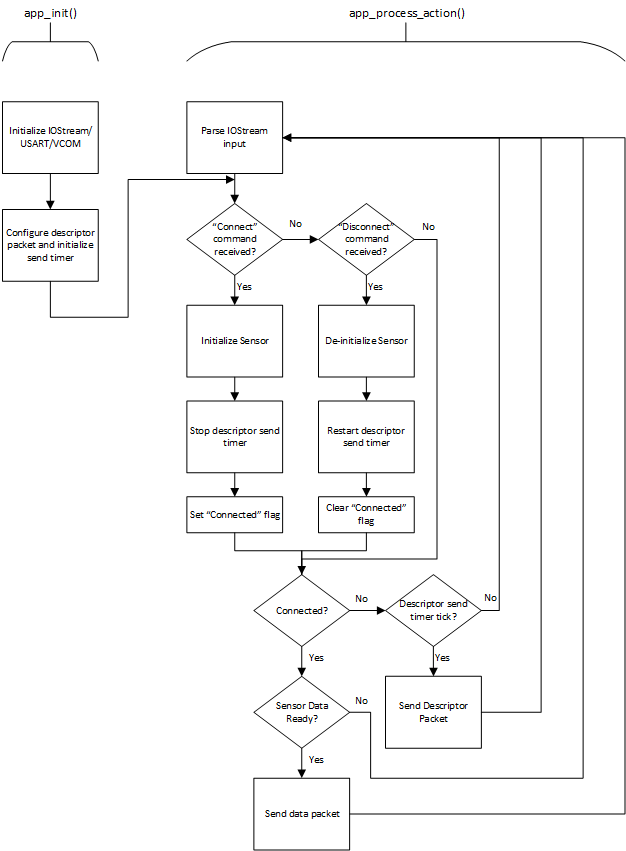

# SensiML Microphone Data Capture Example #

## Summary ##

This project uses the Thunderboard Sense 2 (EFR32MG12) and onboard I2S microphone sensor to take audio measurements and send data via serial UART for consumption by SensiML's Data Capture Lab. The example project uses the I/O Stream service along with Microphone component drivers running in a bare-metal configuration. Sensor data from the I2S Microphone is transferred over virtual COM port (VCOM) at 921600 baud. The sensor data output data rate is configured at 16 kHz.

Software Components used: I2S Microphone, Simple LED, IO Stream: USART, Sleeptimer

## Gecko SDK version ##

v3.1

## Hardware Required ##

- One SLTB004A Thunderboard Sense 2 Development Kit
<https://www.silabs.com/development-tools/thunderboard/thunderboard-sense-two-kit>
- One micro USB cable

## Setup ##

Import the included .sls file to Studio then build and flash the project to the SLTB004A development kit.
In Simplicity Studio select "File->Import" and navigate to the directory with the .sls project file.
The project is built with relative paths to the STUDIO_SDK_LOC variable which was defined as

C:\SiliconLabs\SimplicityStudio\v5\developer\sdks\gecko_sdk_suite\v3.1

In Simplicity Studio, under the Debug Adapters window, right-click on the Thunderboard Sense 2 device and select "Launch console..." from the drop-down menu. In the Adapter Console window, select the "Admin" tab and type "serial vcom config speed 921600" into the terminal input. This will modify the VCOM baudrate to match the application settings. If making any changes to the USART baudrate, the baudrate change must also be modified in the VCOM debug adapter settings.

## How the Project Works ##

The application uses the process-action bare-metal project configuration model. First, the IO Stream/USART are configured for 8 bit, no parity, 1 stop bit, and 921600 baudrate. A periodic sleep timer is also configured with 1 second interrupt. Within the application's process actions, the serial input is monitored for a connection command expected from SensiML's Data Capture Lab (DCL). A JSON configuration packet is sent via USART/VCOM to the PC once per second (via sleep timer) until the connection command is received, at which point the application halts monitoring the serial input and sending configuration information and the I2S Microphone is initialized and audio data sent to PC at the specified data rate (default setting is 16 kHz). The onboard LEDs are also used to indicate that the application is running (blinking green LED at 2 Hz) and when the application is waiting for the connection command (solid red LED). Once connected, the red LED will turn off. Upon disconnecting from SensiML, the red LED will be turned on again and the device will resume sending configuration packets. The device can be reconnected without a reset. 

The output data rate is hard-coded in the application in "app_voice.c" defined as VOICE_SAMPLE_RATE_DEFAULT (line 32) using the enumeration "sample_rate_t" found in "app_voice.h" starting at line 23. Two data rates are available, 8 KHz and 16 kHz (default setting).

The sensor sampling rate can be modified by changing the #define VOICE_SAMPLE_RATE_DEFAULT in the source. When doing so, it is important for the user to also configure/re-configure the sensor settings within SensiML's Data Capture Lab to reflect these changes. The configurations must match for the data acquisition to operate correctly. 

## .sls Projects Used ##

SensiML_Microphone_data_capture.sls

## How to Port to Another Part ##

Open the "Project Properties" and navigate to the "C/C++ Build -> Board/Part/SDK" item.  Select the new board or part to target and "Apply" the changes.  Note: there may be dependencies that need to be resolved when changing the target architecture.

## Known issue ##

When connected to the Data Capture Lab, if the device is used to record data for a long period of time, noise can be introduced into the audio data. This is being investigated internally. 