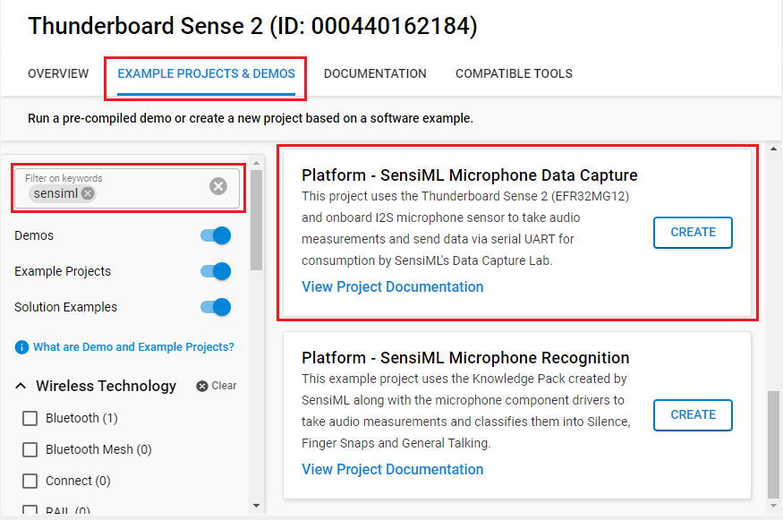
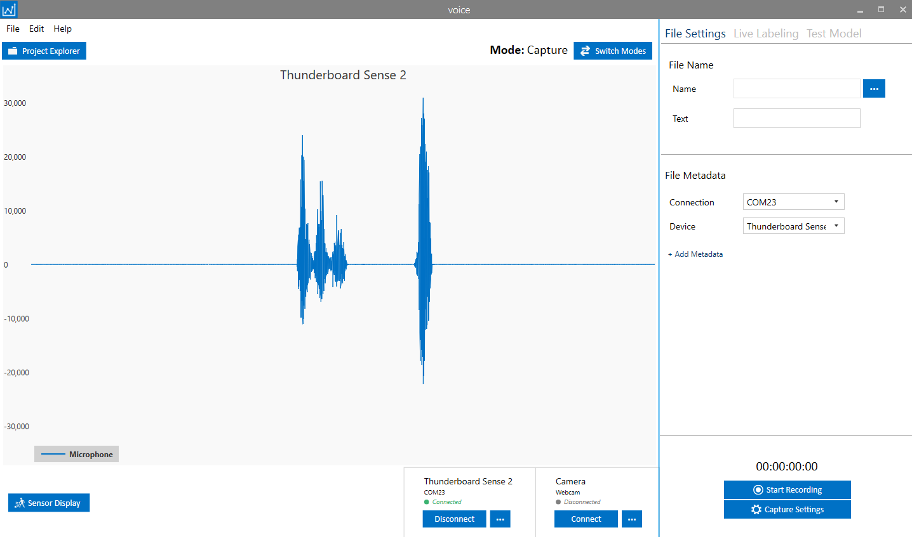

# Platform - SensiML Microphone Data Capture #

## Overview ##

This project uses the Thunderboard Sense 2 (EFR32MG12) and onboard I2S microphone sensor to take audio measurements and send data via serial UART for consumption by the SensiML Data Studio application. The example project uses the I/O Stream service along with Microphone component drivers running in a bare-metal configuration. Sensor data from the I2S Microphone is transferred over a virtual COM port (VCOM) at 921600 baud. The sensor data output data rate is configured at 16 kHz.

## Gecko SDK version ##

- v4.4.3

## Software Required ##

- [SensiML Data Studio](https://sensiml.com/download/)

## Hardware Required ##

- Thunderboard Sense 2 Development Kit - SLTB004A

## Connections Required ##

- Connect the Kit to the PC through a micro USB cable.

## Setup ##

To test this application, you can either create a project based on an example project or start with an "Empty C Project" project based on your hardware.

### Create a project based on an example project ###

1. Make sure that this repository is added to [Preferences > Simplicity Studio > External Repos](https://docs.silabs.com/simplicity-studio-5-users-guide/latest/ss-5-users-guide-about-the-launcher/welcome-and-device-tabs).

2. From the Launcher Home, add your device to My Products, click on it, and click on the **EXAMPLE PROJECTS & DEMOS** tab. Find the example project filtering by **sensiml**.

3. Click **Create** button on the **Platform - SensiML Microphone Data Capture** example. Example project creation dialog pops up -> click Create and Finish and Project should be generated.

4. Build and flash this example to the board.

**Note:**

- Make sure that this repository is added to [Preferences > Simplicity Studio > External Repos](https://docs.silabs.com/simplicity-studio-5-users-guide/latest/ss-5-users-guide-about-the-launcher/welcome-and-device-tabs).

### Start with an "Empty C Project" project ###

1. Create an **Empty C Project** project for your hardware using Simplicity Studio 5.

2. Copy all attached files in *inc* and *src* folders into the project root folder (overwriting existing).

3. Open the .slcp file. Select the SOFTWARE COMPONENTS tab and install the software components:

   - [Platform] → [Driver] → [LED] → [Simple LED] → default instance name: **led0** and **led1**.
   - [Platform] → [Board Drivers] → [I2S Microphone]
   - [Platform] → [Board] → [Board Control] → Active "Enable Microphone"
   - [Application] → [Utility] → [Assert]
   - [Services] → [Timers] → [Sleep Timer]
   - [Services] → [IO Stream] → [IO Stream: USART] → default instance name: **vcom** → Set Baud rate to 921600
   - [Services] → [IO Stream] → [IO Stream: Retarget STDIO]
   - [Third Party] → [Tiny printf]

4. Build and flash the project to your device.

## How It Works ##

The application uses the process-action bare-metal project configuration model.

- First, the IO Stream/USART is configured for 8-bit, no parity, 1 stop bit, and 921600 baud rate. A periodic sleep timer is also configured with a 1-second interrupt.
- Within the application's process actions, the serial input is monitored for a connection command expected from SensiML Data Studio. A JSON configuration packet is sent via USART/VCOM to the PC once per second (via sleep timer) until the connection command is received, at which point the application halts monitoring the serial input and sending configuration information and the I2S Microphone is initialized and audio data sent to PC at the specified data rate (default setting is 16 kHz).
- The onboard LEDs are also used to indicate that the application is running (blinking green LED at 2 Hz) and when the application is waiting for the connection command (solid red LED). Once connected, the red LED will turn off. Upon disconnecting from SensiML Data Studio, the red LED will be turned on again and the device will resume sending configuration packets. The device can be reconnected without a reset.

The output data rate is hard-coded in the application in "app_voice.c" defined as VOICE_SAMPLE_RATE_DEFAULT (line 32) using the enumeration "sample_rate_t" found in "app_voice.h" starting at line 23. Two data rates are available, 8 KHz and 16 kHz (default setting).

The sensor sampling rate can be modified by changing the #define VOICE_SAMPLE_RATE_DEFAULT in the source. When doing so, it is important for the user to also configure/re-configure the sensor settings within SensiML Data Studio to reflect these changes. The configurations must match for the data acquisition to operate correctly.

## Testing ##

- Flash the project to your device. Make sure that the Thunderboard Sense 2 board is configured to change VCOM baud rate to 921600. For more detail, see [initial setup for flashing](https://sensiml.com/documentation/firmware/silicon-labs-thunderboard-sense-2/silicon-labs-thunderboard-sense-2.html#initial-setup-for-flashing).
- On your PC, run the SensiML Data Studio application. Connect to the Thunderboard Sense 2 board. You should expect a similar output to the one below.

## Known issue ##

When connected to the Data Studio, if the device is used to record data for a long period of time, noise can be introduced into the audio data. This is being investigated internally.
