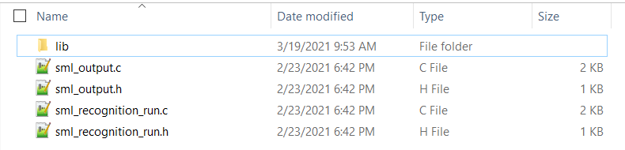

# SensiML Recognition Examples #


## Summary ##

The projects provided in this repository contain the recognition firmware for IMU (3-axis accelerometer and 3-axis gyroscope) to detect stationary, horizontal and vertical movements and audio (microphone) to detect silence, fingers snapping and general talking using Silicon Lab's Thunderboard Sense 2 development kit. Both project implementations utilize pre-built models through SensiML's Knowledge Packs.

## Hardware Required ##

- One SLTB004A Thunderboard Sense 2 Development Kit
<https://www.silabs.com/development-tools/thunderboard/thunderboard-sense-two-kit>
- One micro USB cable

## Setup ##

### Device firmware/kit configuration - Simplicity Studio ###

Import the included .sls file to Studio then build and flash the project to the SLTB004A development kit.
In Simplicity Studio select "File->Import" and navigate to the directory with the .sls project file.
The project is built with relative paths to the STUDIO_SDK_LOC variable which was defined as

C:\SiliconLabs\SimplicityStudio\v4\developer\sdks\gecko_sdk_suite\v3.1

### SensiML Setup ###

The model that gets generated by SensiML for an embedded device is called a Knowledge Pack. The Knowledge Pack for the IMU sensor contains the device firmware code for predicting horizontal, vertical and stationary motion and is incorporated into a Simplicity Studio V5 application. This will be flashed to the Thunderboard Sense 2 device.
The library version of the SensiML Knowledge Pack allows users to integrate Knowledge Pack APIs into an embedded application at the firmware level. 

The zipped library file has a structure as shown below:



The knowledgepack folder contains both the library and full example code for running Recognition on the device. Regardless of the platform being used for development, these steps should be followed:

1. Unzip the folder containing the knowledgepack
2. Copy the unzipped directory <project name>/knowledgepack to a chosen location
3. Set up Simplicity Studio V5 IDE 
4. Add in library calls to the code 

> **Note:** The two recognition examples already come with linked Knowledge Packs, so no further action needs to be taken by the user. The section below provides general instructions on incorporating Knowledge Packs into a Simplicity Studio V5 project. 

### Simplicity Studio V5 IDE Setup ###

Simplicity Studio V5 projects can link the SensiML library file fairly easily. The following steps should be followed to link a Knowledge Pack Library into Simplicity Studio V5. 

#### Setting up the Simpicity Studio V5 Project ####

Right click on the project and go to **Properties.** From there go to **C/C++ Build** → **Settings**:


#### Adding the Library ####

Go to **GNU ARM C Linker** → **Libraries**. Link the sensiml and math (m) libraries and include the sensi ml folder in the search path for the linker. 


#### Adding Include Directories ####

Click on **GNU ARM C Compiler** → **Includes**. Click "**Add**" (green below) and add the location of the knowledge pack directory:


#### Calling Knowledge Pack APIs from your code #### 

Most modern linker applications will not link the library until a call is made to a function within the library. This should be done within the application. 

##### Adding the header include #####

First, include kb.h and kb_defines.h in app.c. 

```
//SensiML Includes
#include "kb.h"
#include "kb_defines.h"
```

##### Initialize the model(s) #####

Initialization must be done once, even if there are multiple models in the Knowledge Pack. In app.c, this is done in app_init() with kb_model_init().

```
void app_init(void)
{
  app_iostream_usart_init();
  app_led_init();

  // Initialize Knowledge Pack Model
  kb_model_init();

  app_sensor_imu_init();
  app_sensor_imu_enable(true);

}
```

Once this call is added, the project can be compiled to see the RAM/Stack Usage, as the library will be linked in at this point. 

##### Running the Model for Classification #####

This example uses the default single-layer Knowledge Pack from SensiML. In app_sensor_imu.c/app_voice.c, sml_recognition_run() is called to run recognition on the model created. 
```
void app_sensor_imu_process_action(void)
{
  sl_status_t sc;

  sc = app_sensor_imu_get(&data[APP_IMU_AXES_PER_SENSOR], data);
  if(sc == SL_STATUS_OK)
  {
      sml_recognition_run(data, 1, 6, 1);
  }
}
```

Within sml_recognition_run() API, there are three key items to take away (refer to sml_recognition_run.c) -
```
ret = kb_run_model((SENSOR_DATA_T *)data, num_sensors, KB_MODEL_slide_simple_rank_0_INDEX);
```
This is the call to pass a single sample of data to the model. The model will take care of any segmentation and feature extraction/classification from there. 
```
if (ret >= 0)
```
If the return value from kb_run_model is greater than or equal to zero, the model has received a classification. 0 means Unknown. Above zero pertains to the class map seen when running SensiML Analytics Studio:
```
sml_output_results(KB_MODEL_slide_simple_rank_0_INDEX, ret);
```
In this example, the classification results are sent to the serial terminal. The user can change this to decide how to handle the output from the classifier.
```
kb_reset_model(KB_MODEL_rank_0_INDEX);
```
After a classification is completed, the model needs to be reset. This essentially sets it back to its initialized state, and gets the model ready for classifying the next event the device may be experiencing.

>Note: The files sml_recognition_run.c/.h and sml_output.c/.h are generated along with the model. A user model, if created, will be replacing these files. The files allow for multi-layer models, single-layer models and other model types. 

For more information about Knowledge Packs, refer to https://sensiml.com/documentation/knowledge-packs/index.html. 