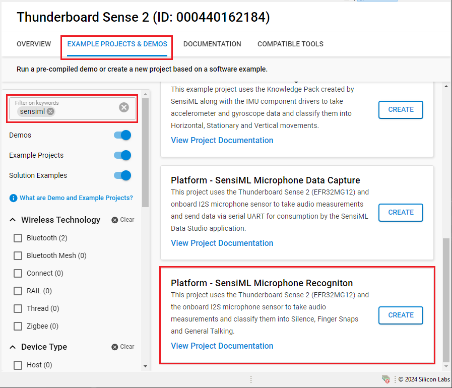
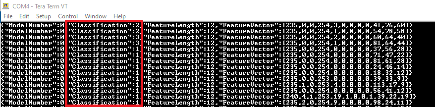

# Platform - SensiML Microphone Recognition #

## Overview ##

This project uses the Thunderboard Sense 2 (EFR32MG12) and the onboard I2S microphone sensor to take audio measurements and classify them into Silence, Finger Snaps and General Talking. This example project uses the Knowledge Pack created by SensiML along with the microphone component drivers running in a bare-metal configuration. The sensor data output is passed to the Machine Learning model created using SensiML's analytics studio, which is downloaded as a Knowledge Pack and incorporated into a Simplicity Studio V5 project to run inferences on the Thunderboard Sense 2.

For more on Knowledge Packs, see the [Knowledge Pack](https://sensiml.com/documentation/knowledge-packs/index.html) documentation.

## Gecko SDK version ##

- v4.4.3

## Hardware Required ##

- Thunderboard Sense 2 Development Kit - SLTB004A

## Connections Required ##

- Connect the Kit to the PC through a micro USB cable.

## Setup ##

To test this application, you can either create a project based on an example project or start with an "Empty C Project" project based on your hardware.

### Create a project based on an example project ###

1. Make sure that this repository is added to [Preferences > Simplicity Studio > External Repos](https://docs.silabs.com/simplicity-studio-5-users-guide/latest/ss-5-users-guide-about-the-launcher/welcome-and-device-tabs).

2. From the Launcher Home, add your device to My Products, click on it, and click on the **EXAMPLE PROJECTS & DEMOS** tab. Find the example project filtering by **sensiml**.

3. Click the **Create** button on the **Platform - SensiML Microphone Recognition** example. Example project creation dialog pops up -> click **Finish** and Project should be generated.

   

4. Build and flash this example to the board.

### Start with an "Empty C Project" project ###

1. Create an **Empty C Project** project for your hardware using Simplicity Studio 5.

2. Copy all attached files in *inc* and *src* folders into the project root folder (overwriting existing).

3. Copy the `knowledgepack` (located in the SimplicityStudio folder) into the project root folder. Link the SensiML library to the project. See [Simplicity Studio Setup](https://github.com/SiliconLabs/platform_applications/tree/master/platform_SensiML/platform_SensiML_Recognition#simplicity-studio-setup) for details.

4. Open the .slcp file. Select the SOFTWARE COMPONENTS tab and install the software components:

   - [Platform] → [Driver] → [LED] → [Simple LED] → default instance name: **led0** and **led1**.
   - [Platform] → [Board Drivers] → [I2S Microphone]
   - [Platform] → [Board] → [Board Control] → Active "Enable Microphone"
   - [Application] → [Utility] → [Assert]
   - [Services] → [Timers] → [Sleep Timer]
   - [Services] → [IO Stream] → [IO Stream: USART] → default instance name: **vcom**
   - [Services] → [IO Stream] → [IO Stream: Retarget STDIO]
   - [Third Party] → [Tiny printf]

5. Build and flash the project to your device.

## How It Works ##

The application uses the process-action bare-metal project configuration model. Running a Machine Learning model on an embedded device such as the Thunderboard Sense 2 can be very broadly classified into three steps.

- Step 1: Data collection and labeling which is covered in the Microphone Data Capture project.
- Step 2: This labeled data is then passed on to SensiML's Analytics Studio to design a machine learning model based on the end goal (i.e., classify audio). For inference to run on an embedded device, a Machine Learning model should be created and converted to an embedded device-friendly version and flashed to the device. The Machine Learning model is created, trained and tested in SensiML's Analytics Studio. The model that gets generated for the Thunderboard Sense 2 device is called a KnowledgePack. Going into the details of this process is beyond the scope of this readme, but for more information, refer to [SensiML's Analytics Studio](https://sensiml.com/documentation/guides/getting-started/analytics-studio.html) documentation.
- Step 3:  The KnowledgePack can be downloaded as a library and incorporated into an embedded firmware application. The application can then be flashed onto the device. The model will run on the Thunderboard Sense 2 and can classify incoming voice data based on the labels created in Steps 1 and 2. This project showcases step 3.

## Testing ##

This project detects and classifies three types of audio sounds:

- *Silence (Classification: 1)*
- *Finger Snaps (Classification: 2)*
- *General Talking (Classification: 3)*

The data obtained from the Microphone sensor is passed onto SensiML's Knowledge Pack which then classifies the audio. The classification output can be viewed on a serial terminal as shown in the image below.

