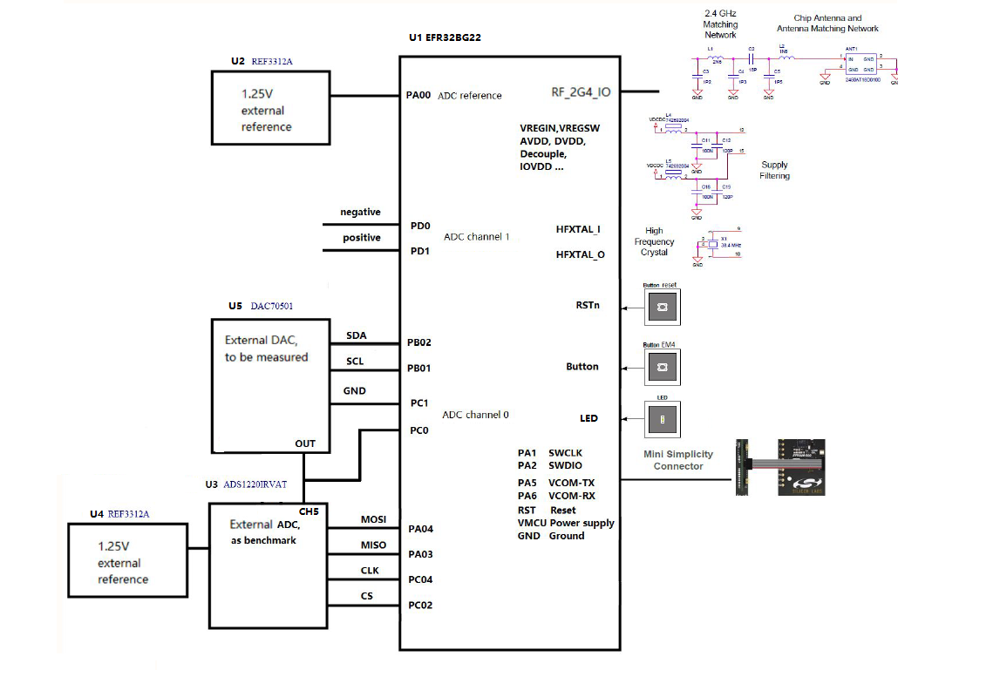
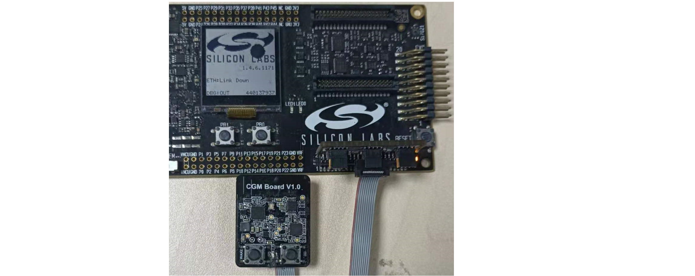
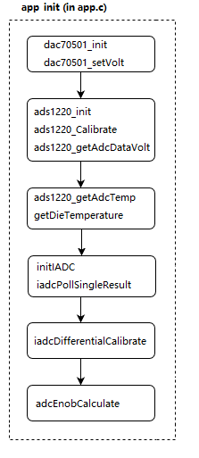

# EFR32BG22 IADC 16-bit ENOB #

## Description ##

The [EFR32BG22](https://www.silabs.com/documents/public/data-sheets/efr32bg22-datasheet.pdf) (Wireless Gecko **Series 2**) **IADC** is an intermediate architecture combining techniques from both **Successive Approximation Register (SAR)** and **Delta-Sigma (ΔΣ)** style converters.

The flexible incremental architecture uses **oversampling** to allow applications to trade speed for **higher resolution**.

- 1 Msps with oversampling ratio = 2
- 76.9 ksps with oversampling ratio = 32

This example discusses how to attain 14.3-bit **ENOB** with **oversampling**. It also covers offset and gain **calibration** of the IADC with **external reference**.

The ENOB is calculated based on the **formula** below:  
  
The BGM board has precision voltage reference and ADC to evaluate the ADC performance on EFR32BG22.
**Key points** to attain 14.3 bit ENOB:

- **Differential** mode input
- External **reference**
- 32+ **oversample** rate

**Peripherals used**: IADC, GPIO, I2C, USART, EMU, CMU

## Gecko SDK Suite version ##

- **Gecko SDK Suite** v4.0.1
- MCU v6.2.1.0
- Bluetooth v3.3.1

## Hardware Required ##

- One WSTK [**mainboard**](https://www.silabs.com/development-tools/wireless/wireless-starter-kit-mainboard)
- One [**bgm board**](doc/CGM-Board_Schematic.pdf)

- One [**BRD8010A**](https://www.silabs.com/development-tools/mcu/32-bit/simplicity-debug-adapter) (bgm board is a proprietary board and was not available to order).

- The bgm board includes: 
  - TI 14-bit Voltage-Output DAC [DAC70501](https://www.ti.com/lit/ds/symlink/dac70501.pdf)
  - TI 24-bit Low Power Delta-sigma ADC [ADS1220](https://www.ti.com/lit/ds/symlink/ads1220.pdf)
  - 2 TI Low Drift Voltage Reference [REF3312s](https://www.ti.com/lit/pdf/sbos392)
  - Silabs [EFR32BG22](https://www.silabs.com/documents/public/data-sheets/efr32bg22-datasheet.pdf)

## Connections Required ##
Connect the bgm board via a micro-USB cable to your PC via WSTK mainboard to flash the example.

## Setup ##

**Connect** the [**bgm board**](doc/CGM-Board_Schematic.pdf) to the WSTK [**mainboard**](https://www.silabs.com/development-tools/wireless/wireless-starter-kit-mainboard) via the 10 pin [**Mini Simplicity Debug Adapter brd8010a**](https://www.silabs.com/development-tools/mcu/32-bit/simplicity-debug-adapter), and connect the WSTK **mainboard** to the **PC** via the **mini USB** connector.

- Set the **Debug Mode** as **External Device (OUT)** in Simplicity Studio **Launcher->Overview->General Information->Debug mode**.
- Set **Target part** in Simplicity Studio **Launcher->Debug Adapter->Device Configuration->Device hardware** as EFR32BG22C224F512IM32.
- Read the **Secure FW** version in **Launcher->Overview->General Information->Secure FW**.
- Flash the **bootloader** first via [**Simplicity Commander**](https://www.silabs.com/developers/mcu-programming-options) or **Flash Programmer** integrated in Simplicity Studio.
- You can get the [bootloader file](doc/bootloader-storage-internal-single-512k.s37) in doc folder of this project.

The final **connections** should look like the one in the picture below:


## Hardware ##

The bgm board schematic is [here](doc/CGM-Board_Schematic.pdf).

### Pins Function Map ###

| EFR32BG22 | Net Name   | Function        |
|-----------|------------|-----------------|
| PA0       | SoC_Vref   | ADC reference   |
| PD0       | ADC_N1     | ADC Pos reserved|
| PD1       | ADC_P1     | ADC Neg reserved|
| PC0       | ADC_P0     | ADC Pos input   |
| PC1       | GND        | ADC Neg input   |
| PA3       | SPI_MISO   | SPI/USART0 MISO |
| PA4       | SPI_MOSI   | SPI/USART0 MOSI |
| PC4       | SPI_CLK    | SPI/USART0 CLK  |
| PC2       | SPI_CS     | SPI/USART0 CS   |
| PA5       | VCOM_TX    | USART1 TX       |
| PA6       | VCOM_RX    | USART1 RX       |
| PB1       | SCL        | I2C0 Clock      |
| PB2       | SDA        | I2C0 Data       |
| PC5       | BTN_EM4    | button          |
| PC3       | LED_EN     | LED             |
| PB0       | ISR        | reserved        |

## How It Works ##

### Memory Layout ###

bootloader + application + nvm3 + lock bits(manufacturing token region)  
```
|--------------------------------------------|
|                 lock bits (8k)             |
|--------------------------------------------|
|                      nvm3 (24k)            |
|--------------------------------------------|
|              application (296k)            |
|--------------------------------------------|
|                bootloader (24k)            |
|--------------------------------------------|
```

### Software Workflow ###



## API Overview ##

**General**:
| API                                   | Comment |
|---------------------------------------|---------------------------------------|
| void initLetimer(void);               | init LETIMER for delays               |
| void letimerDelay(uint32_t msec);     | simple delay                          |
| void initButtonEM2(void);             | button in EM2                         |
| void lightLED(uint8_t onoff)          | LED on/ off                           |
| float getDieTemperature(void);        | get bg22 emu die temperature          |
| double rmsCal(double buffer[], double adcAve);  | rms calculation             |

**dac70501**:
| API                                             | Comment                                           |
|-------------------------------------------------|---------------------------------------------------|
| uint16_t dac70501_init(void);                   | dac70501 initialization                           |
| float dac70501_readRef(void);                   | dac70501 voltage read                             |
| uint16_t dac70501_setRef(uint8_t dacValueHigh, uint8_t dacValueLow); | dac70501 output register set |
| uint16_t dac70501_setVolt(float voltValue);     | dac70501 voltage set (in V unit)                  |
| uint16_t dac070501_powerDown(uint8_t dac_pwdwn, uint8_t ref_pwdwn); | dac70501 power down           |
| uint16_t dac70501_reStart(void);                | dac70501 power up (restart)                       |

**ads1220**:
| API                                             | Comment                      |
|-------------------------------------------------|------------------------------|
| uint32_t ads1220_init(void);                    | ads1220 initialization       |
| double ads1220_getAdcTemp(void);                | ads1220 get temperature      |
| double ads1220_getAdcDataVolt(void);            | ads1220 get voltage          |
| void ads1220_Calibrate(void);                   | ads1220 calibration          |
| void ads1220_powerDown(void);                   | ads1220 power down           |

**efr32bg22 adc**:
| API                                             | Comment                      |
|-------------------------------------------------|------------------------------|
| void resetIADC(void);                           | bg22 iadc reset              |
| void rescaleIADC(uint32_t newScale);            | bg22 iadc rescale            |
| void initIADC(void);                            | bg22 iadc initialization     |
| void bg22SaveCalData(uint32_t scale);           | bg22 iadc cal data save      |
| void bg22RestoreCalData(void);                  | bg22 iadc cal data restore   |
| double iadcPollSingleResult(void);              | bg22 iadc voltage polling    |
| uint32_t iadcDifferentialCalibrate();           | bg22 iadc calibration        |

**variables**:
| variable                                        | Comment                      |
|-------------------------------------------------|------------------------------|
| double buffer[ADC_BUFFER_SIZE];                 | buffer to save adc data      |
| double adcGainResult;                           | adc gain cal result          |
| double adcOffsetresult;                         | adc offset cal result        |
| double adcEnobResult;                           | adc enob result              |

## Power Consumption ##

| Components(Peripheral) | Power Up       | Power Down       | Comment         |
|------------------------|----------------|------------------|-----------------|
| REF3312                | 4.9uA          | -                | ADC reference   |
| DAC70501               | 1.05mA         | 15uA             | ADC input       |
| ADS1220                | 15uA           | -                | External ADC    |
| REF3312                | 150uA          | 3uA              | EFR32BG22 IADC reference |

## .sls Projects Used ##

[platform_adc_enob.sls](SimplicityStudio/platform_adc_enob.sls)

## Steps to Create the Project ##
**Option 1 (Start from an empty prject)**
- Add **EFR32BG22C224F512IM32** in **Launcher->My Products** and **select** it.
- Start with **Bluetooth - SoC Empty project**, rename the project as **platform_adc_enob**.
- Check **With project files:->Link sdk and copy project sources**.
- Open the .slcp file, add software component **Services->IO Stream->IO Stream: USART**, also configure it.
- Add component **platform->peripheral->i2c**
- Add component **platform->peripheral->letimer**
- Add component **platform->peripheral->iadc**
- Add component **application->utility->log**
- Add folder **inc** and **src**.
- **Drag** the source and header files into the folder.
- Add the inc path **Project Explorer->Properties->C/C++ Build->Settings->Tool Settings->GNU ARC C Compile->Includes->Include paths**.
- **Replace** the **app.c**

**Options 2 (Import the sls file)**
 - In Simplicity Studio select **File->Import** and **navigate** to the directory with the **.sls** project file.
 - Import the included **.sls** file to **Simplicity Studio**. 
 - Then **build** and **flash** the project to the bgm board.
 - The project is built with **relative paths** to the STUDIO_SDK_LOC variable which was defined as C:\Users\user_name\SimplicityStudio\SDKs\gecko_sdk

## How to Port to Another Part ##

In Simplicity Studio IDE perspective, open the **Project Explorer->Properties** and navigate to the **C/C++ Build -> Board/Part/SDK** item. Select the new **Board** or **Part** to target and **Apply** the changes.  
**Note**:

- There may be **dependencies** that need to be resolved when changing the target architecture.
- **ONLY** EFR32/EFM32 S2 support this 16-bit ENOB.

## How to Test ##

- **Run** the code in EFR32BG22.
- **Open** a terminal applicatin and observe if the data printed is expected. 
- An example log file is [app_log.txt](doc/app_log.txt).

## Known **Issues** ##

- **PTI** not used
- PC05 use as button (on port **C/D**), not support by the **simple button** component in EM2.

## Reference ##

- DAC70501 [data sheet](https://www.ti.com/lit/ds/symlink/dac70501.pdf)
- ADS1220 [data sheet](https://www.ti.com/lit/ds/symlink/ads1220.pdf)
- REF3312 [data sheet](https://www.ti.com/lit/pdf/sbos392)
- EFR32BG22 [reference manual](https://www.silabs.com/documents/public/reference-manuals/efr32xg22-rm.pdf)
- EFR32BG22 [data sheet](https://www.silabs.com/documents/public/data-sheets/efr32bg22-datasheet.pdf)
- AN1189: Incremental Analog to Digital Converter [(IADC)](https://www.silabs.com/documents/public/application-notes/an1189-efr32-iadc.pdf)
- ENOB [calculation](https://www.tij.co.jp/lit/ug/tiduda7/tiduda7.pdf?ts=1630225963102&ref_url=https%253A%252F%252Fwww.google.com%252F)
