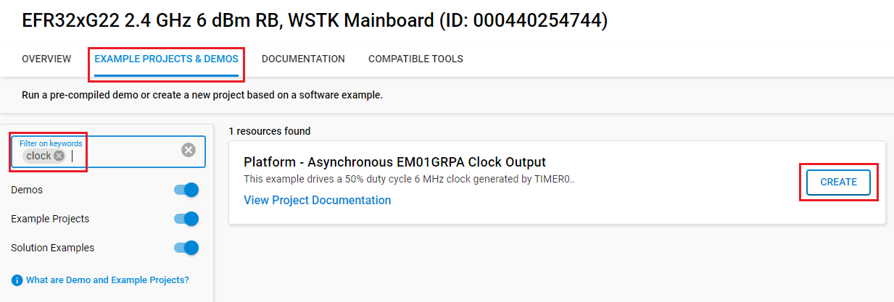

# Platform - Asynchronous EM01GRPA Clock Output


## Summary

This example drives a 50% duty cycle 6 MHz clock generated by TIMER0 on PA6 (expansion header pin 14). The DPLL is set to run at 36 MHz for this purpose. By default, the EM01GRPACLK is sourced from the DPLL and certain peripherals also either run from or default to this clock, namely the TIMERs, EUART, and IADC.

Modules used: CMU, EMU, GPIO, and TIMER0.

## Gecko SDK version

- v4.4.3

## Hardware Required

- [EFR32xG22 Wireless Gecko 2.4 GHz +6 dBm](https://www.silabs.com/development-tools/wireless/slwrb4182a-efr32xg22-wireless-gecko-radio-board)

- Wireless Starter Kit Mainboard

## Connections Required

- Connect the radio board to the WSTK, and connect the WSTK via a micro-USB cable to your PC.

## Setup

To test this application, you can either create a project based on an example project or start with an empty example project.

### Create a project based on an example project

1. Make sure that this repository is added to [Preferences > Simplicity Studio > External Repos](https://docs.silabs.com/simplicity-studio-5-users-guide/latest/ss-5-users-guide-about-the-launcher/welcome-and-device-tabs).

2. From the Launcher Home, add your board to My Products, click on it, and click on the **EXAMPLE PROJECTS & DEMOS** tab. Find the example project filtering by **clock**.

3. Click the **Create** button on the **Platform - Asynchronous EM01GRPA Clock Output** example. Example project creation dialog pops up -> click **Finish** and Project should be generated.

    

4. Build and flash this example to the board.

### Start with an empty example project

1. Create an **Empty C Project** project for your hardware using Simplicity Studio 5.

2. Copy all attached files in the **inc** and **src** folders into the project root folder (overwriting existing file).

3. Open the .slcp file. Select the SOFTWARE COMPONENTS tab and install the software components:

    - [Platform] → [Peripheral] → [TIMER]

4. Build and flash the project to your device.

## How It Works

EFR32xG22 devices (and modules based on the EFR32xG22) have the ability to run some parts of the system asynchronously to the SYSCLK, which is the root high frequency clock, from which all other high-frequency clocks are or can be derived. A key benefit of this arrangement is that things like the TIMERs or IADC can run at an application-specific frequency without impacting the operation of radio, which must always be clocked from the HFXO at 38.4 MHz.

The idea behind this particular example was a customer requirement to provide a 6 MHz CMOS clock output that could serve as the clock source for a companion MCU to the EFR32BG22C112, a cost-optimized member of the EFR32xG22 family that is limited to operation at at maximum of 38.4 MHz.

It would be a simple matter to generate 6 MHz with the DPLL and output this directly to one of the three CMU_CLKOUT[2:0] outputs via the relevant bit fields in the CMU_EXPORTCLKCTRL and GPIO_CMU_CLKOUTnROUTE control registers.

However, the downside of doing this is that there is no way to control the state of the DPLL-driven clock output. When the EFR32xG22 enters EM2, the selected CMU_CLKOUTn stops. Upon exit from EM2, CMU_CLKOUTn drives the unstable output of the DPLL without qualification, and this might be problematic for whatever device needs to use it as a clock.

Using a TIMER to generate the clock has the distinct advantage of providing a software mechanism to not only start and stop the clock but to stop it in a known state. This is particularly important when using the clock for an external processor as stopping/restarting the clock in an unknown state (or out of specification as could happen if the HFRCODPLL output is used directly) might lead to incorrect operation of the device. 

The code flow is as follows:
````  
  initClocks();

  initPB0();

  initTIMER0(&clockState);

  EMU_EM23Init_TypeDef emu23init = EMU_EM23INIT_DEFAULT;
  EMU_EM23Init(&emu23init);
````

1. Initialize clocks.

    This is where the DPLL is configured to run at some multiple of the desired clock output frequency. The HFXO is started first, as it is selected as the source of the SYSCLK and also used as the reference for the DPLL.

2. Initialize push button 0.

    The GPIO for the pin connected to push button 0 is initalized and configured to generate interrupt requests on rising edges.

3. Initialize TIMER0.

    As EM01GRPACLK is the clock for all TIMERs, it is only necessary to setup one timer capture/compare channel (TIMER0 and CC0, in this case) to run in PWM mode and toggle at half the top count value in order to generate a 50% duty cycle output.

    The global clockState variable of type OutputClock_TypeDef specifies the desired frequency, the off state, and whether the clock is running or not. The variable also tracks the values written to the TIMER_TOP and TIMER_CC0_OC registers. These are determined in the initialization function based on the requested output frequency and do not need to be set by the user.

4. Wait in EM1 to allow the clock output to be observed on PA6 (WSTK expansion header pin 14).

    While waiting in EM1 (or running in EM0), the EM01GRPACLK is active, so TIMER0 runs. Pressing button 0 transfers execution to the enabled GPIO interrupt handler where the clock output is stopped by writing 0 to the buffered output compare register. This allows the TIMER to stop with its output in the specified off state. In a real application, some kind of handshaking function might be used to negotiate stopping the clock or even shifting to a higher or lower frequency. Upon exiting the interrupt handler, the system enters EM2.

5. Wait in EM2 to allow the stopped clock output to be observed.

    The EM01GRPACLK remains stopped in EM2 while the system again waits for a rising edge on the button 0 GPIO pin. That edge causes the system to exit EM2, and the interrupt handler writes the predetermined value to TIMER_CC0_OCB, effectively restarting the clock by causing a match and output toggle at the 50% duty cycle count. Upon exit from the IRQ handler, the code returns to the main while loop and step #4 above.