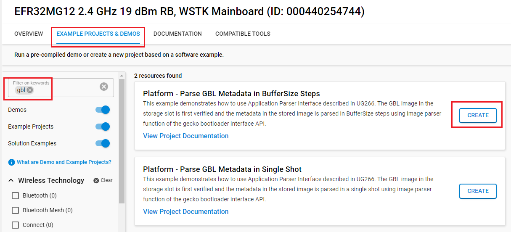
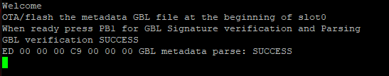

# Platform - Parse GBL Metadata in BufferSize Steps

## Description

This example demonstrates how to use Application Parser Interface described in UG266. The GBL image in the storage slot is first verified and the metadata in the stored image is parsed in BufferSize steps using image parser function of the gecko bootloader interface API.

## Gecko SDK version

- GSDK v4.4.3

## Hardware Required

[EFR32MG12 2.4GHz 19 dBm Radio Board - BRD4161A](https://www.silabs.com/documents/public/user-guides/ug260-brd4161a-user-guide.pdf)

[EFR32MG13 2.4 GHz 915 MHz +19 dBm - BRD4158A](https://www.silabs.com/development-tools/wireless/zigbee/slwrb4158a-efr32mg13-radio-board)

## Connections Required

- Connect the radio board to the WSTK, and connect the WSTK via a micro-USB cable to your PC.

## Setup

To test this application, you can either create a project based on a example project or start with an "Empty C Project" project based on your hardware.

### Create a project based on a example project

1. From the Launcher Home, add the your hardware to My Products, click on it, and click on the **EXAMPLE PROJECTS & DEMOS** tab. Find the example project with filter "gbl".

2. Click **Create** button on the **Platform - Parse GBL Metadata in BufferSize Steps** example. Example project creation dialog pops up -> click Create and Finish and Project should be generated.

3. Build and flash this example to the board.

### Start with an "Empty C Project" project

1. Create a **Empty C Project** project for your device using Simplicity Studio 5.

2. Copy all attached files in *inc* and *src* folders into the project root folder.

3. Open the .slcp file. Select the SOFTWARE COMPONENTS tab and install the software components:

- [Platform] > [Bootloader] > [Bootloader Application Interface]
- [Platform] > [Bootloader] > [App Properties] → Navigate to config file and change the value of  `SL_APPLICATION_SIGNATURE` to `APPLICATION_SIGNATURE_ECDSA_P256` and `SL_APPLICATION_SIGNATURE_LOCATION` to `0`
- [Services] → [IO Stream] → [Driver] → [IO Stream: USART] → default instance name: vcom
- [Services] → [IO Stream] → [Driver] → [IO Stream: Retarget STDIO]
- [Services] → [IO Stream] → [Driver] → [IO Stream: STDLIB Configuration]
- [Services] → [Power Manager] → [Power Manager: Deepsleep]

## How It Works

 In this example, the encrypted/signed GBL image is stored in slot0. When PB1 is pressed, LED1 turn on, GBL Image in slot0 is verified, decrypted/parsed in BufferSize steps and raw metadata is transmitted over USART0(VCOM).

**Below are the steps to perform the test:**

 1. Perform erase on the device before starting the test
   Below is the Simplicity Commander CLI command:
    >     Run: commander device pageerase --region @mainflash --region @userdata <--region @bootloader> <--region @lockbits>

    Note: Series 2 devices don't have dedicated bootloader and lockbits area. Also EFx32xG1 devices don't have dedicated bootloader area.

**Bootloader Project:**

 2. Create bootloader-storage-internal-single project and enable secturity features i.e., signing, encryption and secureboot
 
 3. Build the bootloader-storage-internal-single project and flash the bootloader project at the start address of bootloader area
    >     Run: commander flash <bootloader_project>.s37 --address <start_address>
 
**Security Keys:**

 4. Generate signing keys
    >     Run: commander gbl keygen --type ecc-p256 --outfile signing-key

 5. Generate encryption key
    >     Run: commander gbl keygen --type aes-ccm --outfile encryption-key

 6. Write the encryption key and public key to the EFR32
    >     Run: commander flash --tokengroup znet --tokenfile encryption-key --tokenfile signing-key-tokens.txt.

**Application Project:**
 
 7. Create and build parse_gbl_metadata_singleshot project to generate .s37/.hex files
 
 8. Sign the application image
    >     Run: commander convert <application_project>.s37 --secureboot --keyfile signing-key --outfile <application_project_signed>.s37

 9. Flash signed application image at the start address of application area
    >     Run: commander flash <application_project_signed>.s37 --address <start_address>
       
**OTA/GBL image:**

 10. Create a signed and encrypted GBL file using metadata binary file
     >     Run: commander gbl create <waveform_metadata>.gbl -- metadata <waveform_test1>.bin --sign signing-key --encrypt encryption-key

 11. Flash *waveform_metadata*.gbl at the start address of *Slot0*
     >     Run: commander flash <waveform_metadata>.gbl.bin --address <slot0_start_address>
     
     Note: To flash a GBL image add .bin extension to the GBL file. To perform OTA/OTW upgrade .bin extension is not needed.

 12. Connect the radio board to a terminal program (1152008N1) and Press PB1 for GBL image verification and parsing. Status of application can be seen in the terminal application.

      

**Resources:**

 * For more details about gecko bootloader refer UG266.
 * For more details about Simplicity Commander CLI refer UG162.
    
## Porting to Another EFx32 Series 1 or Series 2 Device

Apart from any issues of pin availability on a given radio board, this code should run as-is on any Series 1 or Series 2 radio board having gecko bootloader support.