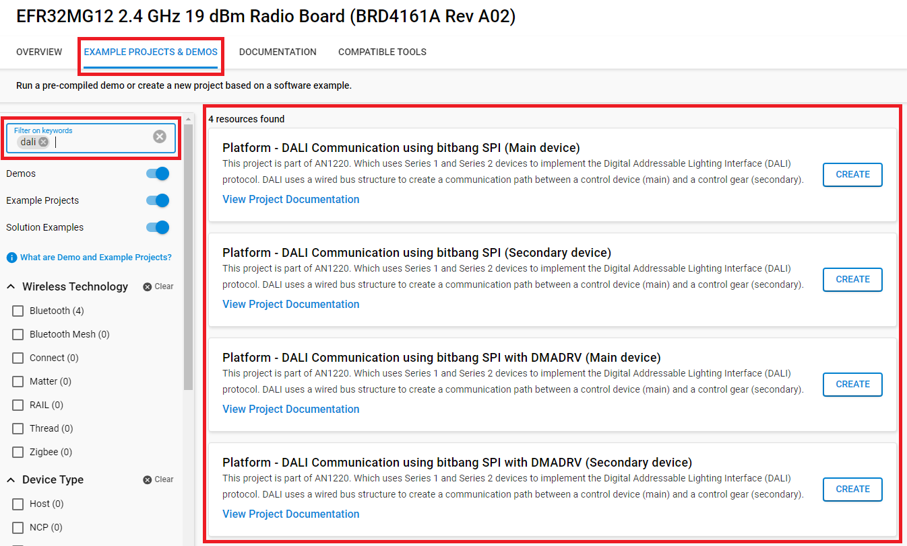
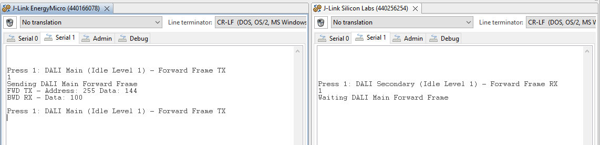

# AN1220: DALI Communication #

## Summary ##

These projects are part of AN1220. DALI is an international standard lighting control system, which uses an asynchronous serial protocol with manchester encoding to send data between the main and secondary devices. These projects demonstrate how to configure Silicon Labs MCUs to send DALI frames between main and secondary devices.

Peripherals used: EUSART, USART, PRS, LDMA, GPIO, TIMER, SYSRTC

## Gecko SDK version ##

v4.4.3

## Hardware Required ##

* Board: Silicon Labs EFM32MG12P Radio Board (BRD4161A) + Wireless Starter Kit Mainboard
  * Device: EFR32MG12P432F1024GL125
* Board: Silicon Labs EFR32xG21 Radio Board (BRD4181A) + Wireless Starter Kit Mainboard
  * Device: EFR32MG21A010F1024IM32
* Board: Silicon Labs EFR32xG24 Radio Board (BRD4186C) + Wireless Starter Kit Mainboard
  * Device: EFR32MG24B210F1536IM48

## Connections Required ##

Connect two boards (a main board and a secondary board) via a micro-USB cable to your PC to flash the example.

The table below defines the GPIO pins and expansion headers used for DALI pins for each radio board.

| Pin     | EFR32MG12 WSTK (BRD4161A) | EFR32xG21 WTSK (BRD4181A) | EFR32xG24 WTSK (BRD4186C) |
| ------- | ------------------------- | ------------------------- | ------------------------- |
| DALI TX | EXP09 - PD11              | EXP04 - PC0               | EXP04 - PC1               |
| DALI RX | EXP11 - PD12              | EXP06 - PC1               | EXP06 - PC2               |
| GND     | EXP01                     | EXP01                     | EXP01                     |

## Setup ##

### Create a project based on an example project

1. From the Launcher Home, add your hardware to My Products, click on it, and click on the **EXAMPLE PROJECTS & DEMOS** tab. Find the example project with the filter "dali".

2. Choose corresponding project for **Main** and **Secondary** device -> click Create and Finish and Project should be generated.
    - **Platform - DALI Communication using bitbang SPI**: This is using SPI bit-banging for device serries 1 & serries 2 with no DALI hardware support.
    - **Platform - DALI Communication using bitbang SPI with DMADRV**: This is using SPI bit-banging with DMADRV for device serries 1 & serries 2 with no DALI hardware support.
    - **Platform - DALI Communication using EUSART**: This is using EUSART with DALI hardware support on device serries 2.

3. Build and flash this example to the board.

## How It Works ##

The WSTK is connected to the computer via VCOM. Typing '1' into the secondary's terminal prepares the secondary device for reception of the forward frame from the main device. Typing '1' into the main's terminal triggers the main device to transmit the forward frame to the secondary device. The secondary device waits about 4 ms and then transmits a backward frame to the main device. Both the secondary and main devices will display the address and data from the forward and the data from the backward frame onto the terminals.

Devices with EUSART DALI support (like the EFR32xG24) can use the EUSART in asynchronous DALI mode to transmit forward frames and receive backward frames. Dedicated EUSART registers are used to configure the device for DALI. The GPIO and SYSRTC are used to configure the settling time and timeout between frames.

Devices without EUSART DALI support (like the EFR32xG12 and EFR32xG21) bit-bang the DALI frames. These projects use SPI to bit-bang DALI forward frames. The GPIO, TIMER, and PRS are used to receive backward frames.

## Testing ##

For testing, you will need 2 Silabs boards. One acts as Main device, one acts as Secondary device.

1. Connect the main's DALI TX pin to the secondary's DALI RX pin, the main's DALI RX pin to the secondary's DALI TX pin, and the main's GND pin to the secondary's GND pin. Refer [Connections Required](#connections-required) section to know how to connect these boards.

2. Open a terminal program (like Simplicity Studio built-in console or Tera Term) for each radio board and set the baud rate to 115201-8-N-1.

3. Use terminal to send character '1' to secondary device and then also sending character '1' to main device. If the DALI frame is success transmited, the result will be shown as the picture below.

