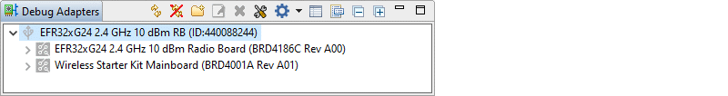
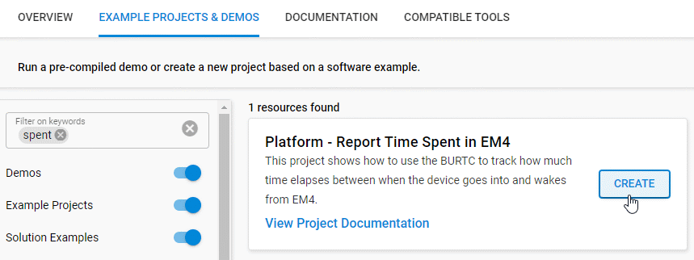
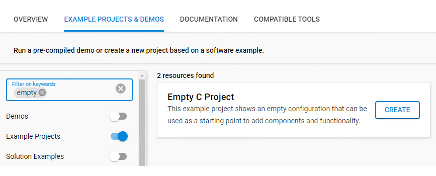
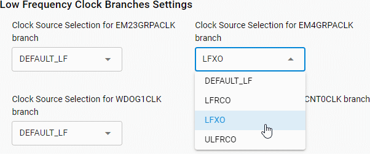

# Timing EM4 Duration with the BURTC #

## Summary ##

This example shows how to use the BURTC to keep track of the amount of time the device spends in EM4. It makes use of the memory LCD on the WSTK or Pro Kit mainboard to display usage instructions and then report elapsed time when the device exits EM4.  

## SDK Version ##

- Simplicity SDK 2024.12.2

## Supported Hardware ##

You need the xG24-RB4186C radio board for EFR32MG24 plugged into either a Pro Kit (BRD4002A) or Wireless Starter Kit (BRD4001A) mainboard. One of these options will fit the bill:

- [EFR32xG24 +10 dBm Pro Kit](https://www.silabs.com/development-tools/wireless/efr32xg24-pro-kit-10-dbm) (xG24-PK6009A)
- [EFR32xG24 +10 dBm Radio Board](https://www.silabs.com/development-tools/wireless/xg24-rb4186c-efr32xg24-wireless-gecko-radio-board) (xG24-RB4186C) and [Wireless Pro Kit Mainboard](https://www.silabs.com/development-tools/wireless/wireless-pro-kit-mainboard) (Si-MB4002A) 
- [EFR32xG24 +10 dBm Radio Board](https://www.silabs.com/development-tools/wireless/xg24-rb4186c-efr32xg24-wireless-gecko-radio-board) (xG24-RB4186C) and Wireless Starter Kit Mainboard (BRD4001A)

## Connections Required ##

To begin, you need to connect the board to your PC with the appropriate USB cable to download the compiled project.

## Setup ##

To test this example, you can either create a project from the repo contents or start with an "Empty C Project" based on your hardware.

### Create a project based on an example project ###

1. Make sure that this repository is added to [Preferences > Simplicity Studio > External Repos](https://docs.silabs.com/simplicity-studio-5-users-guide/latest/ss-5-users-guide-about-the-launcher/welcome-and-device-tabs).

2. From the Launcher, click on your board in the Debug Adapter panel. 

3. Next, click on the **EXAMPLE PROJECTS & DEMOS** tab. Find the example project by entering "spent" in the "Filter on keywords" box.

4. Click the **Create** button on the **Platform - Report Time Spent in EM4** example. When the example project creation dialog pops up, click **Finish** to generate the project.

5. Build and flash this example to the board.

### Start with an "Empty C Project" ###

1. Create an **Empty C Project** for your hardware using Simplicity Studio 5.

2. Copy all files in the `src` folder into the project root folder (overwriting any existing files).

3. Install and configure certain software components as follows:

    3.1. Open the .slcp file in the project.

    3.2. Select the SOFTWARE COMPONENTS tab.

    3.3  Install the following components:

    - [Platform] → [Board Drivers] → [Memory LCD] → [Peripheral Driver] → [Memory LCD with usart SPI driver]

    - [Platform] → [Driver] → [Button] → [Simple Button] and enter "btn0" for the instance name.

    - [Platform] → [Driver] → [GLIB Graphics Library] 

    - [Platform] → [Peripheral] → [RMU] 

    3.4. Change the following setting in Clock Manager:

    - [Services] → [Clock Manager: Clock Manager] → Clock Tree Settings → Low Frequency Clock Branches Settings → Clock Source Selection for EM4GRPACLK branch: LFXO

	  

4. Build and flash the project to your board.

## How It Works ##

After printing usage instructions on the memory LCD, the device waits for the user to press BTN0. The display is updated to let the user know the device has entered EM4 and then waits for BTN1 to be pressed to wake-up.

Because wake from EM4 is a reset, the program restarts. During initialization and printing of the usage instructions, the EMU reset cause register (`EMU->RSTCAUSE`) is checked, and if the `EM4` flag is set, the previously read value from the `BURTC->CNT` register is printed, which is the amount of time in seconds the device was in EM4 when the wake event occurred.

**NOTE:** It is necessary to modify the default main.c created by Simplicity Studio to insert code that reads `BURTC->CNT` and unlatches GPIO retention before `sl_system_init()` is called. In particular, EM4 retention must be unlatched so that code which configures GPIOs and certain clock branches executes correctly.

## Notes on Running the Example ##

When the device goes into EM4, the debugger loses its connection and non-stop error message appear in the console tab. It's best to avoid this in the first place because reconnecting to the target generally requires exiting and restarting Simplicity Studio. 

Because of this, there are two ways to run the project once it is compiled and downloaded:

1. If the project was downloaded by launching the debugger, exit the debugger. Start the example by pressing the RESET button on the WPK/WSTK and follow the instructions on the memory LCD.

2. Unplug the WPK/WSTK and insert a CR2032 battery into the holder or supply 3V using one of the connector options adjacent to the coin cell holder. Slide the AEM-USB-BAT switch to the BAT position and the example will run.

**NOTE:** On the Wireless Pro Kit, the buttons are labeled BTN0 and BTN1, but on the Wireless Starter Kit, they are labeled PB0 and PB1. The functionality is the same in this example (button 0 is used to enter EM4 and button 1 is used to wake from EM4).

## Porting Considerations ##

This project was first built using Gecko SDK 4.4.5 and did not require changes to any of the source files outside of the SDK when built against Simplicity SDK 2024.12.2 because legacy clock configuration components, like  [Services] → [Device Initialization] → [Peripherals] → [Low Frequency Crystal Oscillator (LFXO)], were still used.

Under the hood, however, when a project is created with a Simplicity SDK template (such as "Empty C Project"), the new Clock Manager service is used in place of the legacy clock-specific device initialization components. Source selection for individual clock branches is easily handled from the Clock Manager component configuration panel. In Gecko SDK, this required hand-editing of the autogenerated `sl_device_init_clocks.c` file.

So, in short, this code can be built against the most recent releases of Gecko SDK and Simplicity SDK. Follow the procedure above by starting with the "Empty C Project", but skip the Clock Manager configuration step if you are using Gecko SDK, as it will default to use of the LFXO for the EM4GRPACLK.

Minimal changes are required to port this to another radio board or to move the relevant BURTC code to any given design. In particular, take note of the code in `main()` that saves the BURTC count before the SDK does system initialization and be sure to read the comments in app.c about how the BURTC is also used by the memory LCD, something not likely to apply in most designs.

**NOTE:** The LFRCO will not operate in EM4 if configured for precision mode on devices that support it, such as xG22, xG24, etc. The HFXO resides in the PD1 power domain, which is powered down in EM4, so the precision mode state machine cannot start and stop the HFXO to run calibration. Use the following procedure to disable precision mode in such cases:

    // Disable LFRCO precision mode before entering EM4
    CMU_ClockEnable(cmuClock_LFRCO, true);
    LFRCO->CTRL_SET = LFRCO_CTRL_DISONDEMAND;
    LFRCO->CTRL_CLR = LFRCO_CTRL_FORCEEN;
    LFRCO->CFG_CLR = LFRCO_CFG_HIGHPRECEN;
    LFRCO->CTRL_SET = LFRCO_CTRL_FORCEEN;
    LFRCO->CTRL_CLR = LFRCO_CTRL_DISONDEMAND;
    CMU_ClockEnable(cmuClock_LFRCO, false);
