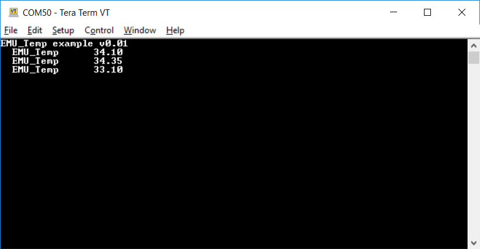

# EMU temperature sensor readout example #

## Summary ##

This project demonstrates the use of the low energy periodic temperature sensor measurement in the EMU block of EFR32xG22 devices. The example project uses TIMER0 to periodically sample the EMU temperature sensor at 1 sample per second using the TEMPDRV driver, and then transmits the temperature information over VCOM/USART1.

Peripherals used: TIMER0, GPIO, EMU, USART1

## Gecko SDK version ##

v2.7.7

## Hardware Required ##

- One SLWSTK6021A EFR32xG22 Wireless Gecko Starter Kit <https://www.silabs.com/development-tools/wireless/efr32xg22-wireless-starter-kit>:
  - BRD4001A Wireless Starter Kit
  - BRD4182A EFR32xG22 Radio Board

## Setup ##

Import the included .sls file to Studio then build and flash the project to the BRD4182A Radio Board attached to WSTK.
In Simplicity Studio select "File->Import" and navigate to the directory with the .sls project file.
The project is built with relative paths to the STUDIO_SDK_LOC variable which was defined as

C:\SiliconLabs\SimplicityStudio\v4\developer\sdks\gecko_sdk_suite\v2.7

## How the Project Works ##

Open a terminal program such as [Tera Term](https://ttssh2.osdn.jp/index.html.en), and connect to the Jlink CDC UART Port for the WSTK using 115200 baud, 8-bit data, 1 stop bit, no parity and no flow control. The terminal application will display the example version number out of reset, and then periodically (1 Hz) update with the latest EMU temperature reading in degrees Celcius.

## .sls Projects Used ##

platform_emu_temp.sls

## How to Port to Another Part ##

This example uses the EMU temperature sensor, available on Series 1 and Series 2 devices. Open the "Project Properties" and navigate to the "C/C++ Build -> Board/Part/SDK" item.  Select the new board or part to target and "Apply" the changes.  Note: there may be dependencies that need to be resolved when changing the target architecture.
