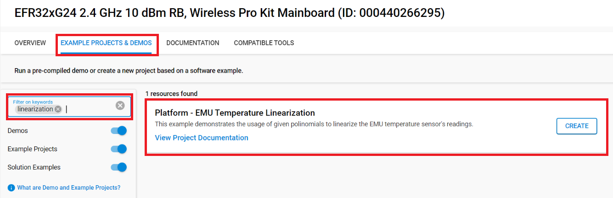
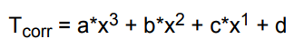
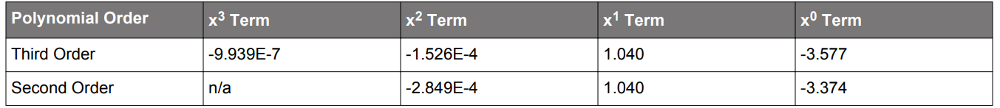
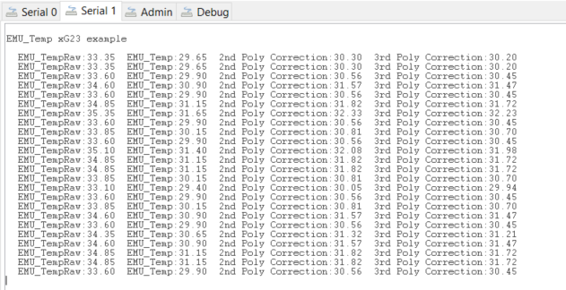

# Platform - EMU Temperature Linearization #

## Overview ##

This project demonstrates the usage of pre-calculated second and third order polinomials in order to achieve die temperature readings with better than +/- 2.5 degrees C accuracy over the full operating temperature range. Further accuracy can be achieved using in-system calibration, which is done automatically via calling the `EMU_TemperatureGet()` function.

## SDK version ##

- SiSDK v2024.12.1-0

## Hardware Required ##

- [EFR32xG24 Wireless 2.4 GHz +10 dBm Radio Board](https://www.silabs.com/development-tools/wireless/xg24-rb4186c-efr32xg24-wireless-gecko-radio-board?tab=overview)

- Wireless Pro Kit (WPK) Mainboard (SLWMB4002A, formerly BRD4002A)

**Note:**

   - Tested boards for working with this example: 

      | Board ID | Description  |
      | ---------------------- | ------ |
      | BRD4182a | [EFR32xG22 Wireless Gecko 2.4 GHz +6 dBm 5x5, QFN40 Radio Board](https://www.silabs.com/development-tools/wireless/slwrb4182a-efr32xg22-wireless-gecko-radio-board?tab=overview)|
      | BRD4210a | [EFR32XG23 868-915 MHz +20 dBm Radio Board](https://www.silabs.com/development-tools/wireless/xg23-rb4210a-efr32xg23-868-915-mhz-20-dbm-radio-board?tab=overview)|
      | BRD4186c | [EFR32xG24 Wireless 2.4 GHz +10 dBm Radio Board](https://www.silabs.com/development-tools/wireless/xg24-rb4186c-efr32xg24-wireless-gecko-radio-board?tab=overview)|
      | BRD4270b | [EFR32FG25 902-928 MHz +16 dBm Radio Board](https://www.silabs.com/development-tools/wireless/proprietary/fg25-rb4270b-efr32fg25-radio-board?tab=overview)|
      | BRD4194a | [EFR32xG27 Wireless 2.4 GHz +8 dBm Radio Board](https://www.silabs.com/development-tools/wireless/xg27-rb4194a-efr32xg27-8-dbm-wireless-radio-board?tab=overview)|
      | BRD4400c | [EFR32xG28 2.4 GHz BLE and +14 dBm Radio Board](https://www.silabs.com/development-tools/wireless/xg28-rb4400c-efr32xg28-2-4-ghz-ble-and-14-dbm-radio-board?tab=overview)|

## Connections Required ##

Connect the board via the connector cable to your PC to flash the example.

## Setup ##

To test this application, you can either create a project based on an example project or start with an "Empty C Project" project based on your hardware.

### Create a project based on an example project ###

1. Make sure that this repository is added to [Preferences > Simplicity Studio > External Repos](https://docs.silabs.com/simplicity-studio-5-users-guide/latest/ss-5-users-guide-about-the-launcher/welcome-and-device-tabs).

2. From the Launcher Home, add your product name to My Products, click on it, and click on the **EXAMPLE PROJECTS & DEMOS** tab. Find the example project filtering by "linearization".

3. Click the **Create** button on **Platform - EMU Temperature Linearization** example. Example project creation dialog pops up -> click Create and Finish and the project should be generated.

4. Build and flash this example to the board.

### Start with an "Empty C Project" project ###

1. Create an **Empty C Project** project for your hardware using Simplicity Studio 5.

2. Copy all files in the `inc` and `src` folders into the project root folder (overwriting the existing file).

3. Install the software components:

    3.1. Open the .slcp file in the project

    3.2. Select the SOFTWARE COMPONENTS tab

    3.3. Install the following components:

    - [Platform] → [Peripheral] → [EMU]

    - [Services] → [IO Stream] → [Driver] → [IO Stream: USART]
    
    - [Services] → [IO Stream] → [IO Stream: Retarget STDIO]

    - [Services] → [IO Stream] → [IO Stream: STDLIB Configuration]

    - [Third party] → [Tiny printf]

4. Enable Virtual COM UART

    - [Platform] → [Board] → [Board Control] → [Configure] → [Enable Virtual COM UART]

5. Build and flash the project to your board.

## How It Works ##

The example first initializes the default iostream instance to be able to log the temperature readings into a serial terminal.

Then, the EMU peripheral's temperature interrupt source is enabled by setting the `EMU_IEN_TEMP` flag. When a temperature data is read (at every 250ms) the `measure_EMU_temp` flag is set by the interrupt service routine and the raw values are corrected. To linearize the measurement and correct for the systematic offset, a second or third-order polynomial equation representing the nominal curve is used. For example, a third-order correction equation takes the form: 

Where:
- T_corr is the corrected temperature (in degrees Celsius)
- x is the measured temperature (in degrees Celsius)
- a is the x^3 term
- b is the x^2 term
- c is the x^1 term
- d is the x^0 term

The polynomial coefficients for both third and second-order polynomials are present in the device Reference Manual (below is an example for the xG24 device). Note that the polynomial coefficients provided assume the raw output (in Kelvin) which have been converted to Celsius prior to linearization:

Utilizing the correct coefficients, the results are printed to the serial interface. The logs should look like the following:

