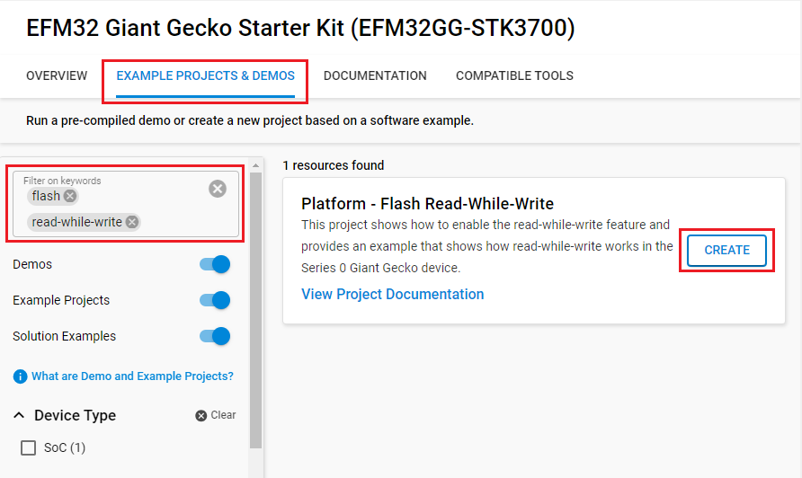

# Platform - Flash Read-While-Write #

## Overview ##

This project shows how to enable the read-while-write feature and provides an example that shows how read-while-write works in the Series 0 Giant Gecko device.

## Gecko SDK Version ##

- v4.4.3

## Hardware Required ##

- Board:  Silicon Labs EFM32GG Starter Kit (STK3700)
  - Device: EFM32GG990F1024
    - PD6 - Expansion Header Pin 16

## Connections Required ##

- Connect the Kit to the PC through a mini USB cable.

## Setup ##

To test this application, you can either create a project based on an example project or start with an "Empty C Project" project based on your hardware.

### Create a project based on an example project ###

1. Make sure that this repository is added to [Preferences > Simplicity Studio > External Repos](https://docs.silabs.com/simplicity-studio-5-users-guide/latest/ss-5-users-guide-about-the-launcher/welcome-and-device-tabs).

2. From the Launcher Home, add your device to My Products, click on it, and click on the **EXAMPLE PROJECTS & DEMOS** tab. Find the example project filtering by **flash** and **read-while-write**.

3. Click **Create** button on the **Platform - Flash Read-While-Write** example. Example project creation dialog pops up -> click Create and Finish and Project should be generated.

4. Build and flash this example to the board.

### Start with an "Empty C Project" ###

1. Create an **Empty C Project** project for your hardware using Simplicity Studio 5.

2. Replace the `app.c` file in the project root folder with the provided `app.c` (located in the src folder).

3. Build and flash the project to your device.

## How It Works ##

Generally, devices with 512 KB of flash or more have the ability to read from one area of flash while writing to another. This feature is called read-while-write and the device datasheet specifies if the device supports it.

On these devices, flash is organized into two or more banks. The read-while-write feature takes advantage of this. Normally, reading from flash is stalled while a flash write or erase is occurring. However, with read-while-write, one flash block can be in the process of performing a write or page erase while reads, such as code fetches, are performed in another block.

The organization of flash is such that the first half of flash is in one bank (for example, addresses 0x00000000 - 0x00080000 on devices with 1024 KB of flash), while the upper half of flash, and the 'information' pages (Lock bits page, Device Info page, User Data page) occupy the other bank.

This means that, if you are erasing a page in the upper half of the flash, you can continue reading flash from the lower half, but cannot read from the information pages until the erase completes.

One exception to this is Series 0 Giant Gecko. On these devices, the information pages occupy a third block of flash, allowing reading from the information pages while erasing a page in the upper or lower half of flash.

The code flow is as follows:

1. The read-while-write bit is set to enable the feature
2. A simple GPIO toggle example is written on the upper flash bank
3. The entire lower half of flash is written with a pattern and during this process, a GPIO is toggled during each write operation

## Testing ##

Build and run the project in debug mode. Observe pin PD6 (Expansion Header Pin 16) on an oscilloscope. When read-while-write is enabled, the GPIO toggle frequency reduces to 6-8 us indicating that the flash is reading while it is writing. When read-while-write is not enabled, the GPIO toggles at about 70 us indicating that a blocking write takes about 70 us. Note that the code example enables read-while-write by default. The user is encouraged to run this test to evaluate the read-while-write functionality.

## Special Notes ##

- During a write or erase, flash read accesses not subject to read-while-write will be stalled, effectively halting code execution from flash. Code execution continues upon write/erase completion. Code residing in RAM may be executed during a write/erase operation regardless of whether read-while-write status.

- The MSC_WDATA and MSC_ADDRB registers are not retained when entering EM2 or lower energy modes.
