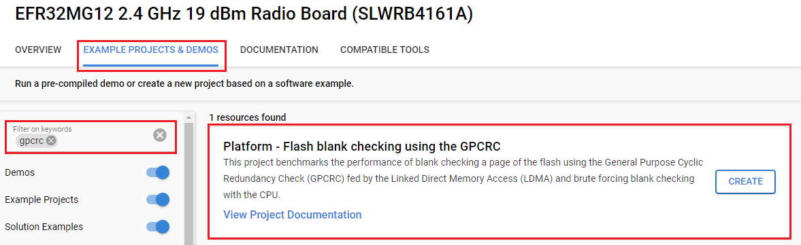
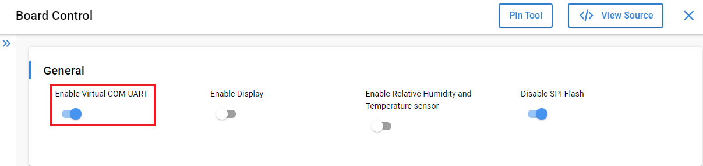
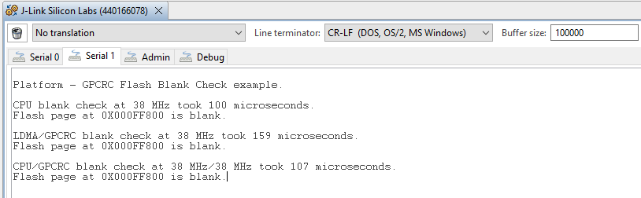

# Platform - Flash blank checking using the GPCRC #


## Overview ##

This project benchmarks the performance of blank checking a page of the flash using the General Purpose Cyclic Redundancy Check (GPCRC) fed by the Linked Direct Memory Access (LDMA) and brute forcing blank checking with the CPU.

## Gecko SDK version ##

- GSDK v4.4.3

## Hardware Required ##

- [EFR32MG12 2.4GHz 19dBm Radio Board](https://www.silabs.com/development-tools/wireless/zigbee/slwrb4161a-efr32mg12-radio-board?tab=overview)

- Wireless Starter Kit (WSTK) Mainboard (SLWMB4001A, formerly BRD4001A)

**Note:**

   - Tested boards for working with this example:

      | Board ID | Description  |
      | ---------------------- | ------ |
      | BRD4182A | [EFR32xG22 Wireless Gecko Starter Kit](https://www.silabs.com/development-tools/wireless/efr32xg22-wireless-starter-kit?tab=overview)|
      | BRD4161A | [EFR32MG12 2.4GHz 19dBm Radio Board](https://www.silabs.com/development-tools/wireless/zigbee/slwrb4161a-efr32mg12-radio-board?tab=overview)|
      | BRD4187C | [EFR32xG24 Wireless 2.4 GHz +20 dBm Radio Board](https://www.silabs.com/development-tools/wireless/xg24-rb4187c-efr32xg24-wireless-gecko-radio-board?tab=overview)|
      | BRD4104A | [EFR32BG13 2.4 GHz 10 dBm Radio Board](https://www.silabs.com/development-tools/wireless/bluetooth/slwrb4104a-efr32bg13-bluetooth-radio-board?tab=overview)|
      | BRD4158A | [EFR32MG13 2400/915 MHz 19 dBm Radio Board](https://www.silabs.com/wireless/zigbee/efr32mg13-series-1-socs/device.efr32mg13p732f512gm48?tab=specs)|
      | BRD4257B | [EFR32FG14 2400/868 MHz 13 dBm Radio Board](https://www.silabs.com/development-tools/wireless/proprietary/slwrb4257b-efr32fg14-868-mhz-radio-board?tab=overview)|
      | BRD4180A | [EFR32xG21 Wireless Gecko Starter Kit](https://www.silabs.com/development-tools/wireless/efr32xg21-wireless-starter-kit?tab=overview)|
      | BRD2204A | [EFM32GG11 Giant Gecko Starter Kit](https://www.silabs.com/development-tools/mcu/32-bit/efm32gg11-starter-kit?tab=overview)|

## Connections Required ##

Connect the board via the connector cable to your PC to flash the example.

## Setup ##

To test this application, you can either create a project based on an example project or start with an "Empty C Project" project based on your hardware.

### Create a project based on an example project ###

1. Make sure that this repository is added to [Preferences > Simplicity Studio > External Repos](https://docs.silabs.com/simplicity-studio-5-users-guide/latest/ss-5-users-guide-about-the-launcher/welcome-and-device-tabs).

2. From the Launcher Home, add your product name to My Products, click on it, and click on the **EXAMPLE PROJECTS & DEMOS** tab. Find the example project filtering by "GPCRC".

3. Click the **Create** button on **Platform - Flash blank checking using the GPCRC** example. Example project creation dialog pops up -> click Create and Finish and the project should be generated.


4. Build and flash this example to the board.

### Start with an "Empty C Project" project ###

1. Create an **Empty C Project** project for your hardware using Simplicity Studio 5.

2. Copy all files in the `inc` and `src` folders into the project root folder (overwriting the existing file).

3. Install the software components:

    3.1. Open the .slcp file in the project

    3.2. Select the SOFTWARE COMPONENTS tab

    3.3. Install the following components:

    - [Services] → [IO Stream: USART] → use default instance: vcom

    - [Platform] → [Peripheral] → [GPCRC]

    - [Platform] → [Peripheral] → [TIMER]
 
    - [Application] → [Utility] → [Log]

    - [Platform] → [Board] → [Board Control]: enable **Enable Virtual COM UART** as below:
      

4. Build and flash the project to your board.

## How It Works ##

Because the CPU, GPCRC, and LDMA are clocked at the same frequency. The execution times are calculated by starting TIMER0 at 0. The timer is stopped when the blank check algorithm is complete, and multiplying the resulting count by the appropriate clock cycle time.

On all devices, the system clock (HFCLK or SYSCLK) is sourced from what is generally the highest frequency oscillator available (the HFXO on Silicon Labs series 1 and the DPLL on Silicon Labs series 2). The execution times are generally the fastest possible.

The program flow is as follows:

1. Initialize the  Clock Management Unit (CMU). The oscillator for the system clock (HFCLK or SYSCLK) is enabled and configured.

2. TIMER0 is set up for basic operation but is not started.

3.  Basic LDMA initialization is performed.

4.  The GPCRC is set up to calculate the standard IEEE 802.3 polynomial.

5.  The TIMER0 counter is started and the brute force CPU blank check routine is executed on the last page of flash.

6.  TIMER0 is stopped. The CPU clock frequency is displayed along with the algorithm execution time. The result of the blank check (blank or not blank) is printed.

7.  Steps 6 and 7 are repeated, this time with the LDMA-driven GPCRC blank check.

8.  Steps 6 and 7 are again repeated. This time with a hybrid routine wherein the CPU feeds the flash page contents to the GPCRC. The algorithm is potentially useful. Because it can be used to accelerate flash programming by performing blank checking of the next page in parallel.

## Theory

The simplest way to blank-check a page of the flash is to see if each byte/half-word/word is erased.

```
bool cpuBlankCheckFlashPage(uint32_t baseAddr)
{
  bool result = true;
  uint32_t i = 0;

  while (i < FLASH_PAGE_SIZE)
  {
    // Check using 32-bit read
    if ((*(uint32_t *)(baseAddr + i)) == 0xFFFFFFFF)
      i += 4;
    else
    {
      result = false;
      i = FLASH_PAGE_SIZE;
    }
  }
  return result;
}
```

There is nothing particularly special about this algorithm. It can be made faster by performing a 64-bit memory read, at least on ARM Cortex-M4/M33 devices. Because the C compiler (GCC in this case) will output an LDRD (load double) instruction. To generate an LDRD, the `*(uint32_t *)(baseAddr + i)` should be changed to `*(uint64_t *)(baseAddr + i)`. The early breakpoint is also possible by using `(result && (i < FLASH_PAGE_SIZE))` as the `while` condition.

However, regardless of the technique used, the CPU is going to be tied up. CPU is required to check full of the flash pages in maximum time. This can be appreciable on Series 2 devices where flash pages are 8 Kb and 2 Kb on Series 1 devices.

Using a CRC to blank-check a flash page is simple enough. A blank flash page of a given size is always going to have the same CRC. In fact, this project includes two binary files with 2048 and 8192 bytes of 0xFF value. Hence, the CRC-32 checksums are 0x3f55d17f and 0xb4293435, respectively.

Blank-checking a flash page with the GPCRC has two benefits:

1. It does not tie up the CPU. Once the LDMA descriptors are programmed and the selected channel is started. The full page of the flash is fed to the GPCRC without any CPU intervention.

2. Execution is deterministic. The LDMA always feeds an entire page into the GPCRC. This is going to have a set execution time (unless other bandwidth-intensive LDMA traffic is present).

What this benchmark shows, however, is that the GPCRC and LDMA combination requires more time to blank check a flash page than the CPU alone. The reasons for this are simple:

1. The LDMA can only move 32 bits at a time. The LDMA requires 512 bytes (a 2 KB page on Series 1) or 2048 bytes (an 8 KB page on Series 2) reads from flash and the same number of writes to the GPCRC to do so.

2. While the Cortex-M4/M33 has only a 32-bit compare instruction. The double register load (LDRD) instruction allows the entire flash page to be checked with 256/1024 bytes (Series 1/Series 2) reads and 512/2048 bytes register compares (Series 1/Series 2).

You can launch Console, which is integrated into Simplicity Studio or you can use a third-party terminal tool like Tera Term to receive the data. Data is coming from the UART COM port. A screenshot of the console output is shown in the figure below.


Each loop iteration of the CPU-driven blank check takes fewer clock cycles than the equivalent operation using the LDMA and the GPCRC. Furthermore, the LDMA and GPCRC have some non-negligible setup overhead that adds to the execution time.

Although the CPU cannot be beaten in terms of raw speed. The LDMA and GPCRC have the benefit of being effectively non-blocking. CPU contention with the LDMA for access to the flash is minimized courtesy of the MSC cache. This contention does not exist on dual-bank Series 1 devices (EFM32PG12, EFR32xG12, EFM32GG11, and EFM32GG12) when the CPU and LDMA are accessing alternate flash banks. Furthermore, in EFR32 systems, if there is a need to interleave flash operations with radio traffic. Then, the deterministic execution time of the LDMA and GPCRC may prove useful.

One final note is that the use of the CPU and GPCRC for blank checking are not mutually exclusive. As mentioned above, it would not be particularly complicated to use a single-loop index. This loop is used to program the *Nth* word of flash on page *A* immediately after loading the *Nth* word of page *A+1* into the GPCRC. When the firmware is finished programming page *A*, whether or not page *A+1* is blank is already known.

Even though the flash page programming time is comparable to the execution time of either blank-checking algorithm, the time and energy saved by not having to erase a flash page (10s of ms @ around 2 mA) make the concurrent program and blank-check technique particularly efficient.
