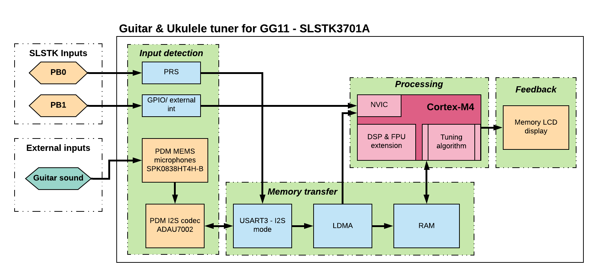

# Guitar and Ukulele tuner using the GG11 Starter Kit #

## Summary ##

The purpose of this project is to demonstrate the usage of the Giant Gecko GG11 started kit to implement a sound-based guitar and ukulele tuner. This example is implemented in the SLSTK3701A starter kit for the EFM32GG11 MCU. Multiple on-board hardware elements are leveraged such as the MEMS microphones, push-buttons, and LCD screen; MCU peripherals such as the PRS, GPIO interrupts, USART (I2S mode), CMU and LDMA. Core-specific peripherals like the DSP, FPU, and NVIC are also utilized. [Figure 1](#figure-1) below shows a high-level functional block representation of the project, each block is marked by a green background.

  

Figure 1. Functional block representation of the project

## Gecko SDK version ##

v2.7

## Hardware Required ##

* One Starter Kit (SLTK3701A) Mainboard, BRD2204A
* A guitar or ukulele to generate the input sound

## Setup ##

Import the included .sls file to Simplicity Studio then build and flash the project to the SLSTK3701A.

## .sls Projects Used ##

platform_guitar_and_ukulele_tuner.sls

## How to Port to Another Part ##

Open the "Project Properties" and navigate to the "C/C++ Build -> Board/Part/SDK" item.
Select the new board or part to target and "Apply" the changes.

**_Note_**_: there may be dependencies that need to be resolved when changing the target architecture_.
