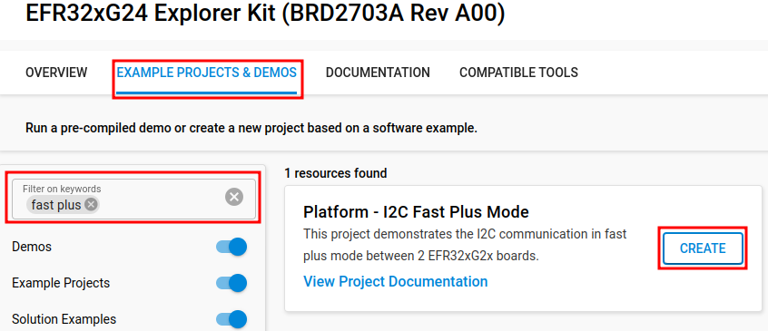
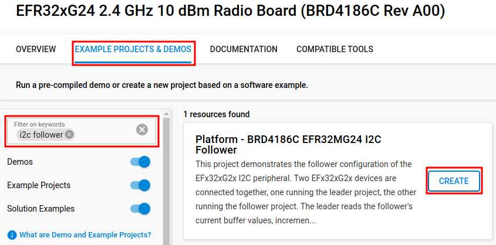
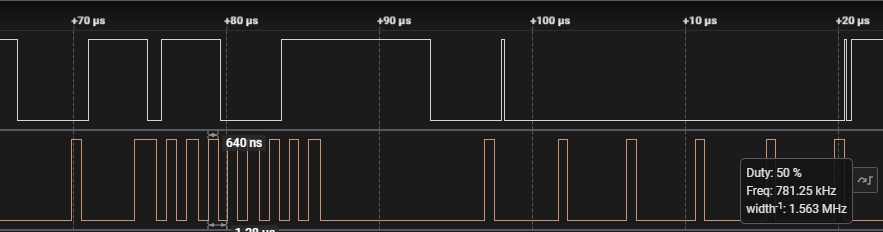

# Platform - I2C Fast Plus Mode #

## Overview ##

This project demonstrates the I2C communication in fast plus mode between 2 EFR32xG2x boards. This project contains the implementation for the leader device. Communication process between 2 boards is triggered once the button 0 is pressed on the leader device.

## SDK version ##

- [SiSDK v2024.12.0](https://github.com/SiliconLabs/simplicity_sdk)

## Software Required ##

- [Simplicity Studio v5 IDE](https://www.silabs.com/developers/simplicity-studio)

## Hardware Required ##

- 1 x [Silicon Labs EFR32xG24 Radio Board (BRD4186C)](https://www.silabs.com/development-tools/wireless/xg24-rb4186c-efr32xg24-wireless-gecko-radio-board?tab=overview) and Wireless Starter Kit

- 1 x [EFR32xG24 Explorer Kit](https://www.silabs.com/development-tools/wireless/efr32xg24-explorer-kit?tab=overview)

## Connections Required ##

The hardware connection is shown in the table below:

| Pin | Leader device (BRD2703A) | Follower device (BRD4186C)|
|:----|:-------------------------|:--------------------------|
| SCL | PB4                      | EXP HEADER 11             |
| SDA | PB5                      | EXP HEADER 7              |

**Note:** You must connect 2 GND pins of 2 board together.

## Setup ##

To test this application, you can either create leader project based on an example project or start with a "Empty C Project" project based on your hardware. You should connect the EFR32xG24 Explorer Kit Board to the PC using a MicroUSB cable.

### Create a project based on an example project ###

1. From the Launcher Home, add the **BRD2703A** to My Products, click on it, and click on the **EXAMPLE PROJECTS & DEMOS** tab. Find the example project filtering by "fast plus".

    

2. Click Create button on the **Platform - I2C Fast Plus Mode** example. Example project creation dialog pops up -> click Create and Finish and Project should be generated.

3. Build and flash this example to the board.

### Start with a "Empty C Project" project ###

1. Create a **Empty C Project** project for your hardware using Simplicity Studio 5.

2. Copy the .c files 'src/app.c' to the following directory of the project root folder (overwriting the existing files).

3. Install the software components:

    - Open the .slcp file in the project.

    - Select the SOFTWARE COMPONENTS tab.

    - Install the following components:
        - [Platform] → [Peripheral] → [I2C]
        - [Platform] → [Peripheral] → [RTCC]

4. Build and flash this project to the board.

### Create follower project ###

1. From the Launcher Home, add the **BRD4186C** to My Products, click on it, and click on the **EXAMPLE PROJECTS & DEMOS** tab. Find the example project filtering by "i2c follower".

    

2. Click Create button on the **Platform - BRD4186C EFR32MG24 I2C Follower** example. Example project creation dialog pops up -> click Create and Finish and Project should be generated.

3. Build and flash this example to the board.

## How it Works ##

Press **BTN0** on the leader kit to trigger an I2C test (read follower buffer, increment, write, read, verify). **LED0** will toggle with a successful I2C test whereas **LED1** will turn on to indicate a failure. You can observe that received values received from the follower (rxBuffer) match transmitted values sent by leader (txBuffer) by viewing *i2c_rxBuffer* and *i2c_txBuffer* respectively in the Expressions window of Simplicity Studio.

## Testing ##

**LED0** is used to verify the result of the transmission process. To confirm that the I2C transmission uses the fast plus mode, an oscilloscope can be used to monitor the frequency.

