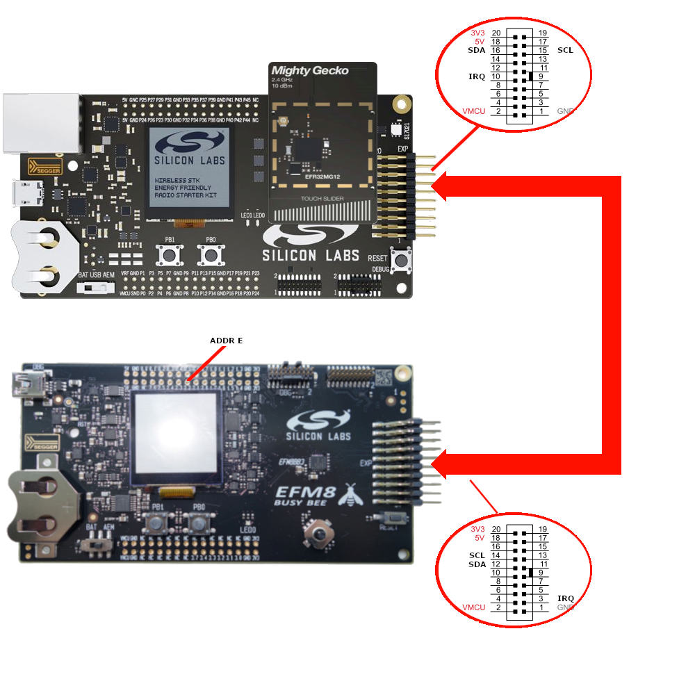
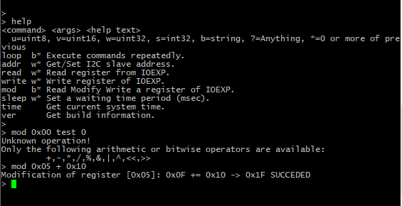
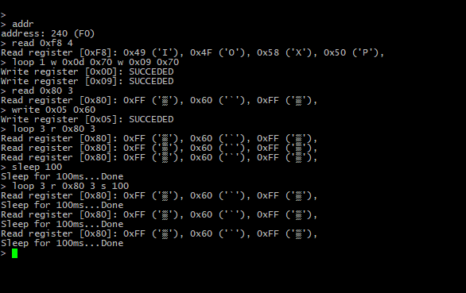

# I2C Test for EFM8 IOExpander #

## Summary ##

This project provides a test tool for EFM8 IOExpander. The example uses I2C module for communication, a GPIO and a LED to detect and signal the interrupts of EFM8 IOExpander. It also contains a simple command interpreter to read, write registers of EFM8 IOExpander, furthermore its additional commands make possible to use it as basic automated test tool. See AN1304 for more information

## Gecko SDK version ##

v2.7.x

## Hardware Required ##

- Wireless Starter Kit (WSTK) Mainboard (SLWMB4001A, formerly BRD4001A)
- EFR32xG12 2.4 GHz 10 dBm Radio Board (BRD4162A)
- Device Under Test: EFM8 (BB1, BB2, BB3, BB52, SB1, SB2 WSTK)

## Connections Required ##

## Setup ##

Clone the repository with this project from GitHub onto your local machine.

From within the Simplicity Studio IDE, select Import -> MCU Project... from the Project menu. Click the Browse button and navigate to the local repository folder, then to the SimplicityStudio folder, select the .sls file for the board, click the Next button twice, and then click Finish.

Note: It is assumed that the Device Under Test is preprogrammed with the appropriate IOExpander project.

## How It Works ##

Two WSTK boards are connected together, one, the SLWMB4001A with EFR32, running this test project, the other, the EFM8 DUT, running the appropriate IOExpander project as a I2C slave. Both device use its Expansion Header for I2C connection and for signaling interrupt event. See details above or in AN1304. After reset or power on, the test program tries to identify the connected device, therefore it is neccessary to power on DUT first. When initialization finished, the program ready to execute commands through serial console. This console can be the in built tool of Simplicity Studio or a 3rd party tool as well. Type help to see the available commands:

| COMMAND   | DESCRIPTION                           |
|-----------|---------------------------------------|
| loop      | Execute commands repeatedly           |
| addr      | Get/Set I2C slave address             |
| read      | Read register from IOEXP              |
| write     | Write register of IOEXP               |
| mod       | Read Modify Write a register of IOEXP |
| sleep     | Set a waiting time period (msec)      |
| time      | Get current system time               |
| ver       | Get build information                 |

Most of the commands are self explaining except mod and loop commands. 
Mod command realizes a read-modify-write process where the modification can be an arithmetic or bitwise operation. Syntax: mod REG OP VAL; And the function behind it: REG OP= VAL (i.e. mod 0x05 + 0x10 -> 0x05 += 0x10).

Loop command realizes repeated execution of a command or sequence of commands. The first parameter of loop command is the loop counter. If loop counter is zero, the result is infinite execution of the command sequence. The infinite execution can break by pressing CTRL-C. As loop command parameter, it is possible to use only the starting letter of other commands. 

Note: Common limitation of commands that they can use maximum 20 parameters!

The project inherited from simple RAIL with HAL example and uses the Gecko Platform configuration tools to configure hardware resources, required drivers, and wireless stack components. It has two main parts, the I2C/IOExpander driver, and the command interpreter. Although the driver part comes from other examples it simplifies and at the same time extends their capabilities. See the .sls file for included components and configuration details. The Gecko Platform handles much of the initialization and setup for this example.

The application relies mostly on command interpreter part, however a callback is registered to the PA09 (pin 10 on Expansion Header) GPIO interrupt to signal when the connected device generates an interrupt. The LED0 shows the current state. With the reading of available ports on IOExpander can acknoledge the interrupt.

The application programming is organised along functionality. The command interpreter functions are placed in cli.c file, while gpio.c includes the before mentioned callback (gpio\_callback()) and its registration in gpio\_init(). The ioexp\_drv.c file is a simplification of bsp\_stk\_ioexp.c on the one hand, because the unused parts (functions, configuration dependencies) are removed. On the other hand there is extended as well. The get/set i2c address and the multiple register reading/writing are new parts to fit i2c behaviour closely to the DUT. Finally main.c is resposible for all of the initializations and cyclic calling of the command interpreter only.

## .sls Projects Used ##

platform_i2c_test_for_efm8_ioexpander.sls

## How to Port to Another Part ##

Open the "Project Properties" and navigate to the "C/C++ Build -> Board/Part/SDK" item. Select the new board or part to target and "Apply" the changes. 
Note: there may be dependencies that need to be resolved when changing the target architecture.

