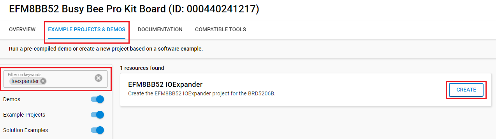

# Platform - I2C Test for EFM8 IOExpander #

## Overview ##

This project provides a test tool for EFM8 IOExpander. The example uses the I2C module for communication, a GPIO pin and a built-in LED to detect and signal the interrupts of EFM8 IOExpander. The command line interface also contains simple command interpreters to read and write registers of EFM8 IOExpander. Furthermore, some additional commands are added to make the example as a basic automated test tool. See [AN1304: GPIO Expander Based on EFM8MCU Product Family](https://www.silabs.com/documents/public/application-notes/an1304-ioexp.pdf) for more information.

## Gecko SDK version ##

- GSDK v4.4.3

## Hardware Required ##

- [EFM32MG12 Wireless Starter Kit (WSTK) Board](https://www.silabs.com/development-tools/wireless/zigbee/efr32mg12-dual-band-starter-kit?tab=overview)

- [EFM8BB52 8-bit MCU Pro Kit - BRD5206B](https://www.silabs.com/development-tools/mcu/8-bit/bb52-pk5206b-efm8bb5-pro-kit?tab=overview)

**NOTE:**
Tested boards for working with this example:

| Board ID | Description  |
| ---------------------- | ------ |
| BRD4161A | [EFM32MG12 Wireless Starter Kit (WSTK) Board](https://www.silabs.com/development-tools/wireless/zigbee/efr32mg12-dual-band-starter-kit?tab=overview) |

## Connections Required ##

The following picture shows the system view of how it works.

## Setup ##

To test this application, you can either create a project based on an example project or start with an "Empty C Project" project based on your hardware.

### Create a project based on an example project ###

1. Make sure that this repository is added to [Preferences > Simplicity Studio > External Repos](https://docs.silabs.com/simplicity-studio-5-users-guide/latest/ss-5-users-guide-about-the-launcher/welcome-and-device-tabs).

2. From the Launcher Home, add your hardware to My Products, click on it, and click on the **EXAMPLE PROJECTS & DEMOS** tab. Find the example project by filtering "ioexpander".

3. Click the **Create** button on the **Platform - I2C Test For EFM8 IOexpander (IOEXP)** example. Example project creation dialog pops up -> click Create and Finish and Project should be generated.

4. Build and flash this example to the board.

### Start with an "Empty C Project" project ###

1. Create an **Empty C Project** project for your hardware using Simplicity Studio 5.

2. Copy the all attached files in the *src* and *inc* folders into your project (overwriting existing).

3. Open the .slcp file. Select the SOFTWARE COMPONENTS tab and install the software components:

     - [Third Party] → [Tiny printf]

     - [Platform] → [Driver] → [LED] → [Simple LED] → default instance name: led0

     - [Services] → [Command Line Interface] → [CLI Instance(s)] → default instance name: inst.

     - [Platform] → [Radio] → [RAIL Utility] → default instance name: inst.

     - [Driver] → [GPIOINT]

     - [Services] → [IO Stream] → [IO Stream: EUSART] → default instance name: vcom and configure as bellow:
     

     - [Platform] → [Board] → [Board Control] → enable: **Virtual COM UART**.

     - [Platform] → [Driver] → [I2C] → [I2CSPM] → add instance name: ioexp and configure as follows:
     

4. Build and flash the project to your device.

### Run **EFM8BB52 IOExpander** project on EFM8 Board ###

1. From the Launcher Home, add your hardware to My Products, click on it, and click on the **EXAMPLE PROJECTS & DEMOS** tab. Find the example project by filtering "ioexpander".

2. Click the **Create** button on the **EFM8BB52 IOExpander** example. Example project creation dialog pops up -> click Create and Finish and Project should be generated.

3. Build and flash this example to the board.

## How It Works ##

The EFM32MG12 plays the role of an I2C central device. The EFM8BB52 Pro Kit plays the role of an I2C peripheral device. They are connected via their expansion header, see [Connections Required](#connections-required). 

After resetting or powering on, the central device tries to identify the connected device. Therefore, it is necessary to power on the peripheral device first. When initialization is finished, the program is ready to execute commands through the serial console. This console can be the built-in tool of Simplicity Studio v5 or a third-party tool such as Putty, MobaXterm, etc. Type **help** to see the available commands:

| COMMAND   | DESCRIPTION                           |
|-----------|---------------------------------------|
| loop      | Execute commands repeatedly           |
| addr      | Get/Set I2C slave address             |
| read      | Read register from IOEXP              |
| write     | Write register of IOEXP               |
| mod       | Read Modify Write a register of IOEXP |
| sleep     | Set a waiting time period (msec)      |
| time      | Get current system time               |
| ver       | Get build information                 |

**Note**:

- Most of the commands are self-explaining except `mod` and `loop` commands. 

- A common limitation of commands is that they can use a maximum of 20 parameters.

The `mod` command realizes a read-modify-write process where the modification can be an arithmetic or bitwise operation. The function behind `mod` command: REG OP= VAL (i.e. mod 0x05 + 0x10 -> 0x05 += 0x10).

Loop command realizes repeated execution of a command or sequence of commands. The first parameter of the loop command is the loop counter. If the loop counter is zero, the result is an infinite execution of the command sequence. The infinite execution can break by pressing CTRL-C. As a loop command parameter, it is possible to use only the starting letter of other commands. 

The application relies mostly on the command line interface part. However, a callback is registered to the PA09 (pin 10 on the Expansion Header of the central device). The GPIO pin interrupts to signal when the connected device generates an interrupt. The LED0 shows the current state. With the reading of available ports, IOExpander can acknowledge the interrupt.

The application is organized along with functionality. The command interpreter functions are placed in the `cli_cmd_function.c` file. while the `gpio.c` file includes the previously mentioned callback function (gpio_callback()). The `ioexp_drv.c` file is a simplification of the `bsp_stk_ioexp.c` on the one hand. Because the unused parts (such as functions, and configuration dependencies) are removed. On the other hand, it is extended as well. The get and set I2C address of the peripheral device and the multiple register reading or writing are new parts.

