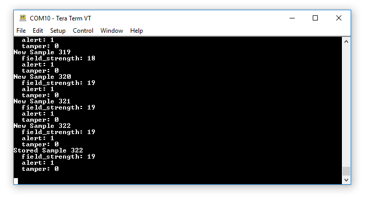
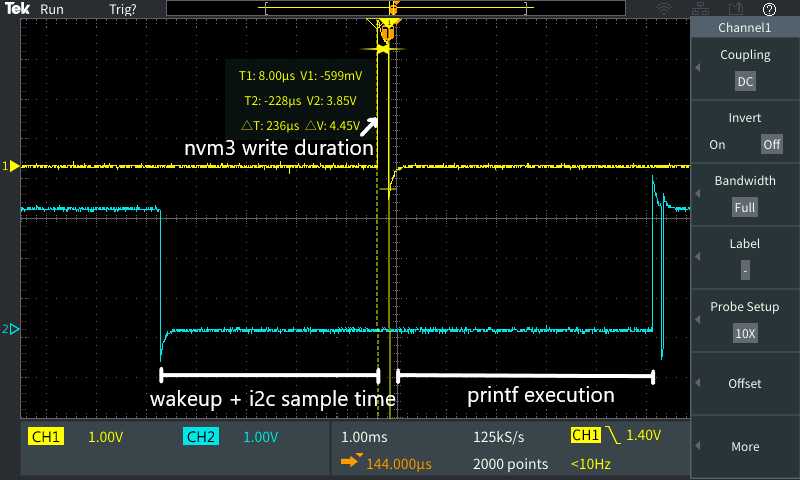

# I2C Read to NVM3 Test

## Summary

This project tests the total system latency when sampling a SI7210 Hall Effect sensor on the I2C bus and storing the information to flash using NVM3. Notably this project makes use of the Gecko Platform to capture the added platform and wireless stack overhead. On each BTN0 press a sensor sample will be recorded, saved to flash, and printed to the Jlink COM port. On reset or startup the device will load and print the most recent saved sensor sample to the COM port. 

## Gecko SDK Version ##

v3.0 or later with Simplicity Studio v5

## Hardware Required ##

* One EFR32BG22 Thunderboard Kit (SLTB010A)

## Setup

Clone the repository with this project from GitHub onto your local machine.

From within the Simplicity Studio IDE, select Import -> MCU Project... from the 
Project menu. Click the Browse button and navigate to the local repository 
folder, then to the SimplicityStudio folder, select the .sls file for the 
board, click the Next button twice, and then click Finish. Build and run the project on a connected Thunderboard kit.

Next, open a terminal program such as [Tera Term](https://ttssh2.osdn.jp/index.html.en), and connect to the Jlink CDC UART Port for the Thunderboard. 
Press BTN0 on the Thunderboard and observe the output to the terminal. Place a magnetic element near the on board Hall Effect sensor near the top left corner of the Thunderboard to observe the values change. Reset the device and observe that the most recent sample was saved through reset and is load to the terminal. 

Trace pins 3 and 7 to see the latency information. When pin 3 is high, the device is writing the sensor sample to flash. When pin 7 is low the device is in EM0, and when pin 7 is high the device is in EM1 or EM2 sleep. From this the timing information can be measured as shown in the scope capture below.

## How the Project Works

The project uses the Gecko Platform configuration tools to configure hardware resources, required drivers, and wireless stack components. The wireless stack components are only present to test added overhead and are not used by this project. See the .slcp file for included components and configuration details. The Gecko Platform handles much of the initialization and setup for this example.

All application programming is handled in app.c. In this file, app\_init() initializes the I2C Hall Effect sensor and GPIO interrupts for BTN0. This function additionally searches nvm3 storage for any saved sensor samples, and if found prints the sample to the terminal.

A callback is registered to the BTN0 GPIO interrupt to signal when to sample the sensor, which is then processed in app\_process\_action(). Once processed, the latest sample is saved to the nvm3 instance, and printed to the terminal as a new sample. GPIO pins PA08 (pin 3) and PC06 (pin 7) are toggled during flash writes and sleep/wakeup respectively. EMLIB sources em\_emu.h/c are modified to toggle PC06 immediately on system wakeup in order to accurately capture the total system latency. 

Note: This example only saves the latest sample to test a simple use case for flash storage. It does not save the information from arbitrary past samples.

## .sls project used

* platform\_i2c\_to\_nvm3\_test.sls

## How to Port to Another Part

This example heavily relies on Thunderboard's onboard SI7210 sensor and VCOM port. The project is also designed to work with series 2 devices only.
To port to a board with equivalent features and a series 2 EFR32 device:
1. Open the .slcp file, and change the Target/SDK to the desired part.
2. Modify the .pintool to use the correct pinouts for the custom board.
3. Modify the 'I2CSPM' and 'SI7210 Driver' software components in the .slcp file to the desired configuration.
4. Modify the sl\_sensor\_hall.c/h sources to function without the Thunderboard board support headers.
