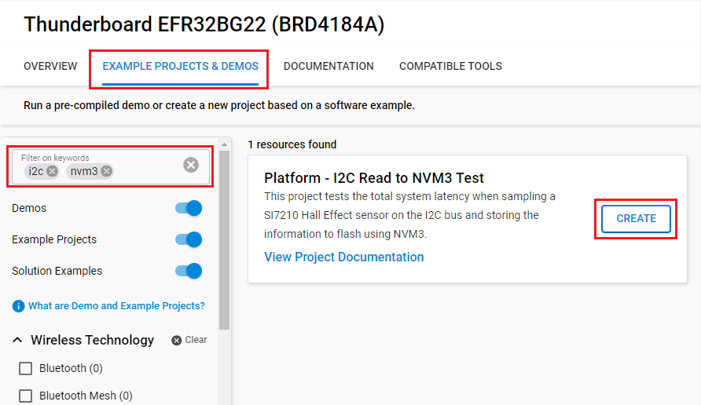
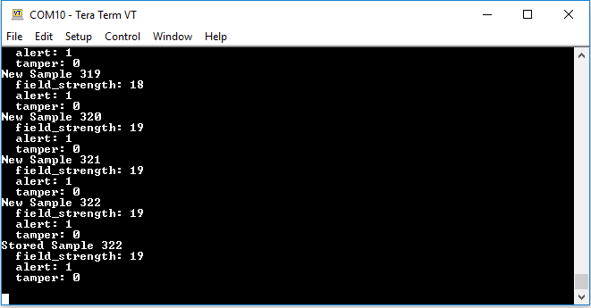
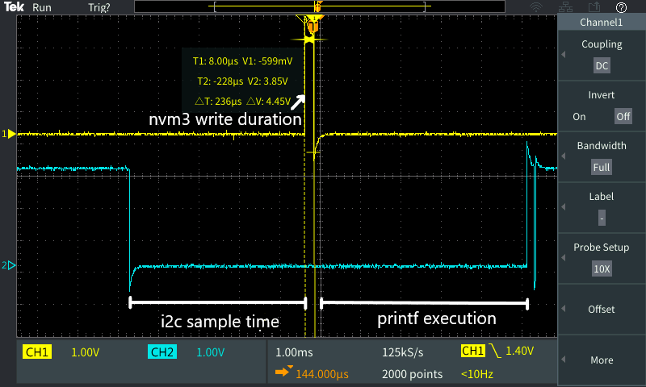

# Platform - I2C Read to NVM3 Test #

## Overview ##

This project tests the total system latency when sampling an SI7210 Hall Effect sensor on the I2C bus and storing the information to flash using NVM3. Notably this project makes use of the Gecko Platform to capture the added platform and wireless stack overhead. On each BTN0 press a sensor sample will be recorded, saved to flash, and printed to the Jlink COM port. On reset or startup, the device will load and print the most recent saved sensor sample to the COM port.

## Gecko SDK Version ##

- v4.4.3

## Hardware Required ##

- One EFR32BG22 Thunderboard Kit (SLTB010A)

## Connections Required ##

- Connect the Kit to the PC through a micro USB cable.

## Setup ##

To test this application, you can either create a project based on an example project or start with a "Bluetooth - SOC Empty" project based on your hardware.

### Create a project based on an example project ###

1. Make sure that this repository is added to [Preferences > Simplicity Studio > External Repos](https://docs.silabs.com/simplicity-studio-5-users-guide/latest/ss-5-users-guide-about-the-launcher/welcome-and-device-tabs).

2. From the Launcher Home, add your device to My Products, click on it, and click on the **EXAMPLE PROJECTS & DEMOS** tab. Find the example project filtering by **i2c** and **nvm3**.

3. Click the **Create** button on the **Platform - I2C Read to NVM3 Test** example. Example project creation dialog pops up -> click **Finish** and Project should be generated.

    

4. Build and flash this example to the board.

### Start with a "Bluetooth - SOC Empty" project ###

1. Create a **Bluetooth - SOC Empty** project for your hardware using Simplicity Studio 5.

2. Replace the `app.c` file in the project root folder with the provided `app.c` (located in the src folder).

3. Open the .slcp file. Select the SOFTWARE COMPONENTS tab and install the software components:

   - [Platform] → [Driver] → [Button] → [Simple Button] → default instance name: **btn0**.
   - [Services] → [NVM3] → [NVM3 Core]
   - [Bluetooth] → [Application] → [Miscellaneous] → [Hall effect sensor]
   - [Platform] → [Board] → [Board Control] → Active "Enable Hall Effect sensor"
   - [Services] → [IO Stream] → [IO Stream: USART] → default instance name: **vcom**
   - [Application] → [Utility] → [Log]

4. Build and flash the project to your device.

## How It Works ##

The wireless stack components are only present to test added overhead and are not used by this project.

All application programming is handled in the `app.c` file. In this file, the `app_init()` function initializes the I2C Hall Effect sensor. This function additionally searches nvm3 storage for any saved sensor samples, and if found prints the sample to the terminal.

Sampling of the Hall sensor is triggered by the BTN0 GPIO interrupt, which is then processed in the `app_process_action()` function. Once processed, the latest sample is saved to the nvm3 instance, and printed to the terminal as a new sample. GPIO pins PA08 (pin 3) and PC06 (pin 7) are toggled during flash writes and sleep/wakeup respectively.

**Note**:

- This example only saves the latest sample to test a simple use case for flash storage. It does not save the information from arbitrary past samples.
- Total system latency does not include Wakeup Time from EM1/EM2. For more details about Wakeup Time, see the **4.8 Wake Up, Entry, and Exit times** section in the [efr32bg22-datasheet](https://www.silabs.com/documents/public/data-sheets/efr32bg22-datasheet.pdf).

## Testing ##

Build and run the project on a connected Thunderboard kit.

Next, open a terminal program such as [Tera Term](https://ttssh2.osdn.jp/index.html.en), and connect to the Jlink CDC UART Port for the Thunderboard.
Press BTN0 on the Thunderboard and observe the output to the terminal. Place a magnetic element near the onboard Hall Effect sensor near the top left corner of the Thunderboard to observe the values change. Reset the device and observe that the most recent sample was saved through reset and is loaded to the terminal.

Trace pins 3 and 7 to see the latency information. When pin 3 is high, the device is writing the sensor sample to flash. When pin 7 is low the device is in EM0, and when pin 7 is high the device is in EM1 or EM2 sleep. From this, the timing information can be measured as shown in the scope capture below.

