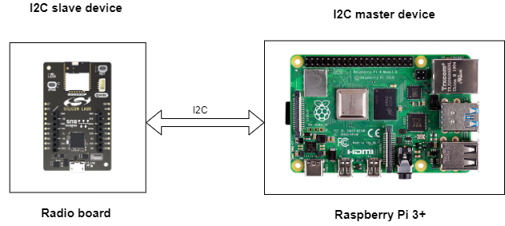
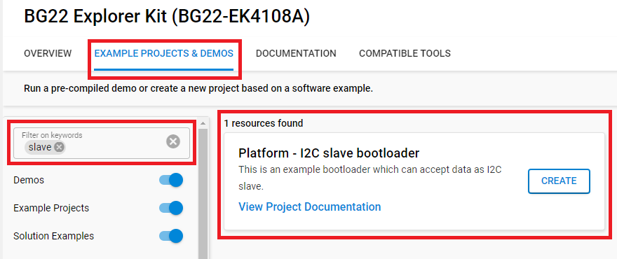
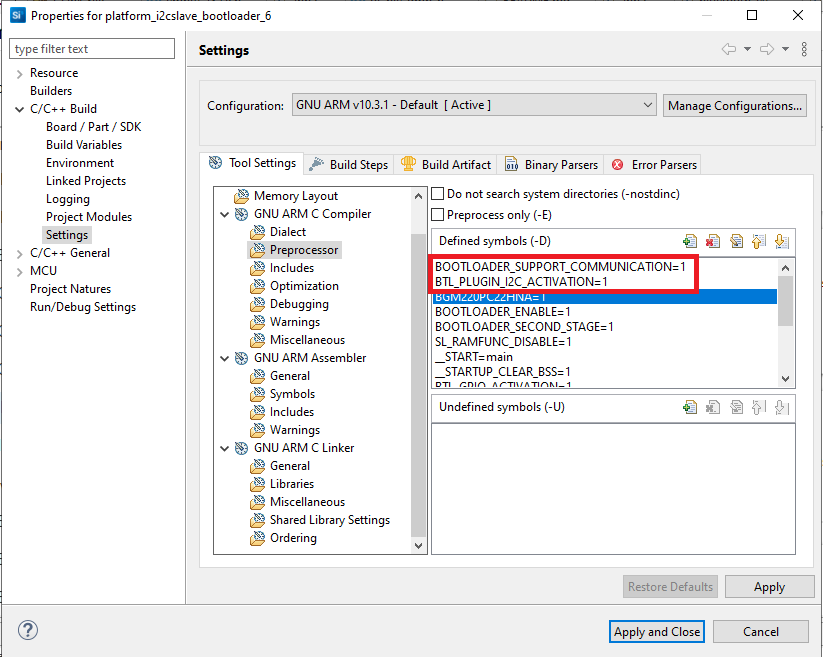
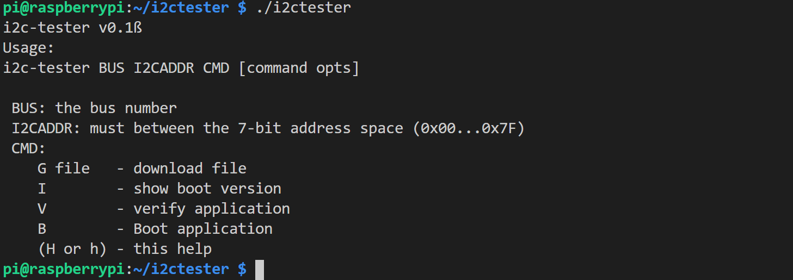
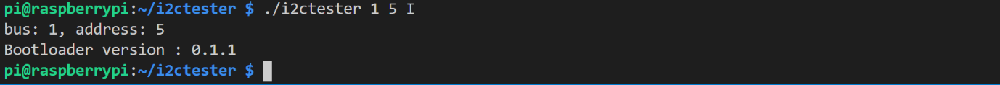
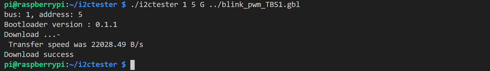
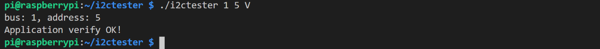
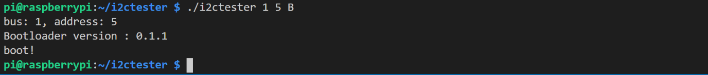

# Platform - I2C slave bootloader #

## Description ##

This example implement I2C slave mode bootloader. The bootloader supports firmware download, checking downloaded application and booting the downloaded software.

## Gecko SDK version ##

- GSDK v4.4.3

## Hardware Required ##

- Slave device: [BGM220 Bluetooth Module Explorer Kit - BGM220-EK4314A](https://www.silabs.com/development-tools/wireless/bluetooth/bgm220-explorer-kit?tab=overview)
- Master device: [Raspberry Pi 3B+](https://www.raspberrypi.com/products/raspberry-pi-3-model-b-plus)

**NOTE:**
Slave device is tested on these boards:

| Board ID | Description  |
| ---------------------- | ------ |
| BRD2703A | [EFR32xG24 Explorer Kit - XG24-EK2703A](https://www.silabs.com/development-tools/wireless/efr32xg24-explorer-kit?tab=overview)    |
| BRD2704A | [SparkFun Thing Plus Matter - MGM240P - BRD2704A](https://www.sparkfun.com/products/20270) |
| BRD2601B | [EFR32xG24 Dev Kit - xG24-DK2601B](https://www.silabs.com/development-tools/wireless/efr32xg24-dev-kit?tab=overview)   |
| BRD4314A | [BGM220 Bluetooth Module Explorer Kit - BGM220-EK4314A](https://www.silabs.com/development-tools/wireless/bluetooth/bgm220-explorer-kit?tab=overview)  |
| BRD4108A | [BG22 Bluetooth SoC Explorer Kit - BG22-EK4108A](https://www.silabs.com/development-tools/wireless/bluetooth/bg22-explorer-kit?tab=overview)  |

## Connections Required ##

- The I2C connection between master and slave device can be made by using jumper wires and the I2C bus must have pullup registers.

## Setup ##

To test this application, you can either create a project based on a example project or start with an "Empty C Project" project based on your hardware.

### Create a project based on a example project ###

1. From the Launcher Home, add the your hardware to My Products, click on it, and click on the **EXAMPLE PROJECTS & DEMOS** tab. Find the example project with filter "slave".

2. Click **Create** button on the **Platform - I2C slave bootloader** example. Example project creation dialog pops up -> click Create and Finish and Project should be generated.

3. Build and flash this example to the board.

### Start with an "Empty C Project" project ###

1. Create a **Empty C Project** project for your device using Simplicity Studio 5.

2. Copy all attached files in *inc* and *src* folders into the project root folder.

3. Copy .slbp files in *SimplicityStudio* folder into the project root folder.

4. Open the .slcp file. Select the SOFTWARE COMPONENTS tab and install the software components:

- Install **[Platform] > [Bootloader] > [Bootloader Core]** component.
- Install **[Platform] > [Bootloader] > [Cyclic Redundancy Check]** component.
- Install **[Platform] > [Bootloader] > [Image Parser]** component.
- Install **[Platform] > [Bootloader] > [Utils] > [Debug]** component.
- Install **[Platform] > [Bootloader] > [GPIO activation]** component.

5. In project build setting add 2 define options as image is shown bellow:

- BOOTLOADER_SUPPORT_COMMUNICATION=1
- BTL_PLUGIN_I2C_ACTIVATION=1

  

## How It Works ##

1. Using i2ctester
   

    i2ctester has some command line arguments. At least bus number and target’s I2C address and a command letter should be given. If the passed arguments are wrong, i2ctester shows it usage.

2. Print bootloader version information
   

3. Download application image (GBL format)
   

4. Verify application
   

5. Boot application
   

## How to Port to Another Part ##

[Raspberry 3+ example master documentation](i2ctester_Rpi3/doc/index.md)\
[Bootloader documentation](doc/index.md).

## Special Notes ##

### Prebuilt ###

- [Raspberry Pi 3+ i2ctester tool](prebuilt/i2ctester_Rpi3/i2ctester)
- [Example gbl applcation that blink led on the BGM220 Bluetooth Module Explorer Kit board](prebuilt/application_gbl/blink_baremetal_application_brd4314a.gbl)