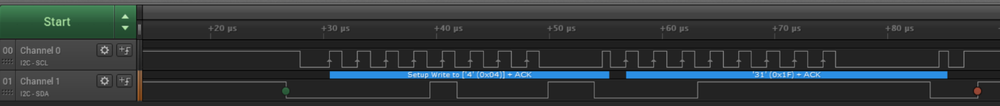

I2C Slave Bootloader

# Introduction

Project has designated to implement I2C slave mode only bootloader with different activation sources. The bootloader supports firmware download, checking downloaded application and booting the downloaded software. The I2C slave operation is capable to work with 400kHz clock speed. Able to get bootloader upon reset by predefined pin or I2C command activation.

# Theory of Operation

The bootloader works with a slave mode I2C interface. First initializes the necessary peripherals and checks IO pin state and receives I2C messages. If the preconfigured pin asserted or the I2C_FIRMWARE_UPGRADE_OPERATION command received through I2C slave interface, the bootloader also remains active and waits for I2C commands, otherwise it continues the booting process.
## I2C bootloader protocol

<table>
<td width="25%">

|  |
|:--:|
| ***Figure 1.** I2C bootloader protocol* |
</td><td>
I2C bootloader uses a proprietary protocol. It keeps the master-slave relationship over all of operations. This means, the slave does not act as master over the time during bootloader is active. When the master issues a message, the slave process it and responses as a result for a I2C read operation or the result will be asked by master device periodically. [Table 1](#table-1) lists bootloader commands what can be issued for the slave. See [Table 3](#table-3) for the specific sequences of each command.

[Figure 1](#figure-1) shows a sample sequence. When the bootloader waits in upgrade operation, the download should be initiated by BOOT_GBL_DOWNLOAD (see [Table 1](#table-1) for commands) command. It changes the operation to download and initializes the GBL parser infrastructure and waits for the download frames. When a download frame arrives by BOOT_DOWNLOAD_FRAME, it runs some checks to ensure the data transfer was without error. These checks are including frame length inspection, CRC and sequence number field matching. Then sets the status depending on GBL parser’s result. If any error detected by the parser, the whole download should be repeated as nature of the parsing process. The status set to BOOT_REPLY_PENDING during parsing and checking period. The frame can be repeated if other errors have detected. If the download finished, or the BOOT_DOWNLOAD_COMPLETE command issued, the status set depending on the parser evaluation about the downloaded file has completed the parsing.
</td>
</table>

 ***Table 1.** I2C bootloader commands*

|  Command |  Command byte |  issued in operation |  Operation changed to |  Description |
|----------|---------------|----------------------|-----------------------|--------------|
| BOOT_GBL_DOWNLOAD | 0x10 | upgrade | download | Initiates firmware download process |
| BOOT_VERSION | 0x20 | all | no state changes | get version info |
| BOOT_BOOT_APP | 0x30 | upgrade | boot | Initiate the boot sequence (resets to app if applicable) - currently does not support slots. |
| BOOT_VERIFY | 0x60 | upgrade | verify -\> upgrade | checks the stored application; result can be received by BOOT_GET_LAST_CMD_STATUS. It returns to upgrade operation upon finish. |
| BOOT_GET_LAST_CMD_STATUS | 0x55 | all | no state changes | get the last issued command’s status/result. |
| BOOT_ABORT | 0xAA | download | update | abort current process |
| BOOT_DOWNLOAD_FRAME | 0x11 | download | no state changes |  download a frame from the application to slave. |
| BOOT_DOWNLOAD_COMPLETE | 0x1F | download | upgrade | Download complete by the host, returning to upgrade state.  |
| BOOT_ACTIVATE_UPGRADE | 0xA9 | boot | upgrade | activates bootloader during boot |

## Boot states

The I2C slave bootloader defines some states during its running period. To clarify the purpose and timing see [Table 2](#table-2) .

 ***Table 2.** I2C Bootloader States*

|  State |  Description |
|--------|--------------|
| boot | Starts on power up/reset, holds until the bootloader checks whether GPIO pin or/and I2C activation |
| upgrade | upgrade mode can be activated by I2C command or GPIO pin. When entered, bootloader waits for I2C commands until the following reset or BOOT_BOOT_APP command. |
| download | Download state can be reached with issued BOOT_GBL_DOWNLOAD command. In this state, the bootloader waits for frame downloads by BOOT_DOWNLOAD_FRAME. Can be terminated by BOOT_DOWNLOAD_COMPLETE or BOOT_ABORT.  |

## Command status

When one of the BOOT_VERIFY, BOOT_GBL_DOWNLOAD, BOOT_DOWNLOAD_FRAME, BOOT_DOWNLOAD_COMPLETE, or unknown command received, a command status byte set. This status holds information about the error, detected by the bootloader during download and upgrade state. [Table 3](#table-3) holds information about the value meanings.

 ***Table 3.** I2C command status*

|  Name |  Value |  Description |
|-------|--------|--------------|
| BOOT_REPLY_OK | 0x00 | No error detected |
| BOOT_REPLY_PENDING | 0x81 | Command currently is under process, turn back later for result |
| BOOT_REPLY_ERR_INCOMPLETE | 0xF9 | Download was incomplete, but BOOT_DOWNLOAD_COMPLETE command has received |
| BOOT_REPLY_ERR_FRAME_SEQUENCE | 0xFA | Frame sequence was not met with the expected value |
| BOOT_REPLY_ERR_PARSE | 0xFB | GBL parser detected errors.  |
| BOOT_REPLY_ERR_CRC | 0xFC | Frame CRC check failed |
| BOOT_REPLY_ERR_LENGTH | 0xFD | Frame length is not matched with the receiver queue size. |
| BOOT_REPLY_ERR_VERIFY | 0xFE | Application verify has failed |
| BOOT_REPLY_ERR_UNKNOWN | 0xFF | Unknown error, for example boot to application attempt failed from update state. |

## Command sequences

The commands are using I2C standard for the physical communication. This means the master always writes upon start transaction. Then -depending on operation- continues writing or reads back from the slave. The slave’s address is a constant value during software compilation (via .H header macro constant). As the I2C standard describes, read operations are multipart operations. At first, there are simple I2C write operations, then the slave puts the response on its output, clocked by the master. If the master wants to read further bytes, it will terminate with an Ack bit or the read operation terminates, master has to response with Nack. For write operations, all the sent data should be Ack’ed by the addressed slave or the master considering the write operation has failed.

***Table 4.** Notation used in byte sequences*

|  Mark |  Description |
|-------|--------------|
| [] | Marks as byte boundaries for bitfields, for example, [Addr:7, Wr] constructs a byte. |
| Addr | The 7 bit address; in the examples, Addr was previously set to 0x4. |
| Rd | Read bit (SDA asserted high) |
| Wr | Write bit (SDA asserted low) |
| :x | x marks the bit length of the field. For example Addr:7 marks 7 bit wide.  |

### BOOT_GBL_DOWNLOAD

Write [Addr:7, Wr:1], 0x10

|  |
|:--:|
| ***Figure 2.** BOOT_GBL_DOWNLOAD pattern* |

### BOOT_VERSION

Write [Addr:7, Wr], 0x20, [Addr:7, Rd]

Read version_info_t structure (6 bytes)

typedef struct __PACKED {

  uint16_t  major;

  uint16_t  minor;

  uint16_t  patch;

} version_info_t;

|  |
|:--:|
| ***Figure 3.** BOOT_VERSION sample* |

### BOOT_BOOT_APP

Write [Addr:7, Wr], 0x30

or

Write [Addr:7, Wr], 0x30, Slot

|  |
|:--:|
| ***Figure 4.** BOOT_BOOT_APP sample with slot selection sample* |

|  |
|:--:|
| ***Figure 5.** BOOT_BOOT_APP without slot selection sample* |

### BOOT_VERIFY

Write [Addr:7, Wr], 0x60

|  |
|:--:|
| ***Figure 6.** BOOT_VERIFY sample* |

### BOOT_GET_LAST_CMD_STATUS

Write [Addr:7, Wr], 0x55, [Addr:7, Rd]

Read status_byte

|  |
|:--:|
| ***Figure 7.** BOOT_GET_LAST_CMD_STATUS sample (read result is 0x00)* |

### BOOT_ABORT

Write [Addr:7, Wr], 0xAA

|  |
|:--:|
| ***Figure 8.** BOOT_ABORT sample* |

### BOOT_DOWNLOAD_FRAME

Write [Addr:7, Wr], i2c_download_frame_t structure, where command = 0x11, length: the downloaded frame size, including head, for example, if the frame_data has 128 bytes, then the length is 128 + (1 + 1 + 2 + 2) = 134 bytes. Supported frame is up to 128 bytes of frame_data.

typedef struct __PACKED {

  uint8_t  command;

  uint8_t  length;

  uint16_t crc16;

  uint16_t frame_seq_nr;

  uint8_t  frame_data[];

} i2c_download_frame_t;

|  |
|:--:|
| ***Figure 9.** BOOT_DOWNLOAD_FRAME head sample* |

### BOOT_DOWNLOAD_COMPLETE

Write [Addr:7, Wr], 0x1F

|  |
|:--:|
| ***Figure 10.** BOOT_DOWNLOAD_COMPLETE sample* |

### BOOT_ACTIVATE_UPGRADE

Write [Addr:7, Wr], 0xA9

|  |
|:--:|
| ***Figure 11.** BOOT_ACTIVATE_UPGRADE sample* |

# Generating GBL file stream

The GBL file can be generated by Simplicity Commander from the .s37 files. see [UG162](https://www.silabs.com/documents/public/user-guides/ug162-simplicity-commander-reference-guide.pdf)  for further information.

# Configuration

 To use the I2C bootloader appropriately, it is necessary to select the used part number and IO pinout. When configuration done, the bootloader ready to build and download to target.

## Selecting device

- To change part number to the used type, open the .isc file and change the device on the general tab by clicking on ‘Edit Architecture’ button

- Now Select architecture dialog appears, change the part to the target’s part number

- When part is selected, click ok to return to the general tab. Now click on ‘Generate’ to create project configurations to the part.

## Changing pinout

The pinout should change after the part has changed to reflect the hardware design’s pin usage.

- Open the Hardware configurator and change the used I2C interface’s pins.

## Changing I2C interface

By default, the I2C slave bootloader uses the I2C0 interface for communication with the master. If a design consideration turns out that should be changed, the following steps can be issued:

- Open the hardware configurator

- Allow the new interface if it necessary

- Set its pinout to reflect the new interface configuration

- Save the hardware configuration

- Open the .isc file

- Change the build variable BSP_I2C_APP_PORT on the ‘Other’ tab

- Save the .isc file

- Click on ‘Generate’ to modify build configuration

## Changing I2C address

I2C slave address is an important variable due to nature of I2C bus. The default is using 0x04, change the BTL_I2C_APP_ADDRESS macro’s value on ‘Other’ tab page of the .isc file if necessary.

## I2C activation time

There is a switchable delay time during startup after reset. This time serves to wait for BOOT_ACTIVATE_UPGRADE command. When the command has arrived, bootloader immediately enters to upgrade mode. The bootloader defaults for 2500 miliseconds, which can be overridden by setting BOOTLOADER_I2C_ACTIVATION_DELAY or completely switched off by removing BTL_PLUGIN_I2C_ACTIVATION from the additional macros on the Other tab of the .isc file.

# References

[UG266](https://www.silabs.com/documents/public/user-guides/ug266-gecko-bootloader-user-guide.pdf)  - Silicon Labs Gecko Bootloader

[UG162](https://www.silabs.com/documents/public/user-guides/ug162-simplicity-commander-reference-guide.pdf)  - Simplicity Commander Reference Guide
