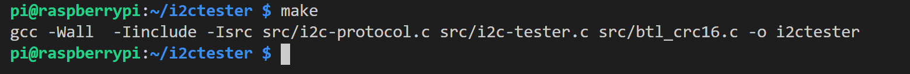

# Using Raspberry Pi 3+ B with I2C Slave Bootloader #

# Introduction

Project has designated to create an example master implementation a RaspberryPi 3B+ for I2C slave bootloader. This document shows that how to use Raspberry Pi 3+ B as master to download firmware to EFR32xGxx devices.

# Theory of Operation

The Raspberry Pi acts as master on I2C bus, the target (bootloader) should be in slave mode. The i2ctester tool issues command based on command line arguments.

# Setup Raspberry Pi 3 B+

## Desktop

To achieve the correct setup, at least the I2C should be enabled and configured. To enable it, use the Raspberry Pi’s Menu -\> Preferences -\> Raspberry Pi Configuration.

|
|:--:|
| ***Figure 1.** Enabling I2C interface via desktop* |

## Console

To enable I2C interface via console, issue the command ‘sudo raspi-config’.

|
|:--:|
| ***Figure 2.** raspi-config* |

Select ‘Interfacing options’ and ‘I2C’.

 |
|:--:|
| ***Figure 3.** Selecting I2C interface* |

Now enable the I2C by selecting ‘Yes’.

 |
|:--:|
| ***Figure 4.** Enabling I2C interface* |

## Configuring I2C

When I2C enabled, it requires some configuration to set SCL clocking frequency to 400kHz.

Edit the /boot/config.txt and edit or add following values:

---

dtparam=i2c_arm=on\
dtparam=i2c1=on\
dtparam=i2c_baudrate=400000

---

Raspberry Pi needs reboot after values have been added.

## Additional tools

If the bootloader is used with I2C activation, need to install i2c-tools by issuing ‘sudo apt install i2c-tools’.

## compiling i2c tester

download i2c tester to Raspberry Pi, and enter ‘make’:

|  |
|:--:|
| ***Figure 5.**  Compiling i2ctester* |

Now the software components are ready to use on Raspberry Pi.

# Hardware configuration

Hardware configuration is only make the hardware connection between the Raspberry Pi and the target.

Table 1. Raspberry Pi 3 B+ I2C pins

|  Name |  Pin |
|-------|------|
| SDA | J8-3 |
| SCL | J8-5 |
| GND | J8-5, J8-9, J8-14, J8-20, J8-25, J8-30, J8-34, J8-39\* \*one connection is enough |

If the target would be activated by additional IO pin or wanted to automatic reset, need additional connection(s) between RPi’s GPIO pin and the target.

When GPIO is used for such connections, need to configure all to out and pull-up enabled:

---

gpio -1 mode PIN out\
gpio -1 mode PIN up

---

PIN means the connector’s pin number when -1 option is used otherwise the GPIO line number should be given. For further reference, see gpio’s man page.

# Using i2ctester

|  |
|:--:|
| *i2ctester arguments* |

i2ctester has some command line arguments. At least bus number and target’s I2C address and a command letter should be given. If the passed arguments are wrong, i2ctester shows it usage.

## Print bootloader version information

command: i2ctester bus slaveaddr I

effect: prints boot version information

|  |
|:--:|
| ***Figure 7.** Get bootloader version*|

## Download application image (GBL format)

command: i2ctester bus slaveaddr G gblfilepath

effect: downloads the GBL file, and checks the result. During download, bootloader checks whether the image is correct even on finish.

 |
|:--:|
| ***Figure 8.** Downloading GBL file to the target* |

## Verify application

command: i2ctester bus slaveaddr V

effect: checks the stored application image and returns its result.

|  |
|:--:|
| ***Figure 9.**  Verify command* |

## Boot application

command: i2ctester bus slaveaddr B

effect: boots the stored application from the target’s flash.

|  |
|:--:|
| ***Figure 10.** Booting application* |

## Activating upgrade mode through I2C

If it switched on before compilation, the bootloader will wait for a while to activation command on I2C interface after reset. To activate the upgrade mode, issue the ‘i2cset -y *bus slaveaddr* 0xA9’ command where bus is the I2C bus number, slaveaddr is the I2C address of the slaver. The bootloader responses with ACK when the command has received and immediately enters to upgrade mode.

