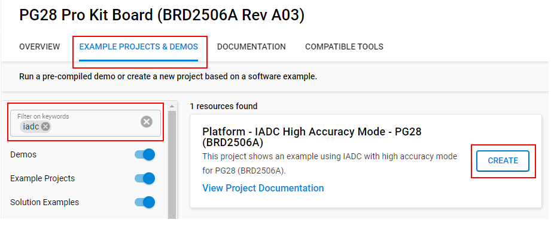
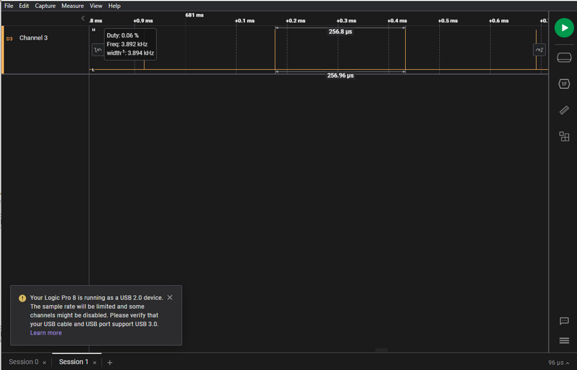
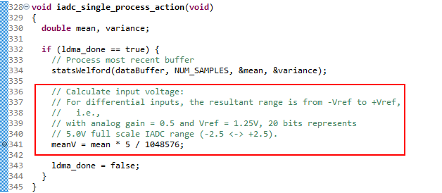
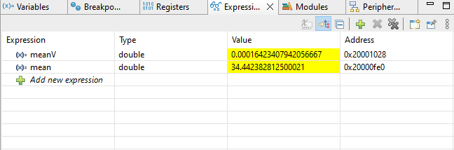

# Platform - IADC 20-bit High Accuracy: Dedicated analog inputs with LDMA ping-pong #

## Overview ##

This project configures the IADC peripheral to run continuously after the software trigger performing single conversions of a differential input.

The IADC peripheral is configured to utilize dedicated analog inputs (AIN0 and AIN1), as a single differential input, AIN0 as positive input and AIN1 as negative. IADC reference is configured to use the external analog reference provided by the ADR1581 circuit on BRD2506A.

Peripherals used: IADC, LDMA, GPIO, PRS

## Gecko SDK version ##

GSDK v4.4.3

## Hardware Required ##

* Board:  Silicon Labs EFM32PG28 Pro Kit Board (BRD2506A)
  * Device: EFM32PG28B310F1024IM68

## Connections Required ##

Connect the board via a micro-USB cable to your PC to flash the example.
Dedicated analog input via SMA connector and expansion header pin 3 are utilized for IADC conversion. The example is configured for differential measurement; jumper expansion header pin 3 to GND (expansion header pin 1) for single-ended analog measurement via SMA connector.

## Setup ##

To test this application, you can either create a project based on an example project or start with an empty example project.

### Create a project based on an example project ###

1. Make sure that this repository is added to [Preferences > Simplicity Studio > External Repos](https://docs.silabs.com/simplicity-studio-5-users-guide/latest/ss-5-users-guide-about-the-launcher/welcome-and-device-tabs).

2. From the Launcher Home, add your board to My Products, click on it, and click on the **EXAMPLE PROJECTS & DEMOS** tab. Find the example project filtering by **'iadc'**.

3. Click the **Create** button on the **Platform - IADC High Accuracy Mode - PG28 (BRD2506A)** example. Example project creation dialog pops up -> click **Finish** and Project should be generated.

    

4. Build and flash this example to the board.

### Start with an empty example project ###

1. Create an **Empty C Project** project for your hardware using Simplicity Studio 5.

2. Replace all source and header files in the project root folder with the provided source and header files (located in the **src** and **inc** folder).

3. Open the .slcp file. Select the SOFTWARE COMPONENTS tab and install the software components:

   - [Platform] → [Peripheral] → [IADC]
   - [Platform] → [Peripheral] → [LDMA]
   - [Platform] → [Peripheral] → [PRS]

4. Build and flash the project to your device.

## How It Works ##

IADC is configured to use FSRCO (Fast startup fixed frequency RC oscillator) for the clock source with the prescaler set to optimize conversion speed to the maximum 5 Mhz allowed for high accuracy mode. The IADC operates in high accuracy mode with an oversampling rate set to 256 to achieve a 20-bit conversion (16-bit ENOB). With high accuracy mode and clock settings, firmware can achieve the 3.8 kSps (kilo-samples per second) max sampling rate as specified in the device datasheet.

The LDMA peripheral is configured to ping-pong data transfers of 1024 conversions between two buffers, allowing statistical processing of one buffer without interrupting data conversion and storage in the other.

Mean and variance calculations are made with the data buffer contents using a simplified [Welford's algorithm](https://en.wikipedia.org/wiki/Algorithms_for_calculating_variance) and results are stored in local variables. Mean voltage is also computed and stored in a global variable.

## Testing ##

1. Observe the GPIO pin PC10, this pin is configured via PRS to pulse with the completion of each IADC single conversion. The PRS module triggers the PC10 pin every 263 microseconds corresponding to the IADC sample rate at 3.8kSps.

   

2. Setting a breakpoint on line 339 in the iadc_single_process_action(), the mean and meanV can be observed by adding these variable names to the expressions window in the Debug perspective.

   

Observe these variables in the Expression window

   

3. Observe the LED1 on board, it will toggle with each LDMA transfer completion of 1024 samples into one of the ping-pong buffers.
