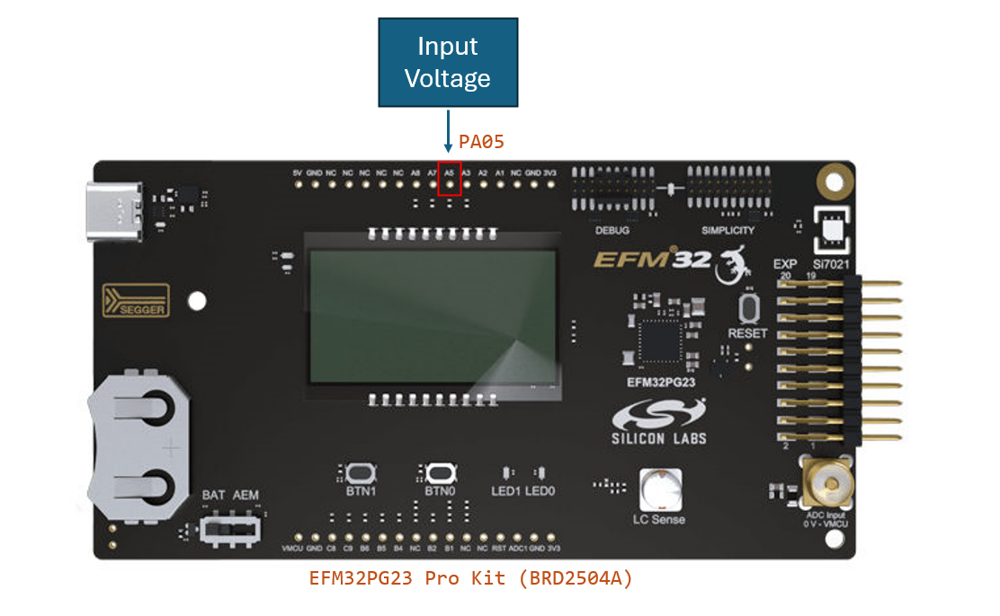
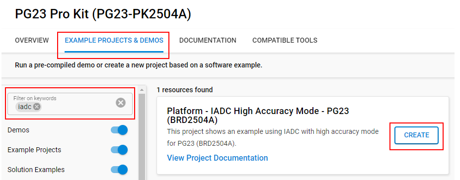
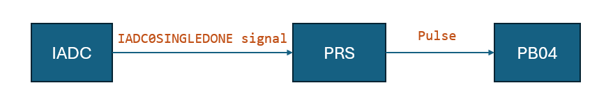
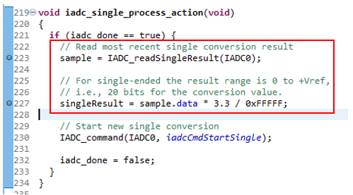
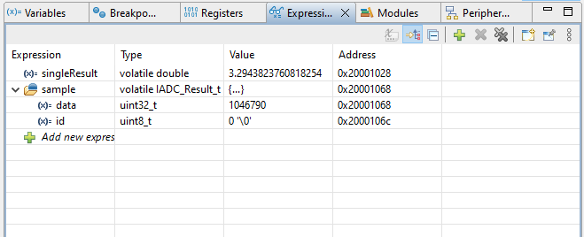
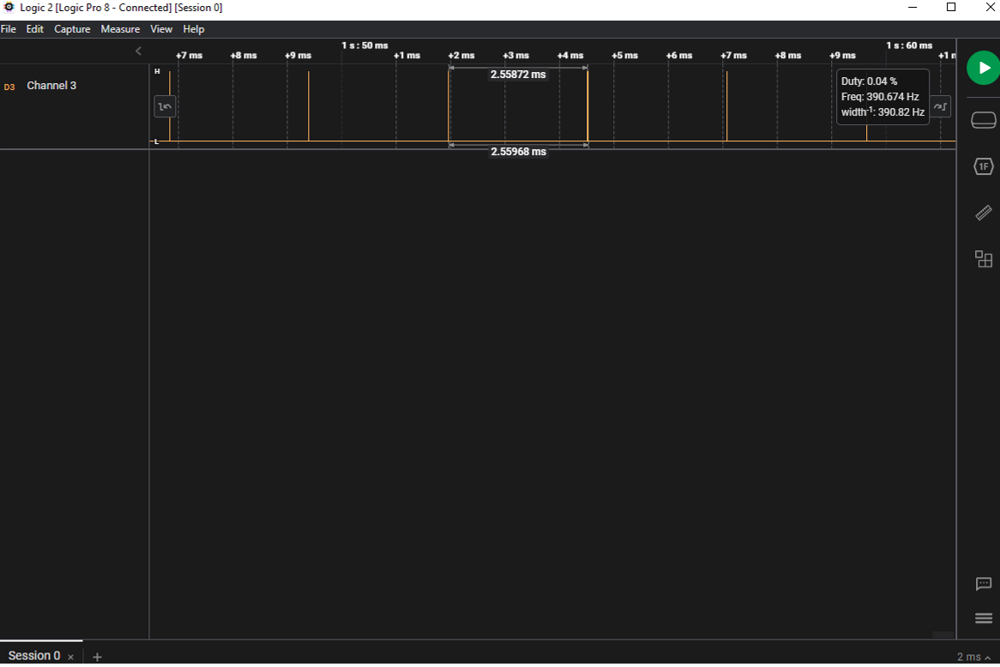

# Platform - IADC High Accuracy Mode #

## Overview ##

This project shows how to use the IADC in high accuracy mode on EFM32PG23-PK2504A (BRD2504A).

## Gecko SDK Version ##

GSDK v4.4.3

## Hardware Required ##

* Board:  Silicon Labs EFM32PG23 Pro Kit (BRD2504A)
	* Device: EFM32PG23B310F512IM48

## Connections Required ##

Connect the board via a micro-USB cable to your PC to flash the example. Using a power supply to apply a voltage to the IADC input pin (PA05).

## Setup ##

To test this application, you can either create a project based on an example project or start with an empty example project.

### Create a project based on an example project ###

1. Make sure that this repository is added to [Preferences > Simplicity Studio > External Repos](https://docs.silabs.com/simplicity-studio-5-users-guide/latest/ss-5-users-guide-about-the-launcher/welcome-and-device-tabs).

2. From the Launcher Home, add your board to My Products, click on it, and click on the **EXAMPLE PROJECTS & DEMOS** tab. Find the example project filtering by **'iadc'**.

3. Click the **Create** button on the **Platform IADC High Accuracy Mode - PG23 (BRD2504A)** example. Example project creation dialog pops up -> click **Finish** and Project should be generated.

    

4. Build and flash this example to the board.

### Start with an empty example project ###

1. Create an **Empty C Project** project for your hardware using Simplicity Studio 5.

2. Replace all source and header files in the project root folder with the provided source and header files (located in the **src** and **inc** folder).

3. Open the .slcp file. Select the SOFTWARE COMPONENTS tab and install the software components:

    - [Platform] → [Peripheral] → [IADC]
    - [Platform] → [Peripheral] → [PRS]
    - [Platform] → [Driver] → [LED] → [Simple LED] → default instance name: led0.
    - [Services] → [Power Manager] → [Power Manager: Deepsleep]
    - [Services] → [Power Manager] → [Power Manager]
    - [Services] → [Timers] → [Sleep Timer]
    - [CMSIS] → [DSP] → [CMSIS-DSP]

4. Build and flash the project to your device.

## How It Works ##

This project demonstrates using the IADC peripheral's oversampling and high-accuracy features to acquire 20-bit resolution conversion results while operating in EM2.

The firmware utilizes emlib IADC structures and functions to properly configure the peripheral and employ the appropriate offset corrections. IADC interrupts on conversion completion wake the MCU into EM0, where the IADC interrupt handler converts the result to a voltage before returning to EM2.

Using the HFRCOEM23 clock source configured for 1 MHz, the IADC sampling rate is 388 Sps with an oversampling rate of 256(OSRHA) * 2(DIGAVG) = 512, and the IADC reads GPIO pin PA05 as input.

The PRS peripheral will output a pulse on PB04 whenever the IADC finishes one single conversion. Additionally, LED0 blinks at a 1 Hz frequency (500 ms toggle rate) to indicate firmware is running.

## Testing ##

1. Build and flash the project to the PG23 Pro Kit.

2. Open the Simplicity Debugger.

3. add "sample" and "singleResult" to the Expressions Window.

    

4. Observe the "sample" variable, it stores the latest ADC sample and is a 20-bit result.

5. Observe the "singleResult" variable, it is the conversion result in voltage and is obtained by the formula: sample*VREF/(2^20).

6. Apply a voltage to the IADC input pin (PA05).

7. Now, start the debugger and observe the change of **sample** and **singleResult** whenever the voltage changes in the IADC input pin.  

    

6. Observe output pin (PB04) pulsing: 20-bit resolution - conversion time formula: ((5*OSR) + 7)/fCLK_ADC with high accuracy OSR set to 256 and 1 MHz fCLK_ADC, this corresponds to single conversion time of ~1.3ms. With digital averaging set to 2X, the final conversion time is ~2.6ms, or a sampling frequency of roughly 388 Hz.

    