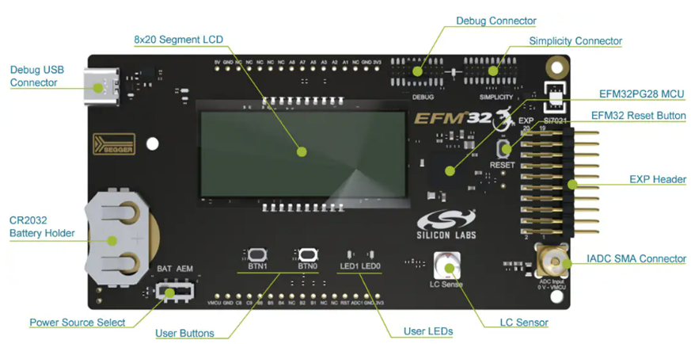
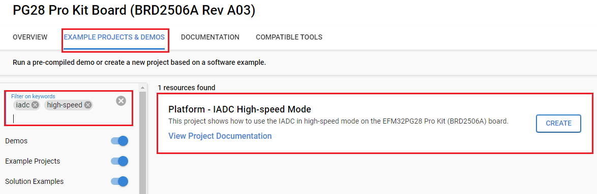
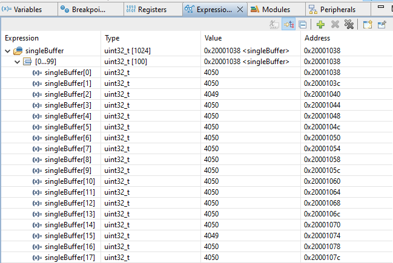
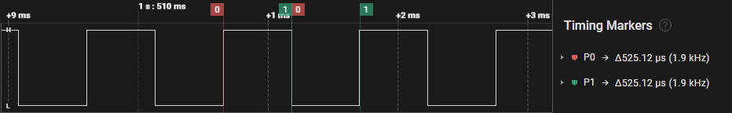

# Platform - IADC High-speed Mode functionality #

## Overview ##

This project shows how to use the IADC in high-speed mode on the EFM32PG28 Pro Kit (BRD2506A) board. IADC is used for oversampling the analog signal on the SMA connector with the high-speed feature. In the high-speed mode, the clock speed of IADC is doubled to 20 MHz (10 MHz in the normal mode). This feature is useful in applications, that require high-speed of sampling data.

## Gecko SDK Suite version ##

- GSDK v4.4.3

## Hardware Required ##

- [Silicon Labs EFM32PG28 Pro Kit Board - PK2506A ](https://www.silabs.com/development-tools/mcu/32-bit/efm32pg28-pro-kit?tab=overview)

## Connections Required ##

Connect the board via a USB Type-C cable to your PC to flash the example.

## Setup ##

To test this application, you can either create a project based on an example project or start with an empty example project.

### Create a project based on an example project ###

1. Make sure that this repository is added to [Preferences > Simplicity Studio > External Repos](https://docs.silabs.com/simplicity-studio-5-users-guide/latest/ss-5-users-guide-about-the-launcher/welcome-and-device-tabs).

2. From the Launcher Home, add the `BRD2506` to My Products, click on it, and click on the **EXAMPLE PROJECTS & DEMOS** tab. Find the example project filtering by **iadc** and **high-speed**.

3. Click the **Create** button on the **"Platform - IADC High-speed Mode"** example. Example project creation dialog pops up -> click **Finish** and Project should be generated.

    

4. Build and flash this example to the board.

### Start with an empty example project ###

1. Create an **Empty C Project** project for your hardware using Simplicity Studio 5.

2. Copy all files in the `inc` and `src` folders into the project root folder (overwriting the existing file).

3. Open the .slcp file. Select the SOFTWARE COMPONENTS tab and install the software components:

    - [Platform] → [Peripheral] → [ADC]
    - [Platform] → [Peripheral] → [LDMA]

4. Build and flash the project to your device.

## How It Works ##

This project demonstrates using the IADC peripheral for oversampling and high-speed features to acquire 12-bit resolution conversion results. The firmware utilizes `emlib_iadc` structures and functions to properly configure the peripheral and employ the appropriate offset corrections.

Once conversions are started, the IADC converts continuously and the LDMA transfers the results into an array. The IADC is clocked from the 39 MHz HFXO. The ADC prescaler divides this by 2. The sampling rate is 1.95 Msps.

## Testing ##

To test the project, follow the below steps:

1. Update the firmware of your board from the **Simplicity Launcher** (if necessary).

2. Build the project and flash the image to the EFM32PG28 Pro Kit board.

3. Open the **Simplicity Debugger** and add the `singleBuffer` variable in the `iadc_single.c` file to the Expressions Window.

4. Apply a voltage to the IADC input pin (SMA connector)

5. Observe the `singleBufffer` array as it will display the ADC results 12-bit result with 1024 samples. The `singleBuffer` array is VDD referenced and scaled 0-4095. The picture below illustrates the `singleBufffer` with the VMCU value as input.

6. To observe the output pin pulsing, use the PB1 pin on the EFM32PG28 Pro Kit board. An edge (including rising or falling) is generated every 1024 samples after about 525 microseconds (uS).

7. Suspend the debugger, observe the measured voltage change in the Expressions Window and how it responds to different voltage values on the corresponding pins.
