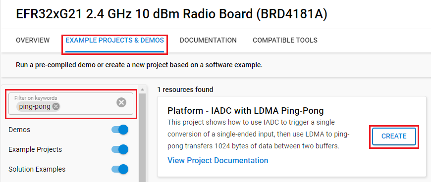
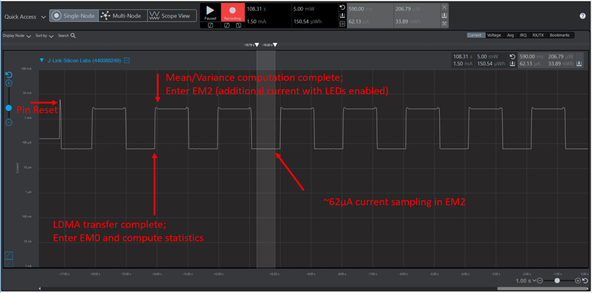

# Platform - IADC with LDMA Ping-Pong #

## Overview ##

This project shows how to use IADC to trigger a single conversion of a single-ended input, then use LDMA to ping-pong transfers 1024 bytes of data between two buffers. Mean and variance calculations are made with the data buffer contents using a simplified [Welford's algorithm](https://en.wikipedia.org/wiki/Algorithms_for_calculating_variance) and stored in local variables.The IADC is configured to run in EM2 with clocks source configured to FSRCO and speed optimized to minimize conversion time between samples. The RTCC peripheral is also included in this example and run from the LFRCO. Typical current consumption while retaining RAM is documented in the Series 2 device datasheet. This approximate current value does not include additional current for the clock trees and the IADC. This project is intended to be profiled with Simplicity Studio's Energy Profiler to observe the current consumption while in EM2.

## Gecko SDK version ##

- GSDK v4.4.3

## Hardware Required ##

- One [SLWSTK6006A EFR32xG21 Wireless Gecko Starter Kit](https://www.silabs.com/development-tools/wireless/efr32xg21-wireless-starter-kit):
  
  - BRD4001A Wireless Starter Kit
  - BRD4181A EFR32xG21 Radio Board

## Connections Required ##

- Connect the board to your PC via a micro-USB cable to flash the example.

## Setup ##

To test this application, you can either create a project based on an example project or start with an empty example project.

### Create a project based on an example project ###

1. Make sure that this repository is added to [Preferences > Simplicity Studio > External Repos](https://docs.silabs.com/simplicity-studio-5-users-guide/latest/ss-5-users-guide-about-the-launcher/welcome-and-device-tabs).

2. From the Launcher Home, add the BRD4181A to My Products, click on it, and click on the **EXAMPLE PROJECTS & DEMOS** tab. Find the example project filtering by **ping-pong**.

3. Click the **Create** button on the **Platform - IADC with LDMA Ping-Pong** example. Example project creation dialog pops up -> click **Finish** and Project should be generated.

    

4. Build and flash this example to the board.

### Start with an empty example project ###

1. Create an **Empty C Project** project for your hardware using Simplicity Studio 5.

2. Replace the `app.c` file in the project root folder with the provided `app.c` (located in the src folder).

3. Open the .slcp file. Select the SOFTWARE COMPONENTS tab and install the software components:

    - [Platform] → [Peripheral] → [IADC]
    - [Platform] → [Peripheral] → [LDMA]
    - [Platform] → [Peripheral] → [RTCC]
    - [Platform] → [Peripheral] → [PRS]
    - [Platform] → [Driver] → [Simple LED] → default instance name: led0, led1

4. Build and flash the project to your device.

## How It Works ##

The IADC is configured to run at 1 MHz for optimal conversion timing, and IADC timer configured such that the Port C Pin 4 single-ended input is sampled at 1 kSps. LED0 will toggle with every LDMA transfer completion of 1024 samples into one of the ping-pong buffers. LED1 will toggle when the statistical analysis of the most recently completed buffer finishes. Setting a breakpoint on line 354 of **app.c**, the mean and variance can be observed by adding these variable names to the expressions window in the Debug perspective. The project can also be observed using Simplicity Studio's Energy Profiler:

