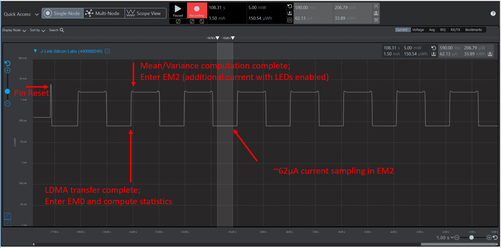

# IADC with LDMA ping-pong example #

## Summary ##

This project configures the IADC peripheral utilizing the internal IADC timer to continously trigger a single conversion of a single-ended input. The LDMA peripheral is configured to ping-pong data transfers of 1024 conversions between two buffers, allowing statistical processing of one buffer without interrupting data conversion and storage in the other. Mean and variance calculations are made with the data buffer contents using a simplified [Welford's algorithm](https://en.wikipedia.org/wiki/Algorithms_for_calculating_variance) and stored in local variables.The IADC is configured to run in EM2 with clocks source configured to FSRCO and speed optimized to minimize conversion time between samples. The RTCC peripheral is also included in this example and run from the LFRCO. Typical current consumption while retaining RAM is documented in the Series 2 device datasheet. This approximate current value does not
include additional current for the clock trees and the IADC. This project is intended to be profiled with Simplicity Studio's Energy Profiler to observe the current consumption while in EM2.

Peripherals used: IADC, LDMA, GPIO, PRS, EMU, RTCC

## Gecko SDK version ##

v2.7.7

## Hardware Required ##

- One SLWSTK6006A EFR32xG21 Wireless Gecko Starter Kit <https://www.silabs.com/development-tools/wireless/efr32xg21-wireless-starter-kit>:
  - BRD4001A Wireless Starter Kit
  - BRD4181A EFR32xG21 Radio Board

## Setup ##

Import the included .sls file to Studio then build and flash the project to the BRD4181A Radio Board attached to WSTK.
In Simplicity Studio select "File->Import" and navigate to the directory with the .sls project file.
The project is built with relative paths to the STUDIO_SDK_LOC variable which was defined as

C:\SiliconLabs\SimplicityStudio\v4\developer\sdks\gecko_sdk_suite\v2.7

## How the Project Works ##

The IADC is configured to run at 1 MHz for optimal conversion timing, and IADC timer configured such that the Port C Pin 4 single-ended input is sampled at 1 kSps. LED0 will toggle with every LDMA transfer completion of 1024 samples into one of the ping-pong buffers. LED1 will toggle when the statistical analysis of the most recently completed buffer finishes. Setting a breakpoint on line 388 in the main while loop, the mean and variance can be observed by adding these variable names to the expressions window in the Debug perspective. The project can also be observed using Simplicity Studio's Energy Profiler:

## .sls Projects Used ##

platform_iadc_ldma_ping_pong.sls

## How to Port to Another Part ##

Open the "Project Properties" and navigate to the "C/C++ Build -> Board/Part/SDK" item.  Select the new board or part to target and "Apply" the changes.  Note: This example uses the IADC peripheral, which is only available on our Series 2 MCU and Wireless MCU devices. There may also be dependencies that need to be resolved when changing the target architecture.
