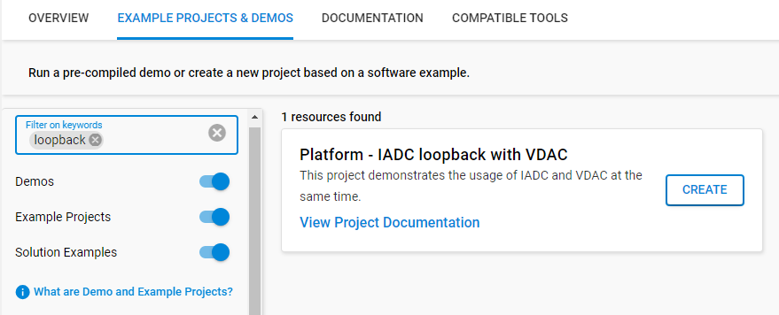
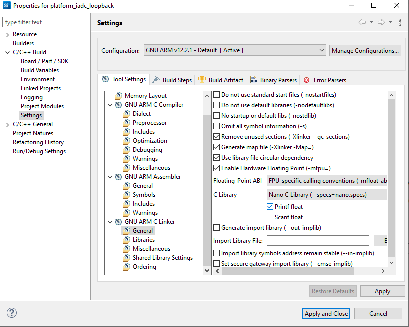
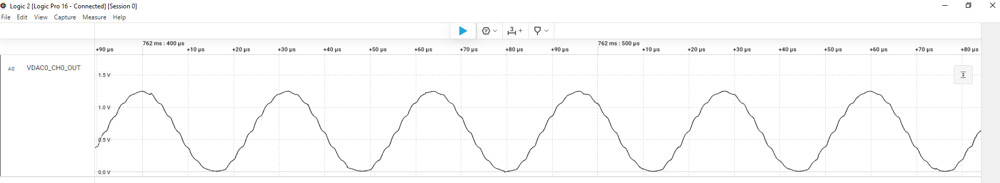
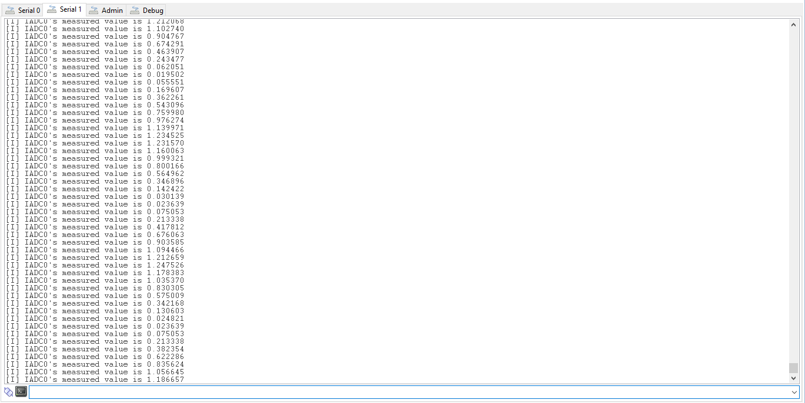

# Platform - IADC Loopback with VDAC #

## Overview ##

This project demonstrates how the VDAC generated signal can be measured back with the IADC. A Logic Analyzer can be attached to the VDAC0 channel (check the Pin Routing section) to see the generated sine wave. The application continuously logs the input data of the IADC. If the VDAC0 and IADC0 channels are connected together with a wire, then the sine wave's samples are also visible on the CLI.

## SDK version ##

- SiSDK v2024.12.1-0

## Hardware Required ##

- [EFR32xG24 Wireless 2.4 GHz +10 dBm Radio Board](https://www.silabs.com/development-tools/wireless/xg24-rb4186c-efr32xg24-wireless-gecko-radio-board?tab=overview)

- Wireless Starter Kit (WSTK) Mainboard (SLWMB4002A, formerly BRD4002A)

**Note:**

   - Tested boards for working with this example: 

      | Board ID | Description  |
      | ---------------------- | ------ |
      | BRD4210a | [EFR32XG23 868-915 MHz +20 dBm Radio Board](https://www.silabs.com/development-tools/wireless/xg23-rb4210a-efr32xg23-868-915-mhz-20-dbm-radio-board?tab=overview)|
      | BRD4186c | [EFR32xG24 Wireless 2.4 GHz +10 dBm Radio Board](https://www.silabs.com/development-tools/wireless/xg24-rb4186c-efr32xg24-wireless-gecko-radio-board?tab=overview)|
      | BRD4270b | [EFR32FG25 902-928 MHz +16 dBm Radio Board](https://www.silabs.com/development-tools/wireless/proprietary/fg25-rb4270b-efr32fg25-radio-board?tab=overview)|
      | BRD4400c | [EFR32xG28 2.4 GHz BLE and +14 dBm Radio Board](https://www.silabs.com/development-tools/wireless/xg28-rb4400c-efr32xg28-2-4-ghz-ble-and-14-dbm-radio-board?tab=overview)|

## Connections Required ##

Connect the board via the connector cable to your PC to flash the example.

## Setup ##

To test this application, you can either create a project based on an example project or start with an "Empty C Project" project based on your hardware.

### Create a project based on an example project ###

1. Make sure that this repository is added to [Preferences > Simplicity Studio > External Repos](https://docs.silabs.com/simplicity-studio-5-users-guide/latest/ss-5-users-guide-about-the-launcher/welcome-and-device-tabs).

2. From the Launcher Home, add your product name to My Products, click on it, and click on the **EXAMPLE PROJECTS & DEMOS** tab. Find the example project filtering by **"loopback"**.

3. Click the **Create** button on **Platform - IADC loopback with VDAC** example. Example project creation dialog pops up -> click Create and Finish and the project should be generated.

4. Build and flash this example to the board.

### Start with an "Empty C Project" project ###

1. Create an **Empty C Project** project for your hardware using Simplicity Studio 5.

2. Copy all files in the `inc` and `src` folders into the project root folder (overwriting the existing file).

3. Install the software components:

    3.1. Open the .slcp file in the project

    3.2. Select the SOFTWARE COMPONENTS tab

    3.3. Install the following components:

    - [Platform] → [Peripheral] → [VDAC]

    - [Platform] → [Peripheral] → [IADC]

    - [Platform] → [Peripheral] → [TIMER]

    - [Platform] → [Peripheral] → [Init] → [GPIO Init] → instance name: timer

    - [Application] → [Utility] → [Log]

4. Enable VCOM in the Board Control Software Component
5. Press Alt+Enter for opening properties and set the Print Float property here:
 
6. Build and flash the project to your board.

## How It Works ##

The example utilizes the VDAC peripheral's internal sine generator in order to generate the reference sine signal. For signal sampling, it uses the IADC0 peripheral in single ended mode. 
Please check the **"Pin Routing"** section below, to see the complete list of where the IADC0 and VDAC0 pins are routed.

The IADC IRQ will toggle a flag when the measurement is done. The logging will be done in the **"app_proccess_action()"**. In order to measure the generated output signal, please follow the instructions below:

### VDAC's Sine Wave
Connect the Logic analyzer with the **""VDAC0_CH0_MAIN_OUT""** of your device.
You will see the sine wave.

### IADC - VDAC loopback 
Connect the VDAC0 and the IADC0 pins physically  with a wire. 
The application will log in to Terminal 1.
If the logging doesn't start, please press an **Enter** in Terminal 1.

### Pin Routing - Actual Pins ###
| Output pin | BRD4210a | BRD4186C | BRD4270B | BRD4400C |
| --- | --- | --- | --- | --- |
| VDAC0_CH0_OUT | PA6 | PA6 | PA6 | PB4|
| IADC0_Single_Input | PA7 | PA7 | PA7 | PB5 |

### Pin Routing - WPK Expansion Header ###
| Output pin | BRD4210a | BRD4186C | BRD4270B | BRD4400C |
| --- | --- | --- | --- | --- |
| VDAC0_CH0_OUT | EXP_HEADER_11 | EXP_HEADER_11 | EXP_HEADER_11 | EXP_HEADER_11 |
| IADC0_Single_Input | EXP_HEADER_13 | EXP_HEADER_13 | EXP_HEADER_13 | EXP_HEADER_13 |