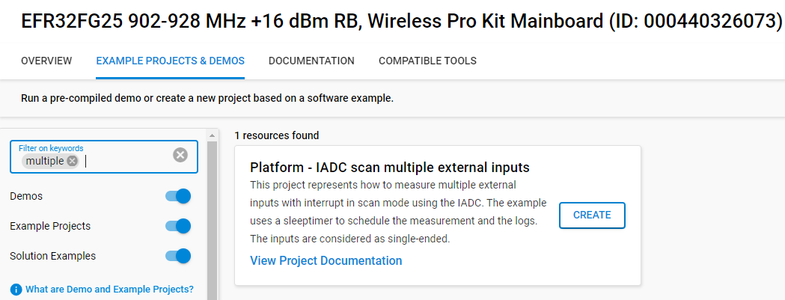
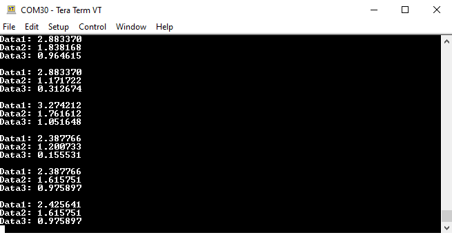

# Platform - IADC scan multiple external inputs #

## Overview ##

This project demonstrates how to measure multiple external inputs with interrupt in scan mode using the IADC. The example uses a sleeptimer to schedule the measurement and logs the results. The inputs are considered as single-ended. The results of the measurements are sent via serial communication (EUSART) and can be observed as logs by using a serial terminal.

## Gecko SDK version ##

- GSDK v4.4.3

## Hardware Required ##

- [EFR32FG25 902-928 MHz +16 dBm Radio Board](https://www.silabs.com/development-tools/wireless/proprietary/fg25-rb4270b-efr32fg25-radio-board?tab=overview)

- Wireless Starter Kit (WSTK) Mainboard (SLWMB4002A, formerly BRD4002A)

**Note:**

   - Tested boards for working with this example: 

      | Board ID | Description  |
      | ---------------------- | ------ |
      | BRD4181c | [EFR32xG21B Wireless Gecko 2.4 GHz +10 dBm Radio Board with Secure Vault](https://www.silabs.com/development-tools/wireless/slwrb4181c-efr32xg21-wireless-gecko-radio-board?tab=overview)|
      | BRD4182a | [EFR32xG22 Wireless Gecko 2.4 GHz +6 dBm 5x5, QFN40 Radio Board](https://www.silabs.com/development-tools/wireless/slwrb4182a-efr32xg22-wireless-gecko-radio-board?tab=overview)|
      | BRD4210a | [EFR32XG23 868-915 MHz +20 dBm Radio Board](https://www.silabs.com/development-tools/wireless/xg23-rb4210a-efr32xg23-868-915-mhz-20-dbm-radio-board?tab=overview)|
      | BRD4186c | [EFR32xG24 Wireless 2.4 GHz +10 dBm Radio Board](https://www.silabs.com/development-tools/wireless/xg24-rb4186c-efr32xg24-wireless-gecko-radio-board?tab=overview)|
      | BRD4270b | [EFR32FG25 902-928 MHz +16 dBm Radio Board](https://www.silabs.com/development-tools/wireless/proprietary/fg25-rb4270b-efr32fg25-radio-board?tab=overview)|
      | BRD4194a | [EFR32xG27 Wireless 2.4 GHz +8 dBm Radio Board](https://www.silabs.com/development-tools/wireless/xg27-rb4194a-efr32xg27-8-dbm-wireless-radio-board?tab=overview)|
      | BRD4400c | [EFR32xG28 2.4 GHz BLE and +14 dBm Radio Board](https://www.silabs.com/development-tools/wireless/xg28-rb4400c-efr32xg28-2-4-ghz-ble-and-14-dbm-radio-board?tab=overview)|

## Connections Required ##

Connect the board via the connector cable to your PC to flash the example.

## Setup ##

To test this application, you can either create a project based on an example project or start with an "Empty C Project" project based on your hardware.

### Create a project based on an example project ###

1. Make sure that this repository is added to [Preferences > Simplicity Studio > External Repos](https://docs.silabs.com/simplicity-studio-5-users-guide/latest/ss-5-users-guide-about-the-launcher/welcome-and-device-tabs).

2. From the Launcher Home, add your product name to My Products, click on it, and click on the **EXAMPLE PROJECTS & DEMOS** tab. Find the example project filtering by "multiple".

3. Click the **Create** button on **Platform - IADC scan multiple external input** example. Example project creation dialog pops up -> click Create and Finish and the project should be generated.

4. Build and flash this example to the board.

### Start with an "Empty C Project" project ###

1. Create an **Empty C Project** project for your hardware using Simplicity Studio 5.

2. Copy all files in the `inc` and `src` folders into the project root folder (overwriting the existing file).

3. Install the software components:

    3.1. Open the .slcp file in the project

    3.2. Select the SOFTWARE COMPONENTS tab

    3.3. Install the following components:

    - [Platform] → [Peripheral] → [IADC]

    - [Services] → [IO Stream] → [Driver] → [IO Stream: EUSART] (In case of an xG21 device IO Stream: USART should be used)

    - [Application] → [Utility] → [Log]

    - [Services] → [Timers] → [Sleep Timer]

    - [Third party] → [Tiny printf]

4. Enable Virtual COM UART

    - [Platform] → [Board] → [Board Control] → [Configure] → [Enable Virtual COM UART]

5. Build and flash the project to your board.

## How It Works ##

The example uses the IADC to measure the voltage level of multiple external inputs in scan mode with interrupt. The inputs are considered as single-ended, thus the signals are measured with ground as the negative input. The reference voltage is 3.3V. The implementation contains the measurement of three inputs, and by adding more elements to the scan table this  number can be raised even further.

The board specific pins are defined in the `app.h` file. These pins are connected to the EXP Header pins or to the Breakout Pins of the Wireless Starter Kit (WSTK). 

The example uses a periodic [sleeptimer](https://docs.silabs.com/gecko-platform/5.0.2/platform-service/sleeptimer) service to schedule the measurements of the IADC and the display of the logs. The default measurement period is 5 seconds, which can be changed by modifying the TIMER_TIMEOUT macro in the 'app.c' file.

By using a serial terminal (like Tera Term) the measured values can be observed. By default the EUSART peripheral is used for the serial communication. Since there is no EUSART peripheral on the devices of the xG21 family, the USART peripheral is used there. 

### Pin Routing ###
| Pin Name | BRD4181b | BRD4182a | BRD4210a | BRD4186c | BRD4270b | BRD4194A | BRD4400C |
| --- | --- | --- | --- | --- | --- | --- | --- |
| IADC ENTRIE0 | EXP_HEADER7 (PB0) | EXP_HEADER7 (PB1) | EXP_HEADER7 (PA5) | WSTK_P19 (PB2) | EXP_HEADER10 (PB4) | EXP_HEADER7 (PB0) | EXP_HEADER11 (PB4) |
| IADC ENTRIE1 | EXP_HEADER9 (PB1) | EXP_HEADER9 (PB2) | EXP_HEADER11 (PA6) | WSTK_P26 (PB4) | EXP_HEADER15 (PB2) | EXP_HEADER9 (PB1) | EXP_HEADER13 (PB5) |
| IADC ENTRIE2 | WSTK_P14 (PA0) | EXP_HEADER15 (PB3) | EXP_HEADER13 (PA7) | EXP_HEADER13 (PA7) | EXP_HEADER16 (PB3) | EXP_HEADER15 (PB2) | EXP_HEADER3 (PA11) |