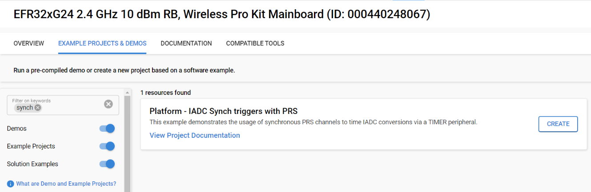

# Platform - IADC synchronous PRS with LDMA #


## Overview ##

This project demonstrates how to synchronize an IADC conversion trigger via the TIMER peripheral. The example utilizes PRS connections between the TIMER0 peripheral and the IADC, as well as the LDMA peripheral to store the measured voltage levels, while the system CPU is being turned off.

## SDK version ##

- SiSDK v2024.12.1-0

## Hardware Required ##

-  [EFR32xG24 Wireless 2.4 GHz +10 dBm Radio Board](https://www.silabs.com/development-tools/wireless/xg24-rb4186c-efr32xg24-wireless-gecko-radio-board?tab=overview)

- Wireless Starter Kit (WSTK) Mainboard (SLWMB4002A, formerly BRD4002A)

**Note:**

   - Tested boards for working with this example: 

      | Board ID | Description  |
      | ---------------------- | ------ |
      | BRD4180b | [EFR32xG21A Wireless Gecko 2.4 GHz +20 dBm Radio Board](https://www.silabs.com/development-tools/wireless/slwrb4180b-efr32xg21-wireless-gecko-radio-board?tab=overview)|
      | BRD4182a | [EFR32xG22 Wireless Gecko 2.4 GHz +6 dBm 5x5, QFN40 Radio Board](https://www.silabs.com/development-tools/wireless/slwrb4182a-efr32xg22-wireless-gecko-radio-board?tab=overview)|
      | BRD4210a | [EFR32XG23 868-915 MHz +20 dBm Radio Board](https://www.silabs.com/development-tools/wireless/xg23-rb4210a-efr32xg23-868-915-mhz-20-dbm-radio-board?tab=overview)|
      | BRD4186c | [EFR32xG24 Wireless 2.4 GHz +10 dBm Radio Board](https://www.silabs.com/development-tools/wireless/xg24-rb4186c-efr32xg24-wireless-gecko-radio-board?tab=overview)|
      | BRD4270b | [EFR32FG25 902-928 MHz +16 dBm Radio Board](https://www.silabs.com/development-tools/wireless/proprietary/fg25-rb4270b-efr32fg25-radio-board?tab=overview)|
      | BRD4194a | [EFR32xG27 Wireless 2.4 GHz +8 dBm Radio Board](https://www.silabs.com/development-tools/wireless/xg27-rb4194a-efr32xg27-8-dbm-wireless-radio-board?tab=overview)|
      | BRD4400c | [EFR32xG28 2.4 GHz BLE and +14 dBm Radio Board](https://www.silabs.com/development-tools/wireless/xg28-rb4400c-efr32xg28-2-4-ghz-ble-and-14-dbm-radio-board?tab=overview)|

## Connections Required ##

Connect the board via the connector cable to your PC to flash the example.

## Setup ##

To test this application, you can either create a project based on an example project or start with an "Empty C Project" project based on your hardware.

### Create a project based on an example project ###

1. Make sure that this repository is added to [Preferences > Simplicity Studio > External Repos](https://docs.silabs.com/simplicity-studio-5-users-guide/latest/ss-5-users-guide-about-the-launcher/welcome-and-device-tabs).

2. From the Launcher Home, add your product name to My Products, click on it, and click on the **EXAMPLE PROJECTS & DEMOS** tab. Find the example project filtering by "synch".

3. Click the **Create** button on **Platform - IADC Synchronous Triggers with PRS** example. Example project creation dialog pops up -> click Create and Finish and the project should be generated.



4. Build and flash this example to the board.

### Start with an "Empty C Project" project ###

1. Create an **Empty C Project** project for your hardware using Simplicity Studio 5.

2. Copy all files in the `inc` and `src` folders into the project root folder (overwriting the existing file).

3. Install the software components:

    3.1. Open the .slcp file in the project

    3.2. Select the SOFTWARE COMPONENTS tab

    3.3. Install the following components:

    - [Platform] → [Peripheral] → [IADC]

    - [Platform] → [Peripheral] → [LDMA]

    - [Platform] → [Peripheral] → [GPIO]

    - [Platform] → [Peripheral] → [TIMER]

    - [Platform] → [Peripheral] → [PRS]

    - [Platform] → [Driver] → [DMADRV]

    - [Platform] → [GPIO Init] (Name the instance as "timer" and route it to the corresponding GPIO pins)

4. Build and flash the project to your board.

## How It Works ##

The example uses the TIMER0 peripheral to synchronize voltage level measurements of an external input in IADC single mode. Each single conversion gets triggered by a TIMER0_CC0 event via PRS, which can be configured by the ```TIMER_FREQ``` macro in the `app.h`. PRS mode can also be configured by the ```SYNC_MODE``` macro, and can vary between synchronous and asynchronous triggers. When ```SYNC_MODE``` is enabled, both the TIMER0 triggers and the IADC itself will run on the same exact clock source, thus eliminating possible clock drift related conversion timing issues. By turning off ```SYNC_MODE``` the conversion triggering will be done asynchronously, which doesn't take clock drift into account.

By default, the ```TIMER_DEBUG``` macro is enabled in the application, which automatically routes the TIMER0_CC0 signal into the LED0 of the WPK (BRD4002) in order to help in debugging trigger related issues.

The example also utilizes the LDMA peripheral to store conversion data into a pre-defined memory space (`singleBuffer`) and shows that the device can be configured to wake up after a certain amount of conversion data has been acquired. This amount can be configured via the ```NUM_SAMPLES``` macro.

Since the synchronous PRS feature is only available between the TIMER peripheral and either the IADC or VDAC peripherals, the lowest energy mode achievable by the application is EM1, where the CPU is being turned off.

### Pin Routing ###
| Pin Name | BRD4180B | BRD4182A | BRD4210A | BRD4186C | BRD4270B | BRD4194A | BRD4400C |
| --- | --- | --- | --- | --- | --- | --- | --- |
| IADC ENTRY | EXP_HEADER14 (PA6) | EXP_HEADER14 (PA6) | EXP_HEADER11 (PA6) | EXP_HEADER11 (PA6) | EXP_HEADER11 (PA6) | EXP_HEADER13 (PA8) | EXP_HEADER11 (PB4) |
| TIMER0_CC0 | EXP_HEADER11 (PD2) | EXP_HEADER11 (PD2) | WSTK_P19 (PB2) | WSTK_P19 (PB2) | WSTK_P27 (PC6) | EXP_HEADER7 (PB0) | WSTK_P19 (PB2) |
| LDMA_GPIO | EXP_HEADER13 (PD3) | EXP_HEADER13 (PD3) | WSTK_P26 (PD3) | WSTK_P26 (PB4) | WSTK_P26 (PC7) | EXP_HEADER9 (PB1) | WSTK_P23 (PD3) |