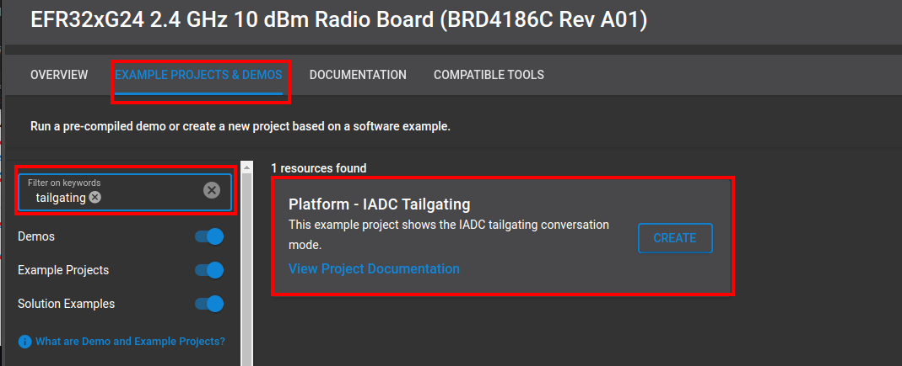
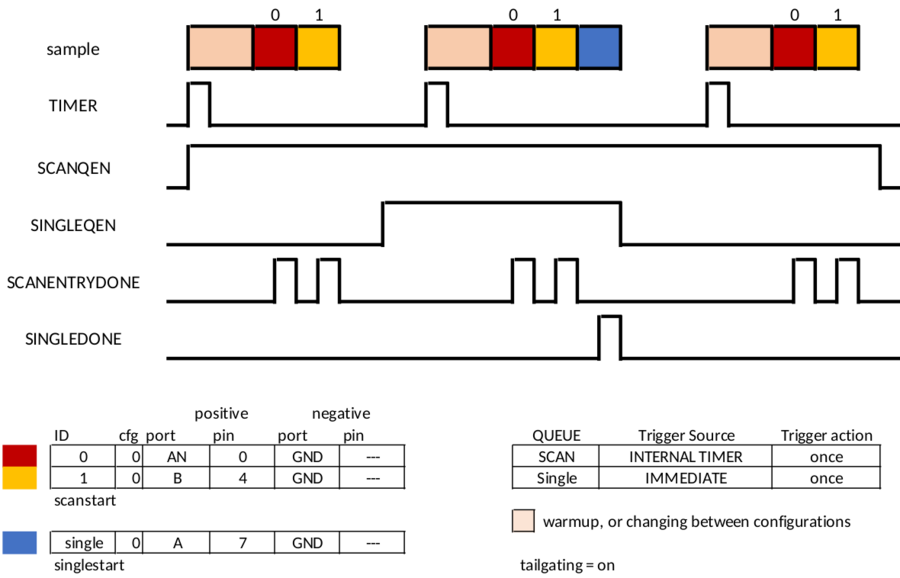

# Platform - IADC Tailgating #

## Overview ##

This example project demonstrates the usage of the IADC in tailgating mode. This mode gives ultimate priority to the Scan queue. The IADC will only perform single conversions immediately after completing a scan sequence. This allows  the system to use the scan queue for high-priority conversions with tight timing requirements, and the single queue for low-priority, on-demand conversion events. 

Note that this setting should only be used when scan conversions are guaranteed to trigger. If no scan sequence is triggered, any single conversion trigger will remain pending indefinitely. It is also important to note that if there is not enough time between scan conversions to service a single conversion, the next scan sequence will be delayed.

## Gecko SDK version ##

- GSDK v4.4.3

## Hardware Required ##

- [EFM32PG23 Pro Kit](https://www.silabs.com/development-tools/mcu/32-bit/efm32pg23-pro-kit?tab=overview)

**Note:**

   - Tested boards for working with this example:

      | Board ID | Description  |
      | ---------------------- | ------ |
      | BRD4181b | [EFR32xG21A Wireless Gecko 2.4 GHz +10 dBm Radio Board with Secure Vault](https://www.silabs.com/development-tools/wireless/slwrb4181b-efr32xg21-wireless-gecko-radio-board?tab=overview)|
      | BRD4182a | [EFR32xG22 Wireless Gecko 2.4 GHz +6 dBm 5x5, QFN40 Radio Board](https://www.silabs.com/development-tools/wireless/slwrb4182a-efr32xg22-wireless-gecko-radio-board?tab=overview)|
      | BRD4210a | [EFR32XG23 868-915 MHz +20 dBm Radio Board](https://www.silabs.com/development-tools/wireless/xg23-rb4210a-efr32xg23-868-915-mhz-20-dbm-radio-board?tab=overview)|
      | BRD4186c | [EFR32xG24 Wireless 2.4 GHz +10 dBm Radio Board](https://www.silabs.com/development-tools/wireless/xg24-rb4186c-efr32xg24-wireless-gecko-radio-board?tab=overview)|
      | BRD4270b | [EFR32FG25 902-928 MHz +16 dBm Radio Board](https://www.silabs.com/development-tools/wireless/proprietary/fg25-rb4270b-efr32fg25-radio-board?tab=overview)|
      | BRD4194a | [EFR32xG27 Wireless 2.4 GHz +8 dBm Radio Board](https://www.silabs.com/development-tools/wireless/xg27-rb4194a-efr32xg27-8-dbm-wireless-radio-board?tab=overview)|
      | BRD4400c | [EFR32xG28 2.4 GHz BLE and +14 dBm Radio Board](https://www.silabs.com/development-tools/wireless/xg28-rb4400c-efr32xg28-2-4-ghz-ble-and-14-dbm-radio-board?tab=overview)|

## Connections Required ##

Connect the board via the connector cable to your PC to flash the example.

## Setup ##

To test this application, you can either create a project based on an example or start with an "Empty C Project" project based on your hardware.

### Create a project based on an example project ###

1. Make sure that this repository is added to [Preferences > Simplicity Studio > External Repos](https://docs.silabs.com/simplicity-studio-5-users-guide/latest/ss-5-users-guide-about-the-launcher/welcome-and-device-tabs).

2. From the Launcher Home, add your product name to My Products, click on it, and click on the **EXAMPLE PROJECTS & DEMOS** tab. Find the example project filtering by "tailgating".

3. Click the **Create** button on **Platform - IADC Tailgating** example. Example project creation dialog pops up -> click Create and Finish and the project should be generated.

4. Build and flash this example to the board.

### Start with an "Empty C Project" project ###

1. Create an **Empty C Project** project for your hardware using Simplicity Studio 5.

2. Copy all files in the `inc` and `src` folders into the project root folder (overwriting the existing file).

3. Install the software components:

    3.1. Open the .slcp file in the project

    3.2. Select the SOFTWARE COMPONENTS tab

    3.3. Install the following components:

    - [Platform] → [Peripheral] → [IADC]
    
    - [Platform] → [Peripheral] → [PRS]

    - [Services] → [IO Stream] → [Driver] → [IO Stream: USART]
    
    - [Services] → [IO Stream] → [IO Stream: Retarget STDIO]

    - [Services] → [IO Stream] → [IO Stream: STDLIB Configuration]

4. Enable Virtual COM UART

    - [Platform] → [Board] → [Board Control] → [Configure] → [Enable Virtual COM UART]

5. Enable floating point print()
    
    - [Floating point print() with GCC](https://community.silabs.com/s/article/floating-point-print-with-gcc?language=en_US)

6. Build and flash the project to your board.

## How It Works ##

The example uses conversion tailgating which is shown in the picture below. In the example, the Scan queue is configured to trigger a two-channel conversion periodically (5ms) on the IADC local timer, while the Single queue is configured to trigger on-demand from software. When a single conversion is requested by pressing BTN0, it waits until after the scan sequence is complete, and then the single conversion is performed. The scan conversions and the single conversion is using the same configuration 0, so a warmup delay is not inserted between the end of the scan and the beginning of the single conversion cycle. Note that this example provides plenty of time between IADC scan conversions for the single conversion to occur, thus no scan conversions are delayed.

The sampled value is printed out over the UART interface. Additionally, a PRS debug signal SCANENTRYDONE and SINGLEDONE is added to the project for test purposes.

### Pin Routing ###
| Pin Name | BRD2504A | BRD4181b | BRD4182a | BRD4210a | BRD4186c | BRD4270b | BRD4194A | BRD4400C |
| --- | --- | --- | --- | --- | --- | --- | --- | --- |
| IADC SCAN0 | AN 0, SMA | EXP10 (PC3) | EXP16 (PB3) | EXP16 (PC7) | EXP16 (PC7) | EXP16 (PB3) | EXP16 (PB3) | EXP16 (PC7) |
| IADC SCAN1 | EXP11 (PB4)| EXP4 (PC0) | EXP15 (PB2) | EXP15 (PC5) | EXP15 (PC5) | EXP15 (PB2) | EXP15 (PB2) | EXP15 (PC5) |
| IADC SINGLE | EXP16 (PA7)| EXP9 (PB1) | EXP9 (PB1) | EXP9 (PD2) | EXP9 (PD2) | EXP10 (PB4) | EXP9 (PB1) | EXP9 (PA14) |
| SCANENTRYDONE | PC8 | EXP13 (PD3) | EXP13 (PD3) | EXP13 (PA7) | EXP13 (PA7) | EXP13 (PA7) | EXP13 (PA8) | EXP13 (PB5) |
| SINGLEDONE | EXP13 (PC9) | EXP11 (PD2) | EXP11 (PD2) | EXP11 (PA6) | EXP11 (PA6) | EXP11 (PA6) | EXP10 (PC3) | EXP11 (PB4) |

