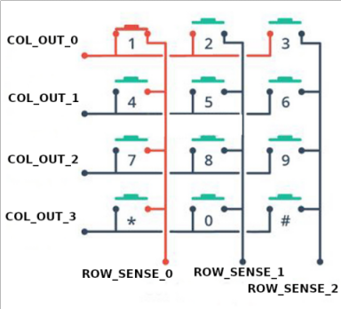
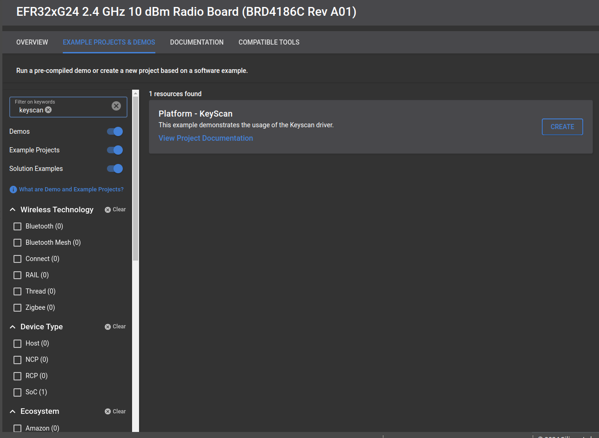
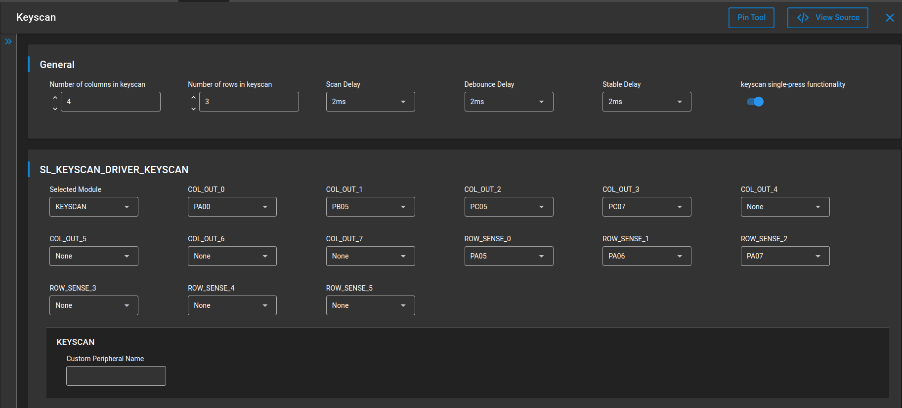
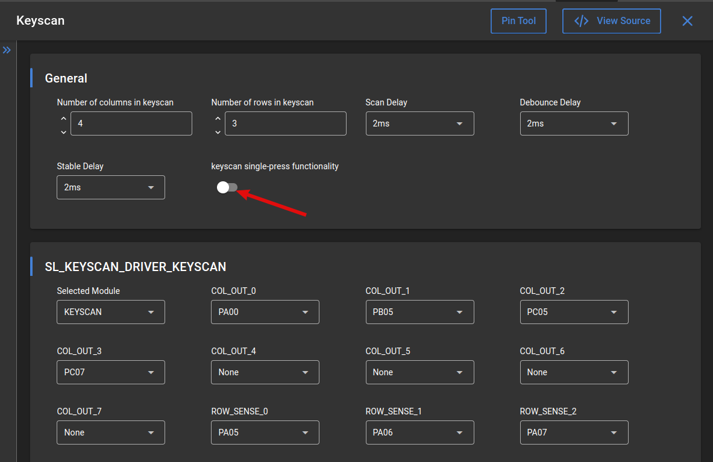

# Platform - KeyScan #

## Overview ##

This project demonstrates the use of the KEYSCAN driver. The MCU operates in a low-power sleep mode between key presses, conserving power while remaining ready for user input. When a key is pressed, the device wakes up, identifies the key and displays its value on the Wireless Pro Kit's LCD screen, providing immediate feedback to the user. This integration highlights the effectiveness of the KEYSCAN driver in managing key detection and event handling.

## SDK version ##

- GSDK v4.4.4

## Hardware Required ##
- [Si-MB4002A Wireless Pro Kit Mainboard](https://www.silabs.com/development-tools/wireless/wireless-pro-kit-mainboard?tab=overview)
- [EFR32xG24 Wireless 2.4 GHz +10 dBm Radio Board](https://www.silabs.com/development-tools/wireless/xg24-rb4186c-efr32xg24-wireless-gecko-radio-board?tab=overview)
- [3 * 4 Matrix Keypad](https://www.adafruit.com/product/3845)

**Note:**

   - Tested boards for working with this example:

      | Board ID | Description  |
      | ---------------------- | ------ |
      | BRD4210a | [EFR32XG23 868-915 MHz +20 dBm Radio Board](https://www.silabs.com/development-tools/wireless/xg23-rb4210a-efr32xg23-868-915-mhz-20-dbm-radio-board?tab=overview)|
      | BRD4186c | [EFR32xG24 Wireless 2.4 GHz +10 dBm Radio Board](https://www.silabs.com/development-tools/wireless/xg24-rb4186c-efr32xg24-wireless-gecko-radio-board?tab=overview)|
      | BRD4400c | [EFR32xG28 2.4 GHz BLE and +14 dBm Radio Board](https://www.silabs.com/development-tools/wireless/xg28-rb4400c-efr32xg28-2-4-ghz-ble-and-14-dbm-radio-board?tab=overview)|

## Connections Required ##

Connect the board via the connector cable to your PC to flash the example.

Connect the keyboard to the board using the Expander header.

### Connection: ###

| Pin Name | BRD4210A | BRD4186C| BRD4400C |
| --- | --- | --- | --- |
| COL_OUT_0 | EXP5 (PA00) | EXP5 (PA00) | EXP5 (PA12) |
| COL_OUT_1 | EXP3 (PA10) | EXP3 (PB05) | EXP3 (PA11)|
| COL_OUT_2 | EXP15 (PC05) | EXP15 (PC05) | EXP15 (PC05) |
| COL_OUT_3 | EXP16 (PC07) | EXP16 (PC07) | EXP16 (PC07) |
| ROW_SENSE_0| EXP7 (PA05) | EXP7 (PA05) | EXP7 (PA13) |
| ROW_SENSE_1| EXP11 (PA06) | EXP11 (PA06) | EXP11 (PB4) |
| ROW_SENSE_2| EXP13 (PA07) | EXP13 (PA07) | EXP13 (PB5) |

## Setup ##

To test the application, you can either create a project based on an example or start with an "Empty C Project" project based on your hardware.

### Creating a project based on an example ###

1. Make sure that this repository is added to [Preferences > Simplicity Studio > External Repos](https://docs.silabs.com/simplicity-studio-5-users-guide/latest/ss-5-users-guide-about-the-launcher/welcome-and-device-tabs).

2. From the Launcher Home, add your product name to My Products, click on it, and click on the **EXAMPLE PROJECTS & DEMOS** tab. Find the example project filtering by "tailgating".

3. Click the **Create** button on **Platform - KeyScan** example. Example project creation dialog pops up -> click Create and Finish and the project should be generated.

4. Build and flash this example to the board.

### Start with an "Empty C Project" project ###

1. Create an **Empty C Project** project for your hardware using Simplicity Studio 5.

2. Copy all files in the `inc` and `src` folders into the project root folder (overwriting the existing file).

3. Install the software components:

    3.1. Open the .slcp file in the project

    3.2. Select the SOFTWARE COMPONENTS tab

    3.3. Install the following components:

    - [Platform] → [Driver] → [KeyScan] → [Keyscan]

    - [Platform] → [Driver] → [GLIB Graphics Library]

    - [Platform] → [Driver] → [GLIB driver for Memory LCD]

    - [Platform] → [Board Drivers] → [Memory LCD] → [Display Driver] → [Monochrome Sharp Memory LCD]

    - [Platform] → [Board Drivers] → [Memory LCD] → [Peripheral Driver] → [Memory LCD with usart SPI driver]
    
    - [Services] → [Power Manager] → [Power Manager]

    - [Services] → [Power Manager] → [Power Manager: Deepsleep]

4. Configure the Keyscan with the proper pin settings
- [Platform] → [Driver] → [KeyScan] → [Keyscan]

    
6. Build and flash the project to your board.

## How It Works ##
The MCU begins by initializing the necessary peripherals and displaying a welcome screen on the Wireless Pro Kit's LCD, signalling that it is ready for use. If no button is pressed, the unit enters EM2 mode to save power. When a key is pressed, the Keyscan driver detects the event and wakes the device from sleep. The driver identifies the key pressed and its value is displayed on the Wireless Pro Kit's LCD screen, providing immediate feedback to the user. After processing the button press and updating the display, the device returns to sleep mode, ready to efficiently process the next button press.

By default, the unit operates in single mode, which generates an interrupt when a button is pressed. Since this mode is designed for single button presses, if several keys are pressed simultaneously, the application will only display the first key.

If you modify the highlighted switch in the keyscan configuration tab, you can try the multiscan mode

The sample application also supports multi-scan mode, which can be enabled by changing the settings in the Keyscan Configration tab. This provides flexibility for scenarios where simultaneous keypress detection is required. When using multi-scan mode the application stops scanning at the first column with a detected keypress and displays all the rows pressed for that column. Scanning does not resume until all keys are released, ensuring consistent and predictable behaviour.