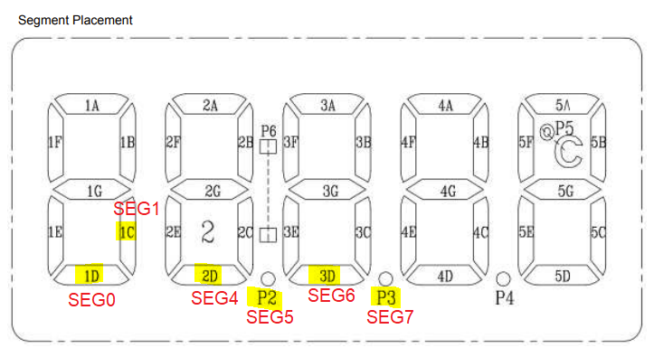

# Platform - FG23 LCD Animation Blink #

## Overview ##

This project shows how to use the FG23 LCD (Liquid Crystal Display) peripheral on the BRD2600A board to perform auto animation and blink without CPU intervention.

This project displays a pattern on the segment LCD. The LCD peripheral can execute various animations without involving the LCD data registers as well as the CPU. It allows specialized patterns to run on the LCD panel while the microcontroller remains in Low Energy Mode.

More information on [How it works](#how-it-works) below.

## Gecko SDK version ##

GSDK v4.4.3

## Hardware Required ##

* Board:  Silicon Labs EFR32FG23 Dev Kit (BRD2600A)
  * Device: EFR32FG23B010F512GM48

## Connections Required ##

Connect the board via a micro-USB cable to your PC to flash the example.

## Setup ##

To test this application, you can either create a project based on an example project or start with an empty example project.

### Create a project based on an example project ###

1. Make sure that this repository is added to [Preferences > Simplicity Studio > External Repos](https://docs.silabs.com/simplicity-studio-5-users-guide/latest/ss-5-users-guide-about-the-launcher/welcome-and-device-tabs).

2. From the Launcher Home, add your board to My Products, click on it, and click on the **EXAMPLE PROJECTS & DEMOS** tab. Find the example project filtering by **'lcd animation'**.

3. Click the **Create** button on the **Platform - FG23 LCD Animation Blink** example. Example project creation dialog pops up -> click **Finish** and Project should be generated.

    

4. Build and flash this example to the board.

### Start with an empty example project ###

1. Create an **Empty C Project** project for your hardware using Simplicity Studio 5.

2. Replace the `app.c` file in the project root folder with the `app.c` file in the src folder.

3. Open the .slcp file. Select the SOFTWARE COMPONENTS tab and install the software components:

    - [Platform] → [Peripheral] → [LCD]
    - [Services] → [Power Manager] → [Power Manager]

4. Build and flash the project to your device.

## How It Works ##

The EFR32FG23 Dev Kit supports the segment LCD segment peripheral.

A maximum of 8 segments can be used for the animation feature. They can either be segments 0-7 controlled by COM0 or segments 8-15 controlled by COM0. The animation is implemented as two programmable 8-bit registers that are shifted either left or right for every other animation state for a total of 16 states. The LCD_AREGA register is shifted every odd state. The LCD_AREGB register is shifted every even state. The two registers can either be OR'ed or AND'ed to achieve the desired animation pattern. The animation state machine is described in section 27.3.13.3 of the reference manual.

The BRD2600A board only maps segments 0-1 and segments 4-7 to the segment LCD panel, therefore the animation feature can only control 6 physical LCD segments on this board.

The LCD peripheral can also blink at a frequency given by CLKevent every 2Hz. The segments will be
alternating between on and off when the LCD is blinking. Refer to section 27.3.13.1 of the reference manual
for more information regarding the blinking feature.

For this example, the LCD segments controlled by the animation feature are 1D, 1C, 2D, P2, 3D, P3. 
Refer to the BRD2600A schematic for additional information.

## Testing ##

1. Build and flash the hex image onto the board. Reset the board and observe the segment LCD displaying animation at a 2Hz rate
2. Change BLINK_ENABLE define on line 30 of `app.c` file to 1
3. Rebuild and flash the hex image onto the board. Reset the board and observe the segment LCD displaying animation and blinking at a 2Hz rate. This example runs as it is and requires no user intervention.

**Note**:
As seen in the video above, the LCD will be blank for 2 seconds since segments 2 and 3 are not mapped to the onboard LCD. The blink feature is not enabled in the video.
