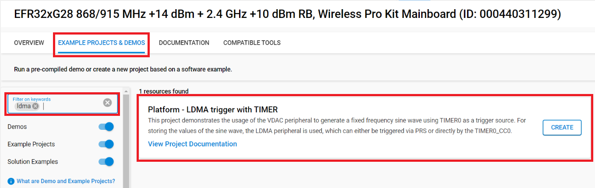
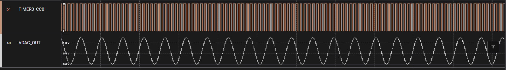

# Platform - LDMA trigger with TIMER #

## Overview ##

This project demonstrates the usage of both the LDMA and VDAC peripherals to generate a fixed frequency sine wave using TIMER0 as a trigger source. For storing the values of the sine wave, the LDMA peripheral is used, which can either be triggered via PRS or directly by the TIMER0_CC0.

## Gecko SDK version ##

- GSDK v4.4.4

## Hardware Required ##

- [EFR32xG24 Wireless 2.4 GHz +10 dBm Radio Board](https://www.silabs.com/development-tools/wireless/xg24-rb4186c-efr32xg24-wireless-gecko-radio-board?tab=overview)

- Wireless Starter Kit (WSTK) Mainboard (SLWMB4002A, formerly BRD4002A)

**Note:**

   - Tested boards for working with this example: 

      | Board ID | Description  |
      | ---------------------- | ------ |
      | BRD4210a | [EFR32XG23 868-915 MHz +20 dBm Radio Board](https://www.silabs.com/development-tools/wireless/xg23-rb4210a-efr32xg23-868-915-mhz-20-dbm-radio-board?tab=overview)|
      | BRD4186c | [EFR32xG24 Wireless 2.4 GHz +10 dBm Radio Board](https://www.silabs.com/development-tools/wireless/xg24-rb4186c-efr32xg24-wireless-gecko-radio-board?tab=overview)|
      | BRD4270b | [EFR32FG25 902-928 MHz +16 dBm Radio Board](https://www.silabs.com/development-tools/wireless/proprietary/fg25-rb4270b-efr32fg25-radio-board?tab=overview)|
      | BRD4400c | [EFR32xG28 2.4 GHz BLE and +14 dBm Radio Board](https://www.silabs.com/development-tools/wireless/xg28-rb4400c-efr32xg28-2-4-ghz-ble-and-14-dbm-radio-board?tab=overview)|

## Connections Required ##

Connect the board via the connector cable to your PC to flash the example.

## Setup ##

To test this application, you can either create a project based on an example project or start with an "Empty C Project" project based on your hardware.

### Create a project based on an example project ###

1. Make sure that this repository is added to [Preferences > Simplicity Studio > External Repos](https://docs.silabs.com/simplicity-studio-5-users-guide/latest/ss-5-users-guide-about-the-launcher/welcome-and-device-tabs).

2. From the Launcher Home, add your product name to My Products, click on it, and click on the **EXAMPLE PROJECTS & DEMOS** tab. Find the example project filtering by "ldma".

3. Click the **Create** button on **Platform - LDMA trigger with TIMER** example. Example project creation dialog pops up -> click Create and Finish and the project should be generated.

4. Build and flash this example to the board.

### Start with an "Empty C Project" project ###

1. Create an **Empty C Project** project for your hardware using Simplicity Studio 5.

2. Copy all files in the `inc` and `src` folders into the project root folder (overwriting the existing file).

3. Install the software components:

    3.1. Open the .slcp file in the project

    3.2. Select the SOFTWARE COMPONENTS tab

    3.3. Install the following components:

    - [Platform] → [Peripheral] → [VDAC]

    - [Platform] → [Peripheral] → [LDMA]

    - [Platform] → [Peripheral] → [PRS]

    - [Platform] → [Peripheral] → [TIMER]

    - [Platform] → [Peripheral] → [Init] → [GPIO Init] → instance name: timer

4. Build and flash the project to your board.

## How It Works ##

The example uses the timer's (TIMER0) compare channel (CC0) to trigger the VDAC conversion via an LDMA memory to peripheral transfer. The number of samples of the generated sine wave is specified by the `SINE_TABLE_SIZE` macro and is used by the LDMA as a single descriptor looped transfer.

The application defines the `PRS_MODE` macro to switch between the default timer connection interface and the PRS peripheral to connect the timer and the LDMA request line together.

When the timer connection interface is used (`PRS_MODE = 0`), TIMER0 requests a transfer start via the CC0 directly routed to the LDMA peripheral.

When PRS is used (`PRS_MODE = 1`), the peripheral utilizes the prsConsumerLDMA_REQUEST0 consumer line for the transfer's initiation.

A specific output frequency of the sine wave can be configured via the `TIMER0_FREQ` macro, which also takes the number of sampling points into account.

For an aditional debug option, the application defines the `TIMER_DEBUG` macro, which outputs the TIMER0_CC0 signal to one of the GPIOs:

### Pin Routing ###
| Output pin | BRD4210a | BRD4186c | BRD4270b | BRD4400C |
| --- | --- | --- | --- | --- |
| VDAC0_CH0_MAIN_OUT | PB0 | PB0 | PB0 | PB0 |
| SL_EMLIB_GPIO_INIT_TIMER_PIN | PA5 | PA5 | PA5 | PA11 |