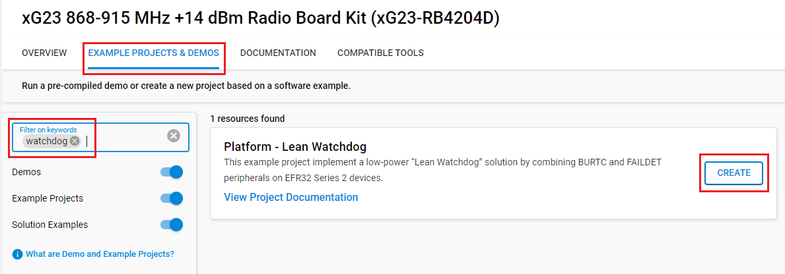

# Platform - Lean Watchdog

## Summary

This project is part of AN1426. A watchdog provides a way to reset the device in case of a system failure. Series 2 EFM32/EFR32 devices have the WDOG peripheral which functions as the dedicated watchdog peripheral. Although the WDOG is capable of running in EM2/3 and consumes very little power, systems with very strict power requirements may benefit from using the "lean watchdog" alternative.

In EM2/3, peripherals are powered by power domains, and these power domains are automatically turned off when not in use. Each power domain is used to power multiple peripherals. If a single peripheral in a power domain is enabled, that entire power domain turns on. If the WDOG is the only peripheral enabled in its power domain, it may be more power efficient to use another peripheral that provides watchdog functionality. The BURTC is a peripheral that resides in the PDHV power domain, which is a power domain that is always on in EM2/3. Enabling the BURTC in EM2/3 adds an insignificant amount of current consumption compared to enabling the WDOG's power domain, especially at higher temperatures. The BURTC can be used as an alternative to the WDOG. Additionally, the LFXO's failure detection (FAILDET) feature can be used to detect a faulty LFXO. This feature is especially useful if the WDOG or BURTC uses the LFXO as the clock source.

Peripherals used: WDOG0, BURTC, LFXO, GPIO, SYSRTC

## Gecko SDK version

- v4.4.3

## Hardware Required

- [EFR32XG23 868-915 MHz +14 dBm Radio Board](https://www.silabs.com/development-tools/wireless/xg23-rb4204d-efr32xg23-868-915-mhz-14-dbm-radio-board)
- Wireless Starter Kit Mainboard

## Connections Required

- Connect the radio board to the WSTK, and connect the WSTK via a micro-USB cable to your PC.

## Setup

To test this application, you can either create a project based on an example project or start with an empty example project.

### Create a project based on an example project

1. Make sure that this repository is added to [Preferences > Simplicity Studio > External Repos](https://docs.silabs.com/simplicity-studio-5-users-guide/latest/ss-5-users-guide-about-the-launcher/welcome-and-device-tabs).

2. From the Launcher Home, add the boardname(BRD4204D) to My Products, click on it, and click on the **EXAMPLE PROJECTS & DEMOS** tab. Find the example project filtering by **watchdog**.

3. Click the **Create** button on the **Platform - Lean Watchdog** example. Example project creation dialog pops up -> click **Finish** and Project should be generated.

    

4. Build and flash this example to the board.

### Start with an empty example project

1. Create an **Empty C Project** project for your hardware using Simplicity Studio 5.

2. Copy all attached files in the inc and src folders into the project root folder (overwriting existing file).

3. Open the .slcp file. Select the SOFTWARE COMPONENTS tab and install the software components:

    - [Platform] → [Peripheral] → [RMU]
    - [Platform] → [Peripheral] → [WDOG]
    - [Platform] → [Peripheral] → [BURTC]
    - [Services] → [Timers] → [Sleep Timer]
    - [Services] → [Power Manager] → [Power Manager]

4. Build and flash the project to your device.

## How It Works

Pressing PB0 toggles the energy mode between EM1 and EM2. When in EM1, the WDOG0 is configured as the system's watchdog. WDOG0 selects the LFXO as its clock source and is configured to reset the system if WDOG0 is not fed within 2 seconds. When in EM2, the BURTC is configured as the system's watchdog. The BURTC selects the LFXO as its clock source and is configured to trigger an interrupt if the BURTC is not fed within 2 seconds. The BURTC's interrupt handler is written to reset the system on a compare match event.

The sleeptimer service uses the SYSRTC to feed the appropriate watchdog every second. Pressing PB1 while the sleeptimer attempts to feed the watchdog will prevent the watchdog from being fed.

## Testing

Pressing PB1 for at most 2 seconds prevents the watchdog from being fed and will trigger a watchdog reset. Out of reset, the software checks the reset cause. If the reset was due to the WDOG0, LED0 will turn on, and the software will stall in an infinite while loop. If the reset was due to a system reset request, LED1 will turn on and the software will stall in an infinite while loop.

The LFXO's FAILDET feature provides extra system failure detection. By enabling the FAILDET feature, the LFXO interrupt is triggered if fewer than 3 LFXO clock positive edges occur during 1 ms. The LFXO interrupt handler is written to reset the system if an LFXO failure is detected.

After flashing the code to the radio board, the user may see that LED1 turns on and the software stalls, although PB1 was not pressed. This is because the flash program sent a system reset request to reset the device after downloading the code. Pressing the RESET button on the WSTK will trigger a pin reset, and the software should function as expected.

This example does not function properly with debuggers in the Simplicty Studio IDE because the debugger sends a system reset request upon connection, and the software will stall in the infinite while loop out of reset.