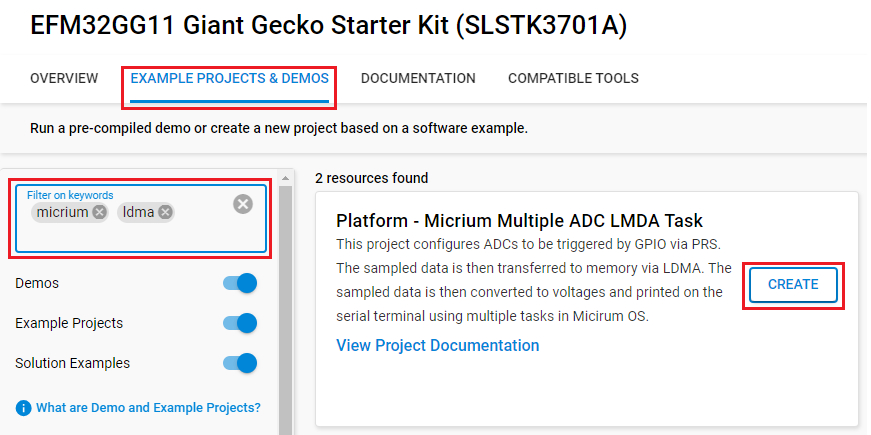
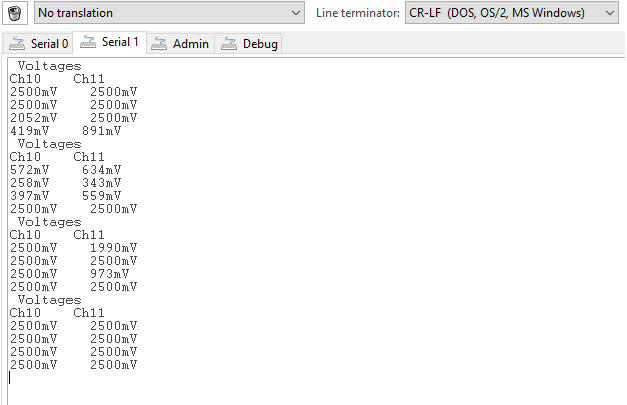

# Platform - Micrium Multiple ADC LMDA Task #

## Overview ##

This project configures ADCs to be triggered by GPIO via PRS. The sampled data is then transferred to memory via LDMA. The sampled data is then converted to voltages and printed on the serial terminal using multiple tasks in Micirum OS.  

## Gecko SDK version ##

- GSDK v4.4.3

## Hardware Required ##

- [SLSTK3701A Giant Gecko GG11 Starter Kit](https://www.silabs.com/development-tools/mcu/32-bit/efm32gg11-starter-kit?tab=overview)

## Connections Required ##

- Connect the Giant Gecko GG11 Starter Kit via a micro-USB cable to your PC.
- Connect pins PA13 (EXP Header Pin 5) and PE11 (EXP Header Pin 6) to the signals to be sampled. 

## Setup ##

To test this application, you can either create a project based on an example project or start with an empty example project.

### Create a project based on an example project ###

1. Make sure that this repository is added to [Preferences > Simplicity Studio > External Repos](https://docs.silabs.com/simplicity-studio-5-users-guide/latest/ss-5-users-guide-about-the-launcher/welcome-and-device-tabs).

2. From the Launcher Home, add the BRD2504A to My Products, click on it, and click on the **EXAMPLE PROJECTS & DEMOS** tab. Find the example project filtering by **micrium** and **ldma**.

3. Click the **Create** button on the **Platform - Micrium Multiple ADC LMDA Task** example. Example project creation dialog pops up -> click **Finish** and Project should be generated.

    

4. Build and flash this example to the board.

### Start with an empty example project ###

1. Create an **Empty C Project** project for your hardware using Simplicity Studio 5.

2. Copy all related files in [src](src) folder into the project and replace the existing files.

3. Open the .slcp file. Select the SOFTWARE COMPONENTS tab and install the software components:

    - [RTOS] → [Micrium OS] → [Kernel] → [Micrium OS Kernel]
    - [Services] → [IO Stream] → [Driver] → [IO Stream: USART] → default instance name: vcom
    - [Services] → [IO Stream] → [Driver] → [IO Stream: Retarget STDIO]
    - [Platform] → [Peripheral] → [ADC]
    - [Platform] → [Peripheral] → [PRS]
    - [Platform] → [Board] → [Starter Kit] → [Board Control] → Enable Virtual COM UART

4. Build and flash the project to your device.

## How it Works ##

The ADCs are configured to be triggered by BTN0. This signal is sent via one of the PRS channels. The ADCs sample the analog signals in single conversion mode and store the data in the internal FIFO. Once the conversion is completed, the sampled data is copied from the FIFO to a buffer in memory. Each ADC has its own buffer in memory. Once the LDMA transfer is done, the data is converted into voltages in one task and printed on the serial terminal in the other task. Access to data and synchronization between tasks is implemented using semaphores, mutex and event flags.

