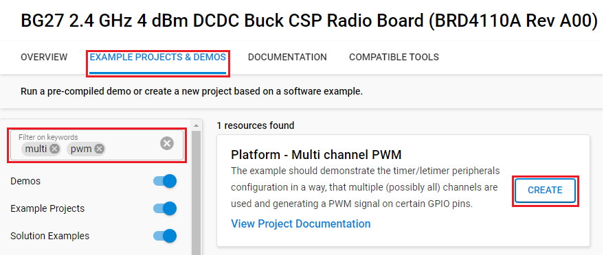
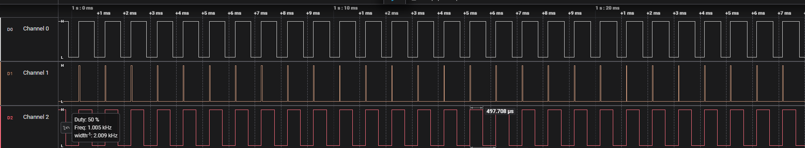

# Platform - Multi Channel PWM #

## Overview ##

The example demonstrate the timer/letimer peripherals configuration in a way, that multiple channels are used and generate a PWM signal on certain GPIO pins.

## Gecko SDK Version ##

- GSDK v4.4.3

## Hardware Required ##

- One SiliconLabs Wireless Gecko Starter Kit
- One of the SiliconLabs radio boards that listed below:

  - [EFR32xG21 2.4 GHz 20 dBm Radio Board](https://www.silabs.com/development-tools/wireless/slwrb4180b-efr32xg21-wireless-gecko-radio-board?tab=overview)

  - [EFR32xG22 Wireless Gecko 2.4 GHz +6 dBm 5x5, QFN40 Radio Board](https://www.silabs.com/development-tools/wireless/slwrb4182a-efr32xg22-wireless-gecko-radio-board?tab=overview)

  - [EFR32XG23 868-915 MHz +20 dBm Radio Board](https://www.silabs.com/development-tools/wireless/xg23-rb4210a-efr32xg23-868-915-mhz-20-dbm-radio-board?tab=overview)

  - [EFR32xG24 2.4 GHz 10 dBm Radio Board](https://www.silabs.com/development-tools/wireless/xg24-rb4186c-efr32xg24-wireless-gecko-radio-board?tab=overview)

  - [EFR32FG25 902-928 MHz +16 dBm Radio Board](https://www.silabs.com/development-tools/wireless/proprietary/fg25-rb4270b-efr32fg25-radio-board?tab=overview)

  - [EFR32BG27 Wireless 2.4 GHz +4 dBm Radio Board (Buck)](https://www.silabs.com/development-tools/wireless/bluetooth/bg27-rb4110b-efr32bg27-4-dbm-buck-wireless-radio-board?tab=overview)

## Connections Required ##

- Connect the board via a micro-USB cable to your PC to flash the example.

## Setup ##

To test this application, you can either create a project based on an example project or start with an empty example project.

### Create a project based on an example project ###

1. Make sure that this repository is added to [Preferences > Simplicity Studio > External Repos](https://docs.silabs.com/simplicity-studio-5-users-guide/latest/ss-5-users-guide-about-the-launcher/welcome-and-device-tabs).

2. From the Launcher Home, add your device to My Products, click on it, and click on the **EXAMPLE PROJECTS & DEMOS** tab. Find the example project filtering by **multi** and **pwm**.

3. Click the **Create** button on the **Platform - Multi Channel PWM** example. Example project creation dialog pops up -> click **Finish** and Project should be generated.

    

4. Build and flash this example to the board.

### Start with an empty example project ###

1. Create an **Empty C Project** project for your hardware using Simplicity Studio 5.

2. Replace the `app.c` file in the project root folder with the provided `app.c` (located in the src folder).

3. Open the .slcp file. Select the SOFTWARE COMPONENTS tab and install the software components:
  
    - [Platform] → [Peripheral] → [TIMER]

4. Build and flash the project to your device.

## How It Works ##

TIMER0 is initialized for PWM on 3 channels (0, 1, and 2) and routed to GPIO pins. PWM duty cycle on channel 0 increases from 0 -> 100%, whereas duty cycle on channel 1 decreases from 100 -> 0%. You can modify the GPIO pins configuration to the LEDs pin on the wireless starter kit or use an oscilloscope to see how PWM works on each channel.

