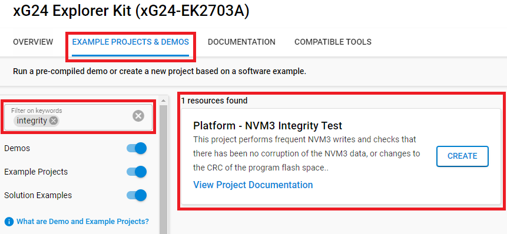

# Platform - NVM3 Integrity Test

## Description ##

This project performs frequent NVM3 writes and checks that there has been no corruption of the NVM3 data, or changes to the CRC of the program flash space.

## Gecko SDK version

GSDK v4.4.3

## Hardware Required

[EFR32xG24 Explorer Kit - XG24-EK2703A](https://www.silabs.com/development-tools/wireless/efr32xg24-explorer-kit?tab=overview)

**NOTE:**
Tested boards for working with this example:

| Board ID | Description  |
| ---------------------- | ------ |
| BRD2703A | [EFR32xG24 Explorer Kit - XG24-EK2703A](https://www.silabs.com/development-tools/wireless/efr32xg24-explorer-kit?tab=overview)    |
| BRD2601B | [EFR32xG24 Dev Kit - xG24-DK2601B](https://www.silabs.com/development-tools/wireless/efr32xg24-dev-kit?tab=overview)   |

## Connections Required

For this project, just connect a supported board to the computer through USB.

## Setup

To test this application, you can either create a project based on an example project or start with an "Empty C Project" project based on your hardware.

### Create a project based on an example project

1. From the Launcher Home, add BRD2703A to My Products, click on it, and click on the **EXAMPLE PROJECTS & DEMOS** tab. Find the example project with the filter "integrity".
2. Click the **Create** button on the **Platform - NVM3 Integrity Test** example. Example project creation dialog pops up -> click Create and Finish and Project should be generated.

3. Build and flash this example to the board.

### Start with an "Empty C Project" project

1. Create an **Empty C Project** project for your device using Simplicity Studio 5.

2. Copy all attached files in the "inc" and "src" folders into the project root folder.

3. Open the .slcp file. Select the SOFTWARE COMPONENTS tab and install the software components:

- [Services] → [NVM3] → [NVM3 Core]
- [Services] → [NVM3] → [NVM3 Default Instance]
- [Services] → [Timers] → [Sleep Timer]
- [Platform] → [Driver] → [LED] → [Simple LED] → default instances: led0, led1
- [Platform] → [Driver] → [Button] → [Simple Button] → default instance: btn0
- [Platform] → [Peripheral] → [GPCRC]

4. Build and flash the project to your device.

**NOTE:**

Use the Flash programmer tool to erase the board first (to ensure there is no NVM3 data in the Flash). Optionally, load any flash patterns to the device.

Build and run the project on a connected board.

LED0 will flash quickly (~10 Hz). The user must press Button0 to start.

If there is an error, LED0 will flash a count of pulses indicating which error occurred.  LED1 will flash while NVM3 is being written.

Errors Code:

1 - NVM3 cannot be opened, or the number of objects incorrect

2 - Cannot get object info

3 - NVM3 data does not match what was written

4 - CRC of program space does not match the original value

5 - NVM3 repack failed

## How It Works

The first time the device runs, the NVM3 is uninitialized. LED0 will flash quickly (~10 Hz). The user must press Button0 to start. The program will initialize NVM3 and write the program space CRC to NVM3.

After initialization, the program will periodically write to NVM3 storage.  It will stop and flash LED0 with an error number (~2 Hz) if the NVM3 keys do not have the expected value, or if the CRC does not match.

The program drives LED1 high when NVM3 operations (writes or repack) are being conducted.  This will allow an outside device to interrupt power specifically during NVM3 operations to test the device's robustness to sudden power loss.
