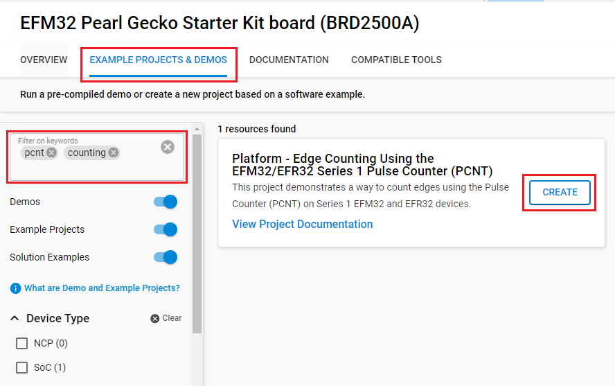
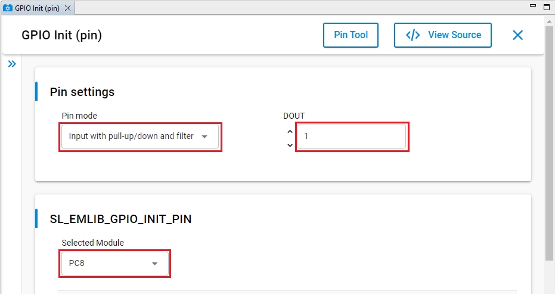

# Platform - Edge Counting Using the EFM32/EFR32 Series 1 Pulse Counter (PCNT) #


## Summary ##

This project demonstrates a way to count edges using the Pulse Counter (PCNT) on Series 1 EFM32 and EFR32 devices.

Although it might seem that a hardware module intended to count pulses ought to also be able to count edges, this is not the case with the PCNT. Specifically, a pulse is counted when either a rising or falling edge is detected on the S0IN pin depending on the value of the PCNT_CTRL_EDGE bit.

However, by using the PRS GPIO producer and the GPIO edge detection logic, it is possible to turn edges into countable pulses.

## Gecko SDK version ##

- GSDK 4.4.3

## Hardware Required ##

Wireless Starter Kit (WSTK) Mainboard (SLWMB4001A, formerly BRD4001A) and one of the following:

- EFR32BG1 2.4 GHz 10.5 dBm Radio Board (SLWRB4100A)
- EFR32BG12 2.4 GHz 10 dBm Radio Board (SLWRB4103A)
- EFR32BG13 2.4 GHz 10 dBm Radio Board (SLWRB4104A)
- EFR32FG1 2.4 GHz/915 MHz 19.5 dBm Radio Board (SLWRB4250A)
- EFR32FG12 2.4 GHz/915 MHz 19 dBm Radio Board (SLWRB4253A)
- EFR32FG13 2.4 GHz/915 MHz 19 dBm Radio Board (SLWRB4255A)
- EFR32FG14 2.4 GHz/915 MHz 19 dBm Radio Board (SLWRB4257A)
- EFR32MG1 2.4 GHz MHz 19.5 dBm Radio Board (SLWRB4151A)
- EFR32MG12 2.4 GHz MHz 10 dBm Radio Board (SLWRB4162A)
- EFR32MG13 2.4 GHz/915 MHz 19 dBm Radio Board (SLWRB4158A)

Or one of the following:

- EFM32GG11 Starter Kit (SLSTK3701A)
- EFM32PG1 Starter Kit (SLSTK3401A)
- EFM32PG12 Starter Kit (SLSTK3402A)
- EFM32TG11 Starter Kit (SLSTK3301A)

## Connections Required ##

- Connect the board via a USB cable to your PC to flash the example.

## Setup ##

To test this application, you can either create a project based on an example project or start with an empty example project.

### Create a project based on an example project ###

1. Make sure that this repository is added to [Preferences > Simplicity Studio > External Repos](https://docs.silabs.com/simplicity-studio-5-users-guide/latest/ss-5-users-guide-about-the-launcher/welcome-and-device-tabs).

2. From the Launcher Home, add your device to My Products, click on it, and click on the **EXAMPLE PROJECTS & DEMOS** tab. Find the example project filtering by **pcnt** and **counting**.

3. Click the **Create** button on the **Platform - Edge Counting Using the EFM32/EFR32 Series 1 Pulse Counter (PCNT)** example. Example project creation dialog pops up -> click **Finish** and Project should be generated.

    

4. Build and flash this example to the board.

### Start with an empty example project ###

1. Create an **Empty C Project** project for your hardware using Simplicity Studio 5.

2. Replace the `app.c` file in the project root folder with the provided `app.c` (located in the src folder).

3. Open the .slcp file. Select the SOFTWARE COMPONENTS tab and install the software components:

    - [Platform] → [Peripheral] → [PCNT]
    - [Platform] → [Peripheral] → [PRS]
    - [Platform] → [Peripheral] → [Init] → [GPIO Init] → default instance name: **pin**. Configure this instance to suit your hardware. Below is the configuration for the BRD2204A (SLSTK3701A) board
    
    - [Platform] → [Driver] → [LED] → [Simple LED] → default instance name: **led0**

4. Build and flash the project to your device.

## How It Works ##

As mentioned above, the PCNT recognizes either a rising or falling edge as a pulse.
Counting all edges requires some logic outside of the PCNT to perform edge-to-pulse conversion.

Fortunately, between the GPIO and PRS modules and the ability of the PCNT to accept input from the PRS,
EFM32 and EFR32 devices have this capability.

The first part of this equation, the edge-to-pulse conversion, is handled by the GPIO and PRS. Typically, the GPIO edge detection logic is used to configure a pin for interrupt capability by enabling the detection of the desired edge(s).

```c
GPIO_ExtIntConfig(SL_EMLIB_GPIO_INIT_PIN_PORT, SL_EMLIB_GPIO_INIT_PIN_PIN, SL_EMLIB_GPIO_INIT_PIN_PIN, true, false, true);
```

This configuration requests interrupts upon detection of rising edges on the GPIO pin connected to STK/WSTK push button 0. By contrast...

```c
GPIO_ExtIntConfig(SL_EMLIB_GPIO_INIT_PIN_PORT, SL_EMLIB_GPIO_INIT_PIN_PIN, SL_EMLIB_GPIO_INIT_PIN_PIN, true, true, false);
```

...detects both rising and falling edges on this pin but with no subsequent interrupt requests. This becomes useful when the PRS GPIO high (pins [15:8]) or low (pins [7:0]) producer is used to generate pulses in response to edges. In this case, the following code...

```c
// Select the PRS source/signal depending on the button 0 port/pin
if (SL_SIMPLE_BUTTON_BTN0_PIN >= 8)
{
  source = PRS_CH_CTRL_SOURCESEL_GPIOH;
  signal = (uint32_t)(SL_SIMPLE_BUTTON_BTN0_PIN - 8);
} else {
  source = PRS_CH_CTRL_SOURCESEL_GPIOL;
  signal = SL_SIMPLE_BUTTON_BTN0_PIN;
}

// Select GPIO as PRS source and signal for both falling edges
PRS_SourceSignalSet(PCNT_PRS_CH, source, signal, prsEdgeBoth);
```

...generates pulses on the specified PRS channel in response to both rising and falling edges from the appropriate GPIO producer (depending on which half of the GPIO port's pins SL_SIMPLE_BUTTON_BTN0_PIN resides).

With the edge-to-pulse conversion taken care of in hardware, it's a simple matter to configure the PCNT to accept input on the designated PRS channel instead of the S0IN pin:

```c
PCNT_Init_TypeDef pcntInit = PCNT_INIT_DEFAULT;

pcntInit.mode     = pcntModeExtSingle;
pcntInit.top      = PCNT_EDGE_COUNT;
pcntInit.s1CntDir = false;
pcntInit.s0PRS    = PCNT_PRS_CH;
pcntInit.filter   = false;

PCNT_Init(PCNT0, &pcntInit);

PCNT_PRSInputEnable(PCNT0, pcntPRSInputS0, true);
```

This method has some limitations:

1. It can only run in EM0 and EM1 because the PRS pulses are synchronous. Technically, GPIO edge detection is not available in EM2. This is because it's only possible to detect a change away from the level present on a pin before entering EM2.

2. When the PCNT is running in externally clocked mode, the first three edges detected appear to not be counted. This is because they are needed to actually clock the PCNT registers and synchronize them with the HFCLKLE domain.

That said, it's possible to get around #2 by faking the first three pulses:

```c
for (i = 0; i < 3; i++)
  PRS_PulseTrigger(1 << PCNT_PRS_CH);
```

After this, each edge is counted as it happens.

## Testing ##

The code flow is as follows:

1. Initialize the CMU (HFXO, HFCLKE, and LFACLK).

2. Initialize the GPIO.

   - Button 0 is used to generate the edges
   - LED 0 is toggled in response to pulse count overflows

3. Initialize the PRS.

4. Initialize the PCNT.
The PCNT top value (the value at which the counter rolls over to 0) is set, in this example, to 5. This means that 3 button pushes (each of which causes 2 edges) result in a rollover and PCNT overflow interrupt request.

5. Three dummy pulses are triggered under software control on the specified PRS channel in order to prime the PCNT logic so that the edges associated with subsequent button presses are immediately counted.

6. The device enters EM1 and waits until PCNT_EDGE_COUNT + 1 edges (5 + 1) are detected, at which point the PCNT overflow interrupt is requested, and the associated handler clears the resulting interrupt flag and toggles LED 0 on the STK/WSTK.
