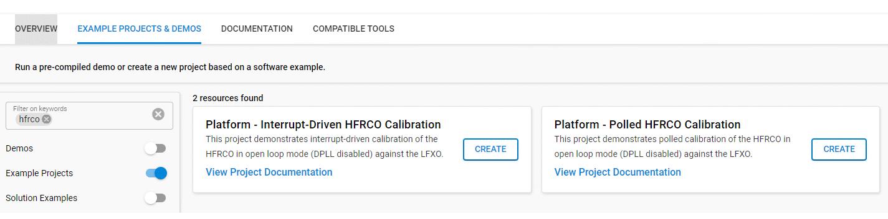
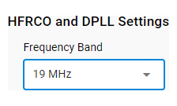
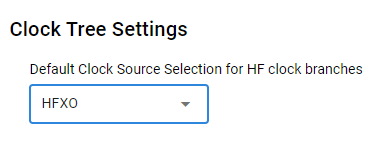
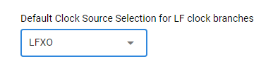
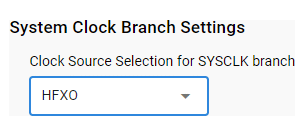
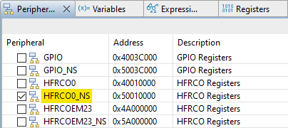
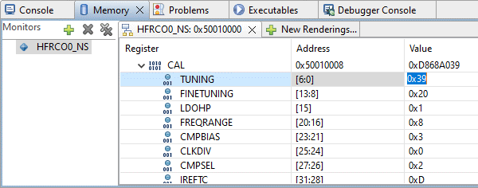

# HFRCO Interrupt-Driven Calibration Examples #

## Summary ##

This example demonstrates interrupt-driven calibration of the HFRCO against the LFXO.

Unlike the polled example, where `sl_clock_manager_wait_rco_calibration()` continuously reads `CMU->STATUS` to determine when the down counter has reached zero, the CALRDY interrupt is enabled here so that other code can run while counting occurs.

In both cases, the algorithm uses the `sl_clock_manager_set_rc_oscillator_calibration()` API to adjust the `HFRCODPLL->CAL.TUNING` field one bit at a time until a value is found that results in the calibration up count matching the ideal value for the given frequency as closely as possible. The difference here is that calibration runs continuously so the up count is evaluated each time the CALRDY interrupt fires until tuning is achieved.  

You can observe calibration progress and the effect of changing the HFRCODPLL tuning on an oscilloscope by probing GPIO pin PB1.  

## SDK Version ##

- Simplicity SDK 2024.12.2

## Supported Hardware ##

- [EFM32PG22 Dev Kit](https://www.silabs.com/development-tools/mcu/32-bit/efm32pg22-dev-kit?tab=overview) (BRD2503A)
- [EFM32PG23 Pro Kit](https://www.silabs.com/development-tools/mcu/32-bit/efm32pg23-pro-kit?tab=overview) (BRD2504A)
- [EFM32PG26 Pro Kit](https://www.silabs.com/development-tools/mcu/32-bit/efm32pg26-pro-kit?tab=overview) (BRD2505A)
- [EFM32PG28 Pro Kit](https://www.silabs.com/development-tools/mcu/32-bit/efm32pg28-pro-kit?tab=overview) (BRD2506A)

## Required Connections ##

Connect the board to your PC with the appropriate USB cable.

## Setup ##

To test this example, you can either create a project from the repo contents or start with an "Empty C Project" based on your hardware.

### Create a project based on an example project ###

1. Make sure that this repository is added to [Preferences > Simplicity Studio > External Repos](https://docs.silabs.com/simplicity-studio-5-users-guide/latest/ss-5-users-guide-about-the-launcher/welcome-and-device-tabs).

2. From the Launcher Home, add your product name to My Products, click on it, and click on the **EXAMPLE PROJECTS & DEMOS** tab. Find the example project filtering by "HFRCO".

3. Click the **Create** button on **Platform - Interrupt-Driven HFRCO Calibration** example. When the example project creation dialog pops up, click Create and Finish to generate project.

4. Build and flash this example to the board.

### Start with an "Empty C Project" ###

1. Create an **Empty C Project** for your hardware using Simplicity Studio 5.

2. Copy all files in the `src` folder into the project root folder (overwriting any existing files).

3. Adjust settings for some of the default software components as follows:

    3.1. Open the .slcp file in the project

    3.2. Select the SOFTWARE COMPONENTS tab

    3.3. Change the following settings in Clock Manager:

    - [Services] → [Clock Manager: Clock Manager] → Oscillator Settings → HFRCO and DPLL Settings: 19 MHz

      

    - [Services] → [Clock Manager: Clock Manager] → Clock Tree Settings → Default Clock Source Selection for HF clock branches: HFXO

	  

    - [Services] → [Clock Manager: Clock Manager] → Clock Tree Settings → Default Clock Source Selection for LF clock branches: LFXO

	  
 
    - [Services] → [Clock Manager: Clock Manager] → Clock Tree Settings → System Clock Branch Settings → Clock Source Selection for SYSCLK branch: HFXO

	  

4. Build and flash the project to your board.

## How It Works ##

This example implements the simplest possible tuning algorithm but does so using interrupts instead of polling. Because the CPU is not sitting in a loop polling the `CMU->STATUS` register, other code can execute while counting occurs in the background.

First, the calibration logic is configured so that the HFRCODPLL clocks the down counter while the LFXO clocks the up counter.  For each calibration run, the down counter counts from 0xFFFFF down to 0 while some number of clocks of the LFXO is tracked by the up counter. In this example, the up counter should register 1808 counts of the LFXO if the HFRCODPLL is tuned to 19 MHz.

Increasing the value of the TUNING field reduces the frequency of the HFRCODPLL while decreasing it increases the frequency. After each calibration run, the number of up counts is compared to the ideal value for the desired frequency and adjusted as follows:

* If the number of up counts needs to be reduced, the down counter clock frequency is too low, and the TUNING value is decremented by one, which increases the frequency of the HFRCODPLL.
* Likewise, if the up count needs to be increased, the down counter clock is too fast, and the TUNING value is incremented by one, which decreases the frequency of the HFRCODPLL.

After adjusting the TUNING field, calibration is run again and the process repeats until the ideal count value is reached or the algorithm determines that a subsequent adjustment is not going to result in an up count that is closer to the ideal count than that which has already been achieved.

To observe the algorithm in action, first set a breakpoint in `start_cal()` where the current value of TUNING is read (around line 124):

    // Get current tuning value
    sl_clock_manager_get_rc_oscillator_calibration(SL_OSCILLATOR_HFRCODPLL, &tuningVal);

Start execution of the program by clicking the Resume button (or pressing F8). When this first breakpoint is reached, enable viewing of the HFRCODPLL registers by selecting HFRCO0_NS in the Peripherals window in the Simplicity Studio Debugger:

Next, expand the CAL register in the memory viewer and the change the TUNING field to its maximum (0x7F) or minimum (0x0) value:

Set another breakpoint immediately after completion of the calibration run and before the registered up count is compared to the ideal value (around line 165) in the `CMU_IRQHandler()`:

    /*
     * If the up counter result is less than the tuned value, the LFRCO
     * is running at a lower frequency, so the tuning value has to be
     * incremented.
     */
    if (upCount < idealCount) {
  
Now click the Resume button (or press F8) to start the calibration run. When the second breakpoint is reached, you can single step through the algorithm to see how the up count is evaluated and the TUNING field is adjusted to get the HFRCODPLL frequency closer to the intended target. The algorithm stops when the registered up count matches the ideal up count for the desired frequency or when a subsequent adjustment cannot get a result that is closer to the target. 

## Observing the HFRCO Output ##

If you wish to see the output of the HFRCODPLL on an oscilloscope as calibration runs, connect a probe to the breakout connector pad that corresponds to PB1 pin on your board as follows:

- For PG22, PB1 is the 5th pin from the top (pin 9) of the column of breakout connectors on the left side of the Dev Kit 
- For PG23, PB1 is the 7th pin from the right (pin 10) on J101, which is the row of breakout connectors on the south side of the Pro Kit
- For PG26, PB1 is the 6th pin from the right (pin 22) on the top row of J101, which are the rows of breakout connectors on the south side of the Pro Kit
- For PG28, PB1 is the 7th pin from the right (pin 10) on J101, which is the row of breakout connectors on the south side of the Pro Kit

The changing output is easiest to see after setting the `HFRCODPLL->CAL.TUNING` field to its maximum or minimum as this causes the algorithm to run a larger number of iterations than would be the case when the current HFRCODPLL frequency is close to the target calibration frequency.    
 
## Modifications ##

This algorithm can be used as-is to dial the HFRCOEM23 to an arbitrary frequency within a given tuning band. Simply change the occurrences of Clock Manager constants for the HFRCODPLL to the equivalent for the HFRCOEM23:

* `SL_OSCILLATOR_HFRCODPLL` to `SL_OSCILLATOR_HFRCOEM23`
* `SL_CLOCK_MANAGER_CLOCK_CALIBRATION_HFRCODPLL` to `SL_CLOCK_MANAGER_CLOCK_CALIBRATION_HFRCOEM23`
* `SL_CLOCK_MANAGER_EXPORT_CLOCK_SOURCE_HFRCODPLL` to `SL_CLOCK_MANAGER_EXPORT_CLOCK_SOURCE_HFRCOEM23`