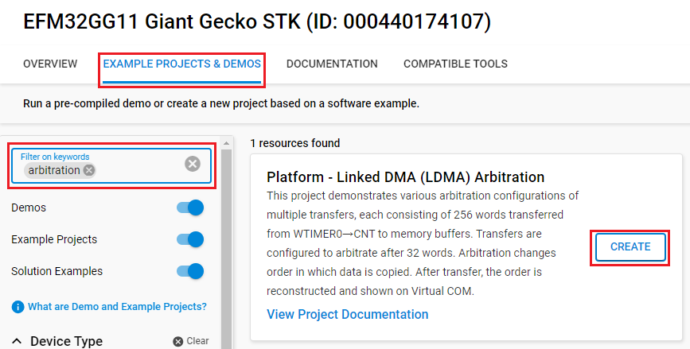
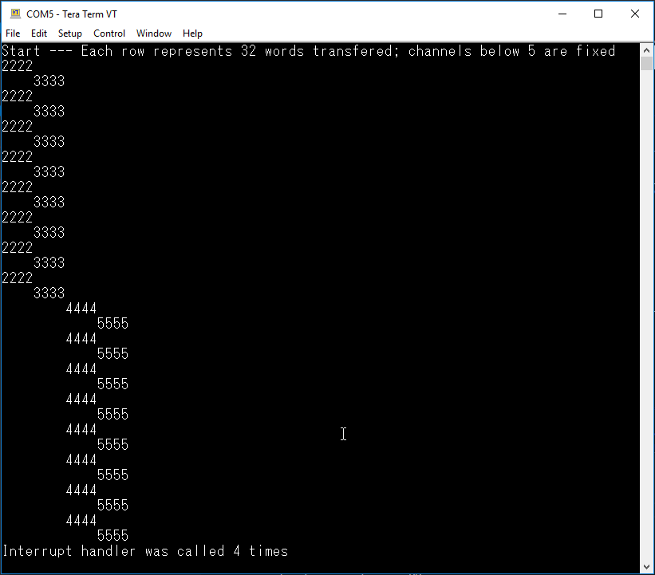

# Platform - Linked DMA (LDMA) Arbitration #

## Overview ##

This project demonstrates various arbitration configurations of multiple transfers, each consisting of 256 words transferred from WTIMER0→CNT to memory buffers. Transfers are configured to arbitrate after 32 words. Arbitration changes order in which data is copied. After transfer, the order is reconstructed and shown on Virtual COM.

## Gecko SDK version ##

- GSDK v4.4.3

## Hardware Required ##

- [SLSTK3701A Giant Gecko GG11 Starter Kit](https://www.silabs.com/development-tools/mcu/32-bit/efm32gg11-starter-kit?tab=overview)

## Connections Required ##

Connect the Giant Gecko GG11 Starter Kit via a micro-USB cable to your PC.

## Setup ##

To test this application, you can either create a project based on an example project or start with an empty example project.

### Create a project based on an example project ###

1. Make sure that this repository is added to [Preferences > Simplicity Studio > External Repos](https://docs.silabs.com/simplicity-studio-5-users-guide/latest/ss-5-users-guide-about-the-launcher/welcome-and-device-tabs).

2. From the Launcher Home, add the BRD2204A to My Products, click on it, and click on the **EXAMPLE PROJECTS & DEMOS** tab. Find the example project filtering by **arbitration**.

3. Click the **Create** button on the **Platform - Linked DMA (LDMA) Arbitration** example. Example project creation dialog pops up -> click **Finish** and Project should be generated.

    

4. Build and flash this example to the board.

### Start with an empty example project ###

1. Create an **Empty C Project** project for your hardware using Simplicity Studio 5.

2. Copy all related files in [src](src) folder into the project and replace the existing files.

3. Open the .slcp file. Select the SOFTWARE COMPONENTS tab and install the software components:

    - [Services] → [IO Stream] → [Driver] → [IO Stream: USART] → default instance name: vcom
    - [Services] → [IO Stream] → [Driver] → [IO Stream: Retarget STDIO]
    - [Platform] → [Peripheral] → [TIMER]
    - [Platform] → [Board] → [Starter Kit] → [Board Control] → Enable Virtual COM UART

4. Build and flash the project to your device.

## How it Works ##

WTIMER0 is setup as a sequential number source.

TIMER0 is used to trigger all pending DMA transfers

All DMA transfers are setup to transfer 32 words per arbitration. All transfers copy the word WTIMER->CNT to a memory location. By following sequence of copied numbers, the order in which they were copied can be traced.

Different behaviors can be observed by varying:

- the number of fixed channels
- the number of arbitration slots assigned to a channel

Virtual COM is used to display results:

The number in the row indicates the channel that is active, each row represents a transfer of 32 words.  Foe example, first three rows indicates 32 words were transferred on ch2, then 32  words on ch3, then 32 words on ch2.
