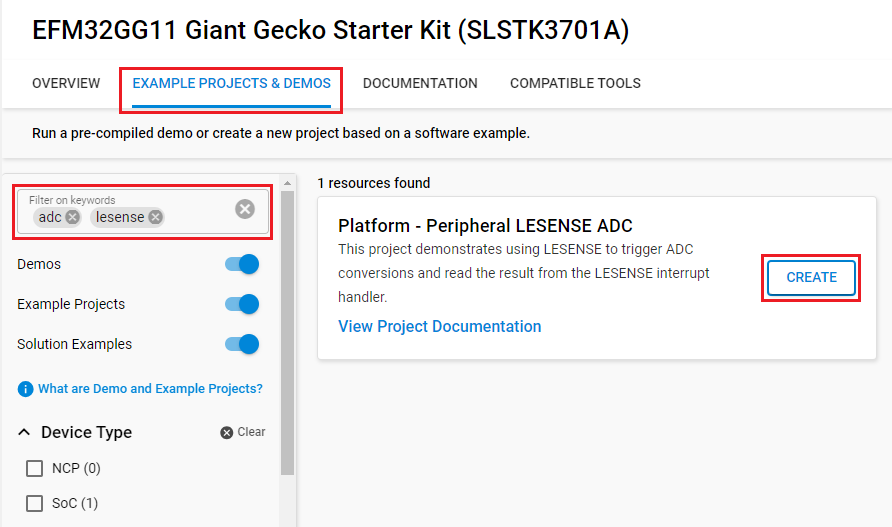

# Platform - Peripheral LESENSE ADC #

## Overview ##

This project demonstrates using LESENSE to trigger ADC conversions and read the result from the LESENSE interrupt handler. This project
scans over two LESENSE channels and samples two ADC inputs at a rate of 1Hz.

## Gecko SDK version ##

- GSDK v4.4.3

## Hardware Required ##

- [SLSTK3701A Giant Gecko GG11 Starter Kit](https://www.silabs.com/products/development-tools/mcu/32-bit/efm32-giant-gecko-gg11-starter-kit)

## Connections Required ##

- Connect the board via a USB Type-C cable to your PC to flash the example.

## Setup ##

To test this application, you can either create a project based on an example project or start with an empty example project.

### Create a project based on an example project ###

1. Make sure that this repository is added to [Preferences > Simplicity Studio > External Repos](https://docs.silabs.com/simplicity-studio-5-users-guide/latest/ss-5-users-guide-about-the-launcher/welcome-and-device-tabs).

2. From the Launcher Home, add the BRD2204A to My Products, click on it, and click on the **EXAMPLE PROJECTS & DEMOS** tab. Find the example project filtering by **adc** and **lesense**.

3. Click the **Create** button on the **Platform - Peripheral LESENSE ADC** example. Example project creation dialog pops up -> click **Finish** and Project should be generated.

    

4. Build and flash this example to the board.

### Start with an empty example project ###

1. Create an **Empty C Project** project for your hardware using Simplicity Studio 5.

2. Replace the `app.c` file in the project root folder with the provided `app.c` (located in the src folder).

3. Open the .slcp file. Select the SOFTWARE COMPONENTS tab and install the software components:

    - [Platform] → [Peripheral] → [ADC]
    - [Platform] → [Peripheral] → [LESENSE]

4. Build and flash the project to your device.

## How It Works ##

ADC is configured in scan mode with two channels enabled:

- APORT3XCH8 - PE8 (Expansion Header 12)
- APORT3YCH9 - PE9 (Expansion Header 14)

The two channels are in input_group 0 with channel numbers 0 and 1 respectively.

LESENSE is configured in periodic scan mode with channels 0 and 1 enabled. Channel 0 and 1 evaluation mode is set to ADC output.
The BUFDATA_VALID interrupt flag is enabled for LESENSE.

LESENSE runs in periodic mode with 1Hz frequency. For each LESENSE scan, two channels will be scanned and two ADC conversions will be triggered.
The result is read by the LESENSE interrupt.

## Testing ##

To test LED blinking at 1Hz:

1. Build and flash the project to the device.
2. Observe LED0 toggling at a rate of 1Hz.

To test ADC sampling:

1. Run the project in debug mode by clicking on the debug icon.
2. Connect a known voltage supply that is between 0-2.5V to the ADC input pins PE8/PE9.
3. Add variable "inputs" to the watch expression window.
4. Run the project, then halt the debugger at any point in time.
5. Observe the values change in the "inputs" variable.

**Note:**

- The "inputs" variable is updated with the new ADC value sampled every 1Hz
