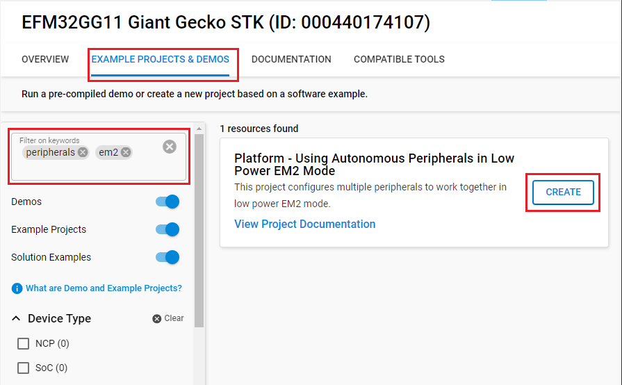
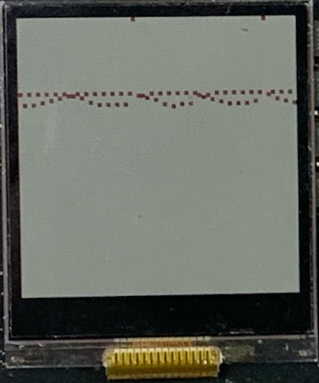

# Platform - Using Autonomous Peripherals in Low Power EM2 Mode #


## Summary ##

This project configures multiple peripherals to work together in low power EM2 mode.

Peripherals used: ADC, LETimer, LDMA, GPIO, PRS, EMU, SPI

## Gecko SDK version ##

- GSDK 4.4.3

## Hardware Required ##

- [One SLSTK3701A Giant Gecko GG11 Starter Kit](https://www.silabs.com/products/development-tools/mcu/32-bit/efm32-giant-gecko-gg11-starter-kit)

## Connections Required ##

- Connect the board via a USB cable to your PC to flash the example.

## Setup ##

To test this application, you can either create a project based on an example project or start with an empty example project.

### Create a project based on an example project ###

1. Make sure that this repository is added to [Preferences > Simplicity Studio > External Repos](https://docs.silabs.com/simplicity-studio-5-users-guide/latest/ss-5-users-guide-about-the-launcher/welcome-and-device-tabs).

2. From the Launcher Home, add your device to My Products, click on it, and click on the **EXAMPLE PROJECTS & DEMOS** tab. Find the example project filtering by **peripherals** and **em2**.

3. Click the **Create** button on the **Platform - Using Autonomous Peripherals in Low Power EM2 Mode** example. Example project creation dialog pops up -> click **Finish** and Project should be generated.

    

4. Build and flash this example to the board.

### Start with an empty example project ###

1. Create an **Empty C Project** project for your hardware using Simplicity Studio 5.

2. Copy the files `app.c`, `graph.h` and `graph.c` into the project root folder (overwriting the existing file).

3. Open the .slcp file. Select the SOFTWARE COMPONENTS tab and install the software components:

    - [Platform] → [Peripheral] → [ADC]
    - [Platform] → [Peripheral] → [PRS]
    - [Platform] → [Peripheral] → [LDMA]
    - [Platform] → [Peripheral] → [LETIMER]
    - [Platform] → [Driver] → [GLIB Graphics Library]
    - [Platform] → [Board] → [Board Control] → Turn on "Enable Display"

4. Build and flash the project to your device.

## How It Works ##

The application is capable of triggering the ADC Conversion from a GPIO button press or a LETIMER timeout through PRS while in EM2. Selecting the triggering source is done by uncommenting the line code in the `app.c` file.

```c
// Uncomment for selecting the triggering source
//#define GPIO_TO_ADC_PRS_MODE
#define LETIMER_TO_ADC_PRS_MODE
```

Once the ADC conversion is completed, the system transitions to EM1 and the LDMA copies the data into a buffer. Once the buffer is full, an LDMA interrupt is triggered to get the device out of EM2 and update the display. The display plots the recorded points and goes back to EM2 once complete.

## Testing ##

Flash the project to your device. Observe the LCD screen on the board. You should expect a similar output to the one below.


