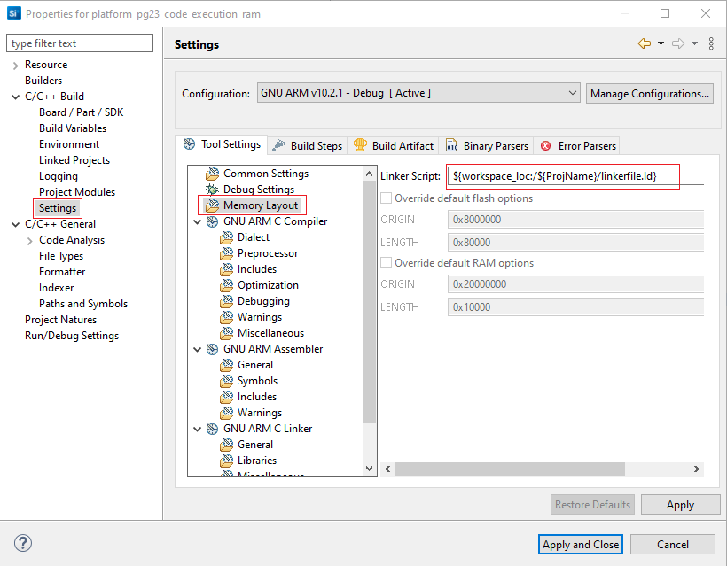
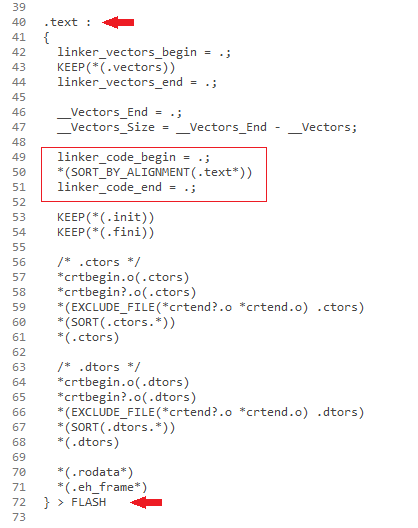
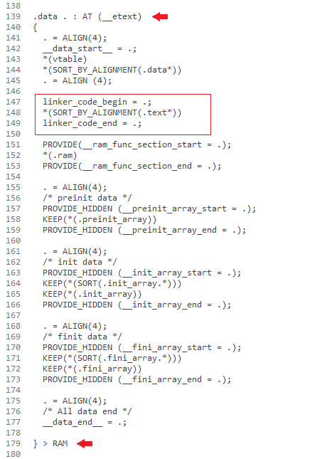
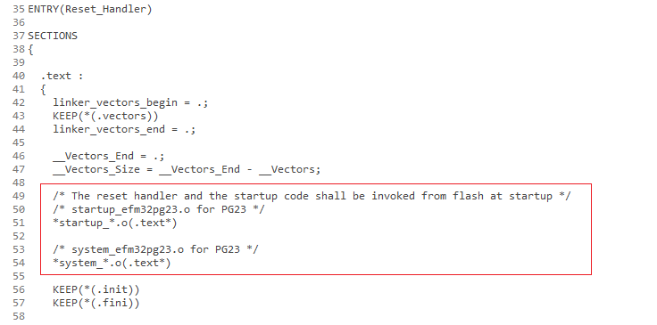
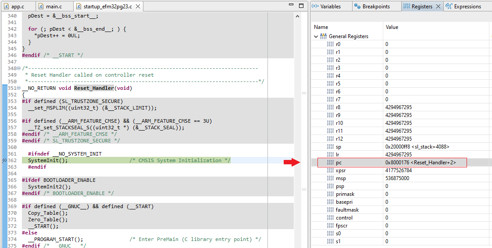
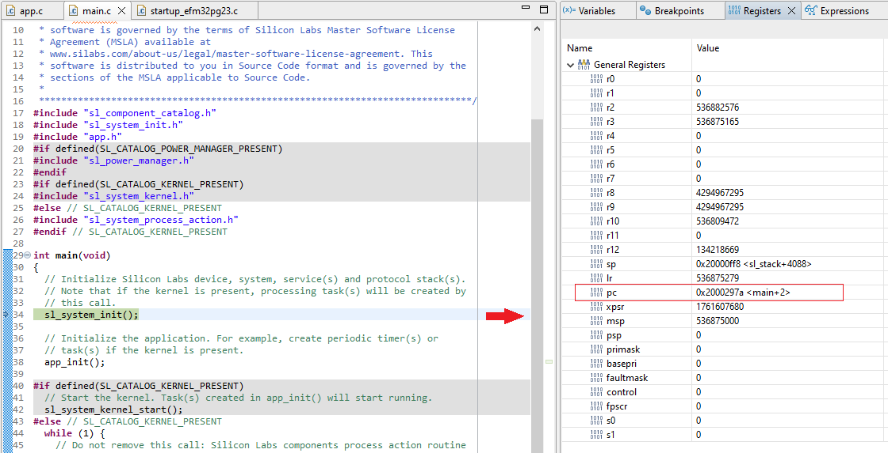
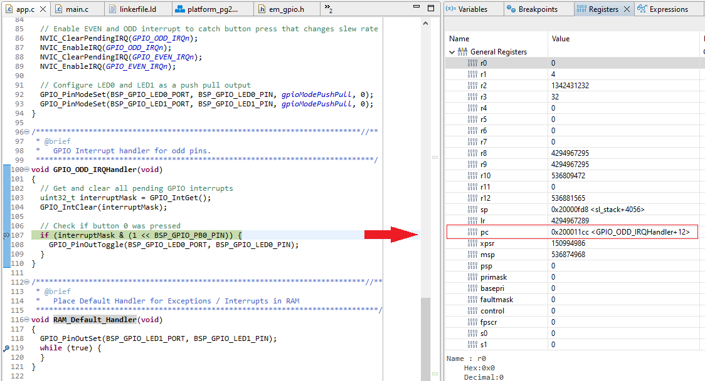
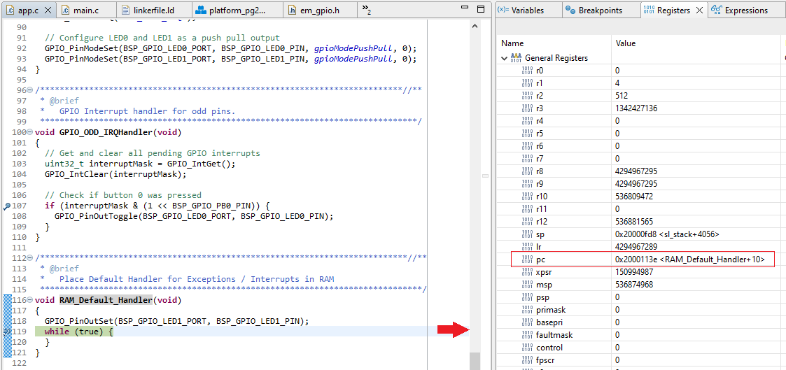

# Executing Code from RAM #


## Overview ##

Normally, in the embedded system architectures, firmware is stored in the microcontroller’s flash memory (code flash/ program flash) and directly executes in place. RAM is a volatile memory and contains nothing upon reset or power cycle. It is used to store data and hold the value of variables at run time.

There are certain situations where it becomes mandatory to run code from RAM. For example, when using flash as emulated EEPROM. While performing write/erase operations on flash, it is not possible to execute code from flash, but it is still possible to execute code from RAM to have low latency interrupts.

This example aims to show how to set up a project so that the entire code is executed in the RAM memory using Silicon Labs development kits.

## Gecko SDK Suite version ##

- GSDK v4.3.2

## Hardware Required ##

- [PG23-PK2504A - EFM32PG23 Pro Kit](https://www.silabs.com/development-tools/mcu/32-bit/efm32pg23-pro-kit)

## Connections Required ##

- Connect the board via a USB Type-C cable to your PC to flash the example.

## Setup ##

To test this application, you can either import the provided `platform_pg23_code_execution_ram.sls` project file or start with an empty example project as the following:

1. Create an **Empty C Project** project for your hardware using Simplicity Studio 5.

2. Replace the `app.c` file in the project root folder with the provided app.c (located in the src folder).

3. Copy the provided `linkerfile.ld` file (located in the SimplicityStudio folder) into the project root folder and change the Linker Script path with following: `${workspace_loc:/${ProjName}/linkerfile.ld}`

    

4. Open the .slcp file. Select the SOFTWARE COMPONENTS tab and install the software components:

    - [Services] → [Interrupt] → [RAM interrupt vector initialization]

5. Build and flash the project to your device.

## How It Works ##

Before the code can be executed from the RAM, it must first be copied to the RAM. This operation requires time and code space to implement. So, in effect the code is stored twice: once in the flash, and once in the RAM.
At startup, the application boots normally from flash. After booting it should copy and load the user application to the RAM and execute it from there.

The operations above can be easily done by modifying the linker file and relocating the vector table as described in the sections below.

### Executing all Code from RAM ###

To place all code in RAM, a linker script is available for this purpose.
In a project started from Simplicity Studio this will normally be
found in the following path `autogen/linkerfile.ld`.

In this file, we can see the section dedicated to program code (.text), placed by default in the flash memory.



Our goal is to place all code in RAM with a section placement that is defined in section .data. Therefore, these lines should be moved to section .data as shown below:



But as mentioned above, before the code can be executed from the RAM, it must first be copied to the RAM from flash memory on startup by invoking the Reset_Handler (entry point). Therefore, the startup code should be kept in flash by adding these lines to the section .text in the flash memory.



Refer to the provided `linkerfile.ld` file (located in the SimplicityStudio folder) for more details.

### Executing Interrupts from RAM ###

If interrupts can be executed from the RAM to have low latency while flash is operating with wait cycles (erase/write), it is necessary to also relocate the vector table from flash to RAM for the interrupts. Indeed if only the interrupt handler is placed in RAM, it will still be necessary to access the vector table located in flash before the interrupt can be executed and latency issues will not be solved.

To relocate the vector table from flash to RAM it is necessary to some of the code that is executed during the system initialization.

The first step is installing the *[RAM interrupt vector initialization]* component. This utility will modify the VTOR register to point to a vector table located in RAM with the declared variable:

```c
typedef void (*vectors_irq_func_ptr)(void);

__ALIGNED(IRQ_TABLE_ALIGNMENT) vectors_irq_func_ptr gecko_vector_table[IRQ_TABLE_SIZE] = { 0 };
```

The original content of the compiled interrupt vector table located in flash is copied in the RAM table above, and the VTOR pointer is set to this new table by revoking the `sl_ram_interrupt_vector_init()` function.

```c
void sl_ram_interrupt_vector_init(void)
{
  vectors_irq_func_ptr *user_vector_table = (vectors_irq_func_ptr*)SCB->VTOR;

  // Initialize new table in RAM if not already initialized
  if (((uint32_t)user_vector_table < RAM_MEM_BASE)
      || ((uint32_t)user_vector_table >= (RAM_MEM_BASE + RAM_MEM_SIZE))) {
    CORE_InitNvicVectorTable((uint32_t*)user_vector_table, IRQ_TABLE_SIZE, (uint32_t*) gecko_vector_table, IRQ_TABLE_SIZE, NULL, false);
  }
}
```

The related files to this component can be found at the path: `${StudioSdkPath}/platform/service/ram_interrupt_vector_init`. Please note that the `sl_ram_interrupt_vector_init()` function is invoked in the `main()` function after the device is started up. By this way, the exceptions (Default_Handler) are handled during the startup of the MCU.

The next step is to implement a new Default_Handler function that can be used from RAM in the application code to catch exceptions and external interrupts not handled by specific ISRs. In the `app.c` file add the `RAM_Default_Handler()` function as below:

```c
/***************************************************************************//**
 * @brief
 *   Place Default Handler for Exceptions / Interrupts in RAM
 ******************************************************************************/
void RAM_Default_Handler(void)
{
  GPIO_PinOutSet(BSP_GPIO_LED0_PORT, BSP_GPIO_LED0_PIN);
  while (true) {
  }
}
```

Then, replace the whole Default handler function address in the vector table in RAM to point to the new Default handler address that is located in RAM by invoking the `ram_interrupt_vector_update()` function.

```c
/***************************************************************************//**
 * @brief
 *   Configures the vector table in RAM to point to the new Default handler
 *   address that is located in RAM.
 *   The new Default handler can be used to catch exceptions
 *   and external interrupts which are not handled by specific ISRs.
 ******************************************************************************/
void ram_interrupt_vector_update(void)
{
  for (uint32_t i = 0; i < IRQ_TABLE_SIZE; i++) {
    // Overwrite target entries.
    if (gecko_vector_table[i] == Default_Handler) {
      gecko_vector_table[i] = RAM_Default_Handler;
    }
  }
}
```

Now the interrupt table the interrupt handlers will be placed in RAM.

So why the vector table should still be kept at the start address of the flash memory?
The reason is the Cortex-M devices will boot from fetching the first two words in the vector table, which are the initial value of the Main Stack Pointer (MSP) and the starting address of the reset handler. Without vector table relocation, the vector table is by default allocated at the start address of the flash memory. See the startup_efm32pg23.c file that can be found at: `${StudioSdkPath}/platform/Device/SiliconLabs/EFM32PG23/Source` for more information. This file contains code that is executed when the device starts up before entering the main() function.

## Testing ##

This example describes the steps to link and execute a full EFM32PG23 project in RAM using Simplicity Studio.

In this example, buttons BTN0 and BTN1 are configured as input and enabled interrupt.
If button BTN0 (PA5 - odd pin) is pressed, an odd interrupt is triggered to toggle LED0.
If button BTN1 (PB4 - even pin) is pressed, a Default Handler in RAM is triggered since even interrupt is not handled by application code.

To be sure the project will be executed from RAM, follow these steps to check:

1. Build the project and download it to the Kit

2. Open Simplicity Debugger, place three breakpoints:

    - In Reset_Handler() at line SystemInit() in the startup_efm32pg23.c file (line 362)
    - In GPIO_ODD_IRQHandler() at line 107 in the app.c file
    - In RAM_Default_Handler() at line 119 in the app.c file

3. Run the debugger. At first time, the CPU is halted into Reset_Handler() in the startup_efm32pg23.c file. Check the Registers -> General Registers watch expression, the PC counter is at address 0x8000176.
That means that the Reset_Handler() is executed in flash.

    

4. Resume the debugger, the CPU is halted into the main() function. Check the Registers -> General Registers watch expression, the PC counter is at address 0x2000297a.
That means that the main() function is executed in RAM.

    

5. Resume the debugger and press the button BTN0 on the PG23 Pro Kit board, the CPU is halted into GPIO_ODD_IRQHandler() in the app.c file. Check the Registers -> General Registers watch expression, the PC counter is at address 0x200011cc.
That means that the GPIO_ODD_IRQHandler() is executed in RAM.

    

6. Resume the debugger and press the button BTN1 on the PG23 Pro Kit board, the CPU is halted into RAM_Default_Handler() in the app.c file. Check the Registers -> General Registers watch expression, the PC counter is at address 0x2000113e.
That means that the new Default Handler function is executed in RAM.

    

## .sls Projects Used ##

`platform_pg23_code_execution_ram.sls`
