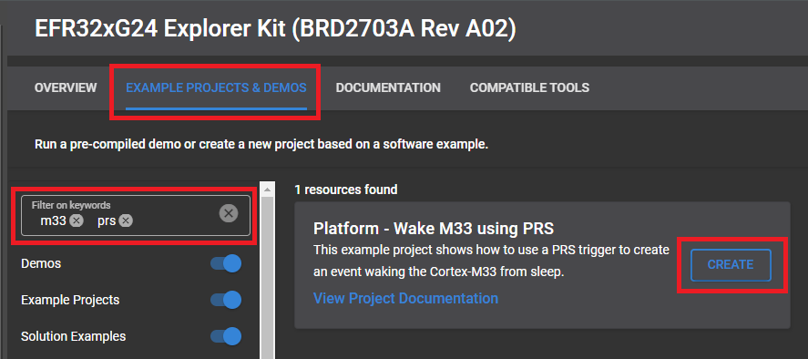

# Platform - Wake M33 using PRS #
test

## Overview ##

The Peripheral Reflex System (PRS) is a network allowing direct communication between different peripheral modules without involving the CPU. Peripheral modules which send out Reflex signals are called producers. The PRS routes these Reflex signals through Reflex channels to consumer peripherals which perform actions depending on the Reflex signals received. One of these consumers is the Cortex-M33, where an event is sent to the CPU in order to wake it up in case it was put to sleep using WFE and not WFI.

This example project shows how to use a PRS trigger from TIMER 0 to create an event waking the Cortex-M33 from sleep.

## SDK version ##

- SiSDK v2024.12.0

## Hardware Required ##

- Any Series 2 Silicon Laboratories Development Kit or Radio Board.

## Connections Required ##

- Connect the board via a USB Type-C cable to your PC to flash the example.

## Setup ##

To test this application, you can either create a project based on an example project or start with an empty example project.

### Create a project based on an example project ###

1. Make sure that this repository is added to [Preferences > Simplicity Studio > External Repos](https://docs.silabs.com/simplicity-studio-5-users-guide/latest/ss-5-users-guide-about-the-launcher/welcome-and-device-tabs).

2. From the Launcher Home, select a board from My Products, click on it, and click on the **EXAMPLE PROJECTS & DEMOS** tab. Find the example project filtering by **prs** and **m33**.

3. Click the **Create** button on the **Platform - Wake M33 using PRS** example. Example project creation dialog pops up -> click **Finish** and Project should be generated.

    

4. Build and flash this example to the board.

### Start with an empty example project ###

1. Create an **Empty C Project** project for your hardware using Simplicity Studio 5.

2. Replace the `app.c` file in the project root folder with the provided `app.c` (located in the src folder).

3. Open the .slcp file. Select the SOFTWARE COMPONENTS tab and install the software components:

    - [Platform] → [Peripheral] → [PRS]

    - [Platform] → [Peripheral] → [TIMER]

    - [Platform] → [Driver] → [Button] → [Simple Button] (leave everything as default)

    - [Platform] → [Driver] → [LED] → [Simple LED] (leave everything as default)

5. Build and flash the project to your device.

## How It Works ##

TIMER0 is set up to overflow every 1 second. PRS connects its producer output (PRS_ASYNC_CH_CTRL_SOURCESEL_TIMER0, PRS_ASYNC_TIMER0_OF) to the Cortex-M33's consumer input (CONSUMER_CORE_M33RXEV) through PRS channel 0.

Every time the Cortex-M33 wakes up it will change the state of LED0 and go back to sleep by calling either Wait For Event (__WFE()) or Wait For Interrupt (__WFI()). Waking from this setup is only possible if it was slept using __WFE().

Pressing BTN0 will cause the code to switch between calling __WFE() and __WFI() and the LED will stop blinking if the latter is selected.
